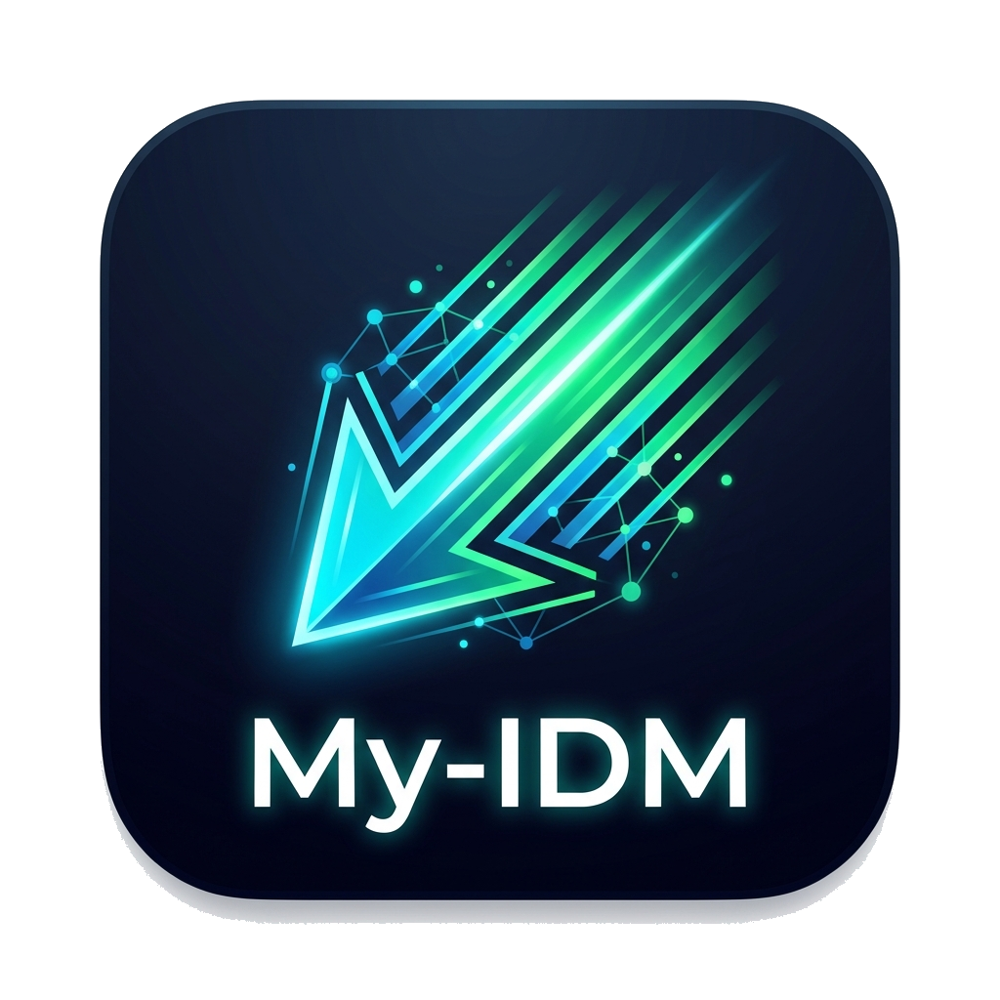
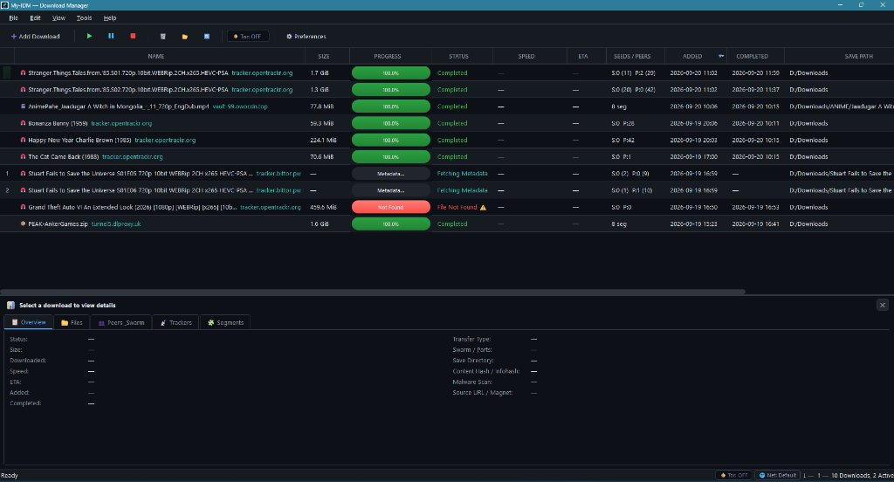

<p align="center">
  
</p>

<h1 align="center">My-IDM — Download Manager</h1>

<p align="center">
  <b>A modern, high-speed download manager with a sleek dark-themed GUI built in Python and Qt (PySide6).</b><br>
  <i>Segmented Parallel HTTP • BitTorrent Engine • VPN Kill Switch Privacy • Automated Malware Scanning</i>
</p>

<p align="center">
  
</p>

---

> [!WARNING]
> **Active Development**: My-IDM is currently in active development. Features, interfaces, and configurations are subject to rapid evolution. Bugs, feedback, and contributions are welcome!

## ✨ Features

- 🚀 **Segmented HTTP & BitTorrent** — 1–32 parallel connections, magnet/torrent support, and crash auto-resume.
- 🧅 **Tor & VPN Privacy** — 1-click Tor routing, network adapter binding, and instant kill switch protection.
- 🛡️ **Antivirus & Safety** — Pre-download deceptive extension blocks and background Windows Defender scans.
- 📋 **5-Tab Details Panel** — Collapsible inspector (<kbd>F4</kbd>) for live segments, torrent files, peers, and trackers.
- 🎛️ **Queue & UI** — Priority queue order (`#`), multi-column sorting, resizable columns, and dark theme.

---

## 🛠️ Tech Stack

| Layer | Technology |
|---|---|
| **GUI** | PySide6 (Qt 6) |
| **HTTP Engine** | `aiohttp` + `asyncio` |
| **Torrent Engine** | `libtorrent` (graceful fallback) |
| **Antivirus** | Windows Defender (`MpCmdRun.exe`) / Custom CLI engines |
| **Network & Privacy** | `psutil` + Tor SOCKS5 + HTTP/SOCKS5 Proxies |
| **Database** | SQLite3 (WAL mode) |

---

## 📥 Installation & Usage

```bash
# Clone & install
git clone https://github.com/rakeshmalik91/my-idm.git
cd my-idm
pip install -r requirements.txt
```

Run the application:
```cmd
run.pyw               # Windows windowed launcher (no command prompt)
run.bat               # Windows console launcher
python -m my_idm.main # Or direct python execution
```

**Options:**
- `-b, --backlog FILE`: Batch load URLs from a text file on startup
- `-v, --verbose`: Enable debug logging

---

## ⌨️ Keyboard Shortcuts

| Shortcut | Action |
|---|---|
| <kbd>Ctrl</kbd> + <kbd>N</kbd> | Add Download (URL / Magnet / .torrent) |
| <kbd>Ctrl</kbd> + <kbd>R</kbd> | Resume Selected Download(s) |
| <kbd>Space</kbd> | Pause Selected Download(s) |
| <kbd>Delete</kbd> | Delete Selected Download(s) |
| <kbd>Enter</kbd> | Open Downloaded File |
| <kbd>Ctrl</kbd> + <kbd>O</kbd> | Open Containing Folder |
| <kbd>F4</kbd> | Toggle Details Panel |
| <kbd>Ctrl</kbd> + <kbd>,</kbd> | Preferences & Settings |
| <kbd>Ctrl</kbd> + <kbd>L</kbd> | Load Backlog File |
| <kbd>Ctrl</kbd> + <kbd>Q</kbd> | Quit Application |

---

## 📂 Configuration & Data Locations

All settings and runtime data are persisted in the user profile:
- **Database**: `~/.my-idm/downloads.db`
- **Resume Cache**: `~/.my-idm/fastresume/`
- **Application Logs**: `~/.my-idm/my-idm.log`
- **Preferences**: Configurable via **Tools → Preferences** (<kbd>Ctrl</kbd>+<kbd>,</kbd>) or status bar badges.

---

## 📚 Documentation

- [**User Guide**](docs/user-guide.md) — Complete user manual: GUI navigation, download management, and troubleshooting.
- [**Architecture Guide**](docs/architecture/main.md) — System design, threading model (`asyncio` + `libtorrent` + Qt), and SQLite schema.
- [**Database & Persistence**](docs/architecture/database.md) — SQLite schema specification, constraints, indexing, `metadata_json` contract, migrations, and self-healing.
- [**Tor Privacy**](docs/architecture/tor.md) — SOCKS5 routing, daemon auto-discovery, startup gating, and exit termination.
- [**VPN & Kill Switch**](docs/architecture/vpn.md) — Network interface binding, adapter watcher loop, and proxy configuration.
- [**Antivirus & Security**](docs/architecture/antivirus.md) — Pre-download checks, Defender/custom scanning, and quarantine.
- [**BitTorrent Engine**](docs/architecture/torrent.md) — libtorrent integration, file priority mapping, and fastresume caching.
- [**Backlog Processing**](docs/architecture/backlog.md) — Batch queuing, multi-location discovery, custom locations & auto-clearing guidelines.
- [**API Reference**](docs/api-reference.md) — Comprehensive API reference for engines, models, and signals.
- [**TODO & Roadmap**](docs/TODO.md) — Active development backlog, feature checklist, and tracked bug fixes.

---

## 📄 License

GPL-3.0-or-later