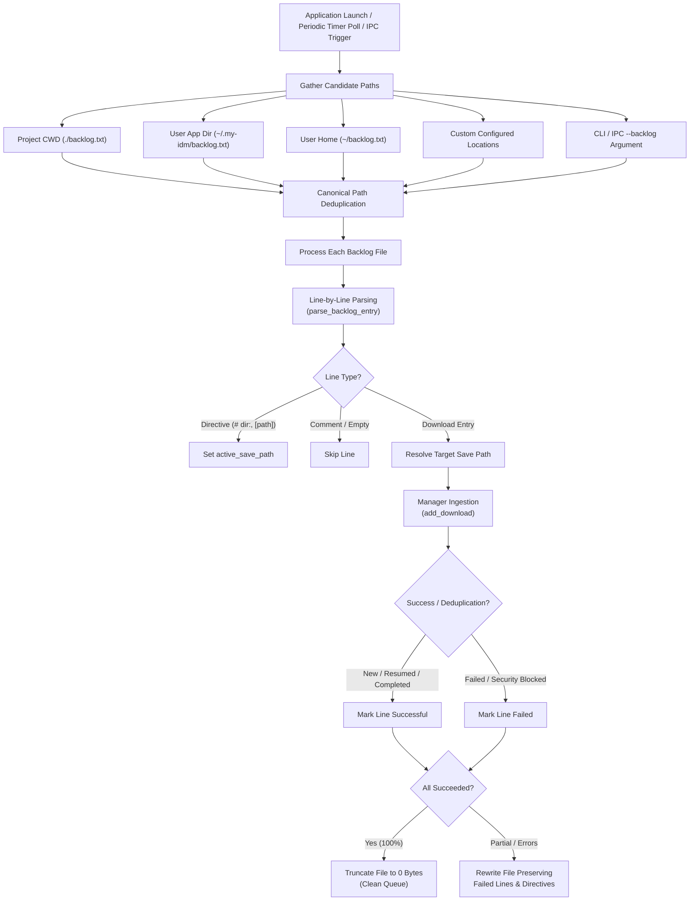

# 📋 Backlog Processing Architecture & Guidelines

This document specifies the architecture, file format guidelines, auto-discovery mechanisms, lifecycle execution, and error handling for backlog processing in **My-IDM**.

---

## 1. Overview & Architecture

Backlog processing enables batch queuing of downloads into My-IDM without manual UI interaction. It is designed for:
- Automated scheduling and scraping workflows.
- Cold-start ingestion of batch download lists.
- Multi-instance IPC handoff from external scripts or CLI invocations.
- Organizing heterogeneous downloads (HTTP, magnet links, `.torrent` files) targeted at different destination folders.



---

## 2. Auto-Discovery & Periodic Polling Hierarchy

When My-IDM boots, ticks on its background polling timer, or receives an IPC activation message, [`DownloadManager.process_backlogs()`](file:///d:/Projects/my-idm/my_idm/manager.py) scans candidate locations in the following precedence order:

| Priority | Location | Description |
| :--- | :--- | :--- |
| **1** | **Command-Line / IPC Argument** | Path explicitly passed via `--backlog <path>` or `-b <path>`. |
| **2** | **Project / Working Directory** | `Path.cwd() / "backlog.txt"` (e.g. `./backlog.txt`). |
| **3** | **Application Config Directory** | `APP_DIR / "backlog.txt"` (`~/.my-idm/backlog.txt`). |
| **4** | **User Home Directory** | `Path.home() / "backlog.txt"` (`~/backlog.txt`). |
| **5** | **Custom Configured Places** | Any folders or `.txt` files configured in **Preferences → General**. |

### 2.1 Periodic Polling Timer
In addition to startup scanning, My-IDM runs an internal `QTimer` (`_backlog_timer`) that scans all discovered locations on a repeating schedule:
- **Default Frequency**: **60 seconds** (1 minute).
- **Configurable**: Adjustable between **5 seconds and 3,600 seconds** (1 hour) in **Preferences → General**.
- **Dynamic Reconfiguration**: Modifying the polling interval or toggle in Settings immediately reconfigures the running timer without restarting the application.
- **Toggleable**: Can be enabled or disabled via `"Periodically scan for new backlog entries"`.

### Canonical Deduplication
To prevent processing the same file multiple times when directories overlap (e.g., if the current working directory is the user home directory), candidate paths are resolved to their canonical lowercase absolute path (`str(path.resolve()).lower()`) before ingestion.

---

## 3. Backlog File Syntax & Guidelines

Backlog files are standard UTF-8 encoded text files. Lines can contain comments, section directives, or download entries with optional destination paths.

### 3.1 Directives (Section Headers)
Directives set the default download destination for all subsequent URLs until changed or reset.

Supported directive syntaxes:
```txt
# dir: D:\Downloads\Torrents
# save_path: D:\Downloads\Torrents
dir = D:\Downloads\Torrents
save_path = D:\Downloads\Torrents
[D:\Downloads\Music]
```

### 3.2 Per-Line Custom Locations, Filenames & Headers
Any download line can override the active destination folder, specify an explicit output filename, or provide custom HTTP headers (such as `Referer`).

| Delimiter / Parameter Style | Example Syntax |
| :--- | :--- |
| **Multi-Pipe (`\|`)** | `https://example.com/video.mp4 \| D:\Anime\Series \| Episode_01.mp4` |
| **Named Options** | `https://example.com/stream \| dir=D:\Anime \| filename=Ep1.mp4 \| referer=https://kwik.cx/` |
| **Arrow (`->`)** | `https://example.com/file.zip -> D:\Downloads\ISO -> Archive.zip` |
| **Tab (`\t`)** | `https://example.com/file.zip\tD:\Downloads\ISO\tArchive.zip` |
| **Aria2 Style (`dir=`, `out=`)** | `https://example.com/file.zip dir="D:\Downloads\ISO" out="MyFile.zip" referer="https://..."` |
| **Semicolon (`;`)** | `https://example.com/file.zip;D:\Downloads\ISO` |
| **Space Separated** | `https://example.com/file.iso D:\Downloads\ISO` |

### 3.3 Queue Assignment

A download line can name the [named queue](queues.md) it belongs to, and a queue directive
applies to everything after it — the same sticky-then-override shape as `dir:`.

```text
# queue: YouTube                 <- sticky: every download below goes to YouTube
https://youtu.be/a
https://youtu.be/b

https://example.com/film.mkv | queue=AnimePahe    <- per-line, overrides the directive
https://example.com/other.zip queue="Big files"   <- aria2 style; quotes allow spaces
```

| Form | Example |
| :--- | :--- |
| **Sticky directive** | `# queue: YouTube`, `queue = YouTube`, `#queue=YouTube` |
| **Multi-Pipe** | `https://example.com/a.zip \| queue=YouTube` |
| **Aria2 style** | `https://example.com/a.zip queue="Big files"` |

Precedence: **per-line `queue=` > the sticky directive > inference from the source.** With no
queue named anywhere, `add_download` infers one — an AnimePahe comment marker or a
`youtube.com` / `youtu.be` URL routes to that source's built-in queue. See
[Source queues](queues.md#source-queues).

Names are resolved case-insensitively against the `queues` table. An **unknown name falls back
to Default and logs a warning** rather than creating the queue: backlog files can be
machine-generated, and auto-create plus a generator is how you end up with "Queue1", "Queue2".
A queue directive line is never itself treated as a download, so the
`clear_backlog_after_load` rewrite preserves it exactly as it preserves `dir:`.

#### The writer side lives in another repo

`D:\Projects\animepahe-downloader\modules\my_idm.py` writes these files. `add_to_my_idm_backlog()`
takes a `queue` argument, defaults it to `config.MY_IDM_QUEUE_NAME` (`"AnimePahe"`), and appends
`| queue=<name>` as the **trailing** column. It is last on purpose: My-IDM also accepts
positional columns (`url | dir | filename`), so a queue name containing a space would otherwise
be read as a save path. The leading columns stay byte-identical to what an older build wrote,
which keeps that repo's duplicate-URL scan — which compares the first column only — working.

This is a **two-repo contract**: changing the line shape on either side needs the other. Both
sides have tests pinning the exact shape — `tests/test_queues.py::TestBacklogQueueDirectives` and
`TestBacklogQueueRouting` here, `tests/test_my_idm.py` there.

### 3.4 Automatic Filename & Header Resolution
My-IDM employs a multi-tiered resolution cascade for filenames and headers:
1. **Explicit Line Parameter**: Parameter `filename=...`, `out=...`, or 3rd pipe column `url | dir | filename`.
2. **Preceding Comment Extraction**: If an immediately preceding comment contains `(filename.ext)` or `[filename.ext]` (e.g. `# Episode 1 (AnimePahe_Ep1.mp4)`), My-IDM automatically adopts the parenthesized filename.
3. **URL Query Parameters**: For direct streaming or CDN URLs where the path is a hash (e.g. `owocdn.top/mp4/hash?file=ActualName.mp4`), My-IDM extracts `file=`, `filename=`, `name=`, or `title=` from the query string.
4. **Smart Video CDN Auto-Referer**: For known media hosts requiring referers (`*.owocdn.top`, `kwik.*`), My-IDM automatically supplies `Referer: https://kwik.cx/` and applies modern browser TLS impersonation via `curl_cffi` to prevent HTTP 403 Forbidden errors.

### 3.5 Path Expansion Rules
Destination paths in backlog files automatically undergo:
1. **Environment Variable Expansion**: `%USERPROFILE%`, `%APPDATA%`, `$HOME`.
2. **User Home Expansion**: Tilde shortcuts like `~/Downloads` expand to the current user's home path.
3. **Path Normalization**: Slashes are normalized to unified forward slashes (`/`), and surrounding quotes (`"` or `'`) are stripped.

### 3.6 Comments and Blank Lines
- Blank lines and whitespace-only lines are ignored.
- Lines starting with `#` or `//` are treated as comments (unless they match a `# dir:` directive).

---

## 4. Lifecycle & Execution Flow

1. **Line Ingestion**:
   - Parsed by [`parse_backlog_entry(raw_line, active_save_path)`](file:///d:/Projects/my-idm/my_idm/manager.py).
   - If no custom destination is specified on the line or in a directive, the app's default effective save path (`GeneralConfig.get_effective_save_path()`) is applied.
2. **Pre-Download Security Gate**:
   - Each URL is checked via `check_url_safety()` before queuing.
   - High-risk extensions or dangerous URLs are blocked or tagged according to security policies.
3. **Deduplication Check**:
   - If the URL already exists in the database:
     - **Completed / Seeding**: Counted as successfully processed (no duplicate added).
     - **Paused / Queued / Error**: Resumed automatically.
     - **Downloading**: Kept active.
   - If new: Added to SQLite database and engine queue.

---

## 5. Auto-Clearing & Error Recovery

To prevent backlog items from being repeatedly downloaded on every application restart, My-IDM implements intelligent queue clearing:

- **Full Success (100%)**:
  When all download entries in a backlog file are successfully queued or resumed, the file is automatically truncated to **0 bytes**.
- **Partial Failure**:
  If certain lines fail (e.g. malformed URL or security violation), My-IDM removes only the successfully queued lines. Failed lines, along with their associated header directives and comments, are preserved in the file so the user or script can correct them.
- **Configurable Preference**:
  Auto-clearing can be toggled via the **"Clear entries from backlog file after processing successfully"** checkbox under **Preferences → General**. When disabled, backlog files remain untouched.

---

## 6. GUI Configuration & Manual Actions

### Preferences Dialog (General Tab)
Under **Preferences → General → Backlog Files Auto-Processing**:
- **Scanned Locations List**: Displays all directories and files currently monitored.
- **`[📁 Add Folder…]`**: Add any custom directory to scan for `backlog.txt`.
- **`[📄 Add File…]`**: Add any specific `.txt` backlog queue file.
- **`[🗑 Remove]`**: Remove selected locations from monitoring.
- **`[↺ Reset Defaults]`**: Restores project directory (`.`), `~/.my-idm`, and `~`.
- **`[x] Clear entries from backlog file after processing successfully`**: Checkbox to toggle automatic post-processing clearing.

### Manual Loading via Menu
Users can manually load a backlog file at any time via:
- **Menu Bar**: **File → Load Backlog…**
- **Keyboard Shortcut**: <kbd>Ctrl</kbd> + <kbd>L</kbd>

---

## 7. Best Practices for Integrations & External Scripts

When writing external scripts (e.g. Python, PowerShell, Bash) to send downloads to My-IDM:

1. **Append-Safe Writing**:
   Use append mode (`>>` or `"a"`) when writing to `backlog.txt` to avoid race conditions with My-IDM's auto-clearing mechanism.
2. **Quote Paths with Spaces**:
   If using inline delimiters like `dir=`, wrap paths with quotes: `https://example.com/file.zip dir="D:\My Documents\Files"`.
3. **Secondary Instance Triggering**:
   If My-IDM is already running, invoking `python -m my_idm.main --backlog <path>` triggers single-instance IPC: the existing window is brought to the foreground and the backlog file is ingested immediately.
