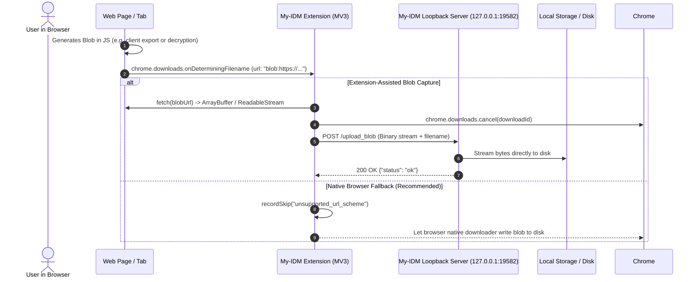

# Blob URL Handling & Capture Analysis

Technical evaluation of browser `blob:` URLs, why external download managers cannot fetch them directly over the network, potential extension-assisted capture mechanisms, and trade-offs.

---

## 🔍 What is a `blob:` URL?

A `blob:` URL (such as `blob:https://example.com/d7286b24-f7e9-4e78-98e8-468f9b9f976a`) is an **opaque, ephemeral handle to an in-memory or locally cached binary object** created inside the browser process via `URL.createObjectURL(blob)`:

1. **Origin-Bound**: It is mapped directly to the origin and execution context (tab, frame, or worker) that instantiated the `Blob` or `MediaSource`.
2. **Process-Internal**: It exists only inside the browser renderer's memory / local cache store. It does **not** exist as an addressable HTTP/HTTPS resource on any remote web server or DNS.
3. **Non-Routable**: External tools (`curl`, Python `httpx`, `libtorrent`, or My-IDM's download engines) cannot connect to `blob:https://...` because there is no remote network host to resolve or connect to.

---

## 🛠️ Theoretical Extension-Assisted Capture Architecture

While external processes cannot fetch a `blob:` URL over the network, a **browser extension** (content script or background service worker) operates within the browser and *can* read in-memory blob data while the creating page remains active.

### Potential Flow:
1. **Interception**: Extension intercepts `chrome.downloads.onDeterminingFilename` where `downloadItem.url` matches `blob:*`.
2. **Extraction**: Extension calls `fetch(blobUrl)` inside the browser context to obtain an `ArrayBuffer` or `ReadableStream`.
3. **Forwarding**: Extension streams the binary payload to an internal loopback endpoint (e.g., `POST http://127.0.0.1:19582/upload_blob`).
4. **Persistence**: My-IDM loopback server writes the incoming stream directly to the target file on disk.
5. **Cancellation**: Extension cancels the browser's native download task.

---

## ⚖️ Trade-Offs & Why Native Browser Handling is Preferred

External download managers (including IDM and My-IDM) generally decline raw `blob:` downloads and allow the browser to complete them natively due to several key technical constraints:

### 1. No Network Acceleration Possible
- The entire file payload already resides in local browser memory or temporary IndexedDB storage (e.g., generated client-side by JavaScript or decrypted in-memory like MEGA).
- There is no remote server to establish 8–32 segmented TCP connections with. Passing the file through loopback IPC adds overhead without increasing download speed.

### 2. Memory Duplication & Out-of-Memory (OOM) Risks
- Fetching large blobs (e.g., 2 GB–5 GB client-side archives or decrypted video exports) into JavaScript memory creates an `ArrayBuffer` inside the extension worker.
- This doubles the process memory footprint and risks crashing the extension worker or browser tab with an OOM exception.

### 3. Lifecycle & `URL.revokeObjectURL()` Race Conditions
- Many web applications immediately invoke `URL.revokeObjectURL(blobUrl)` in a microtask or short timeout (`setTimeout(..., 100)`) right after triggering the download.
- If extension interception introduces asynchronous roundtrip latency before calling `fetch()`, the blob pointer may already be deallocated, resulting in `ERR_FILE_NOT_FOUND` (`404`).

### 4. MediaSource Extensions (`MSE`) vs Static Files
- Video platforms (e.g., YouTube, Twitter, Vimeo) construct `blob:http...` handles for `MediaSource` playback pipelines.
- These are dynamic streaming media buffers rather than complete static downloadable files. Attempting to fetch a `MediaSource` blob yields zero bytes or protocol errors.

---

## 🛡️ My-IDM Policy & Implementation

My-IDM implements the following policy across the browser extension, local server, and desktop application:

1. **Browser Extension Graceful Fallback**:
   - `isCapturableUrl()` in `background.js` verifies schemes against `["http:", "https:", "magnet:"]`.
   - `blob:` URLs bypass external interception and are downloaded natively by the browser.
   - The extension popup logs the skip via `recordSkip("unsupported_url_scheme")` with a clear explanation for the user.
2. **Global Clipboard Filter**:
   - The global clipboard listener explicitly rejects `blob:` URLs, preventing non-actionable error entries from being queued in the download list.
3. **Streaming Media Capture Alternative**:
   - For video streaming pages using `blob:` MediaSource players, My-IDM captures the underlying media by feeding the page URL to `yt-dlp` or intercepting remote `.m3u8` / `.mpd` playlist manifests rather than attempting to read ephemeral playback blobs.
