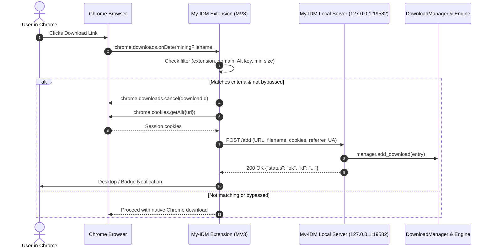

# Browser Integration Architecture (Chromium & Mozilla Firefox)

Technical documentation for the browser integration subsystem connecting Google Chrome (and Chromium-based browsers like Edge, Brave, Opera, Vivaldi) as well as Mozilla Firefox (Gecko) to **My-IDM**.

---

## 🏛️ Architecture Overview

My-IDM integrates with browsers using a **Manifest V3 WebExtension** communicating with a **Local REST Loopback Server** hosted directly inside the My-IDM desktop application.



---

## 🌐 Local REST Loopback Server

My-IDM runs an embedded asynchronous HTTP server on loopback (`127.0.0.1:19582`).

### Security Properties
- **Loopback Only**: Bound strictly to `127.0.0.1` (never `0.0.0.0`), preventing external network access.
- **CORS Support**: Permissive `Access-Control-Allow-Origin: *` to accept `fetch` calls originating from browser extension service workers.
- **Lightweight Lifecycle**: Managed by `DownloadManager`—starts automatically on application launch and cleanly terminates on exit.

### API Endpoints

#### 1. `GET /health`
Verifies server availability and returns application metadata.
- **Response `200 OK`**:
  ```json
  {
    "status": "online",
    "app": "My-IDM",
    "version": "1.0.0"
  }
  ```

#### 2. `POST /add`
Receives intercepted download payloads from the browser extension.
- **Request Headers**: `Content-Type: application/json`
- **Request Body**:
  ```json
  {
    "url": "https://example.com/files/archive.zip",
    "filename": "archive.zip",
    "referrer": "https://example.com/downloads",
    "user_agent": "Mozilla/5.0 (Windows NT 10.0; Win64; x64)...",
    "cookies": "session=xyz123; cf_clearance=...",
    "headers": {
      "Accept-Language": "en-US,en;q=0.9"
    },
    "save_dir": ""
  }
  ```
- **Response `200 OK`**:
  ```json
  {
    "status": "ok",
    "id": "down-uuid-1234",
    "message": "Download added to queue"
  }
  ```
- **Declines (`200 OK` with `status: "ignored"`)**: A decline is deliberately *not* an error
  status. The extension reads a non-ok status as "My-IDM is broken" and falls back to a browser
  download, whereas `ignored` is the shape it already understands for "handled, not queued".
  Each carries a distinct `reason`:
  - `unsupported_url_scheme` — `blob:`, `data:`, `javascript:` and friends have no external
    transport, so queuing one only makes the user wait out the retry ladder.
  - `file_size_below_minimum` — probed size is below `min_file_size_kb`.
  - `capture_paused` — `intercept_all` is off, i.e. the **🎯 Download Capture** tray row or the
    [global hotkey](capture.md) turned capture off. This gate runs *after* the `enabled` check
    and *before* body parsing, the scheme allow-list and the size probe, so a paused capture
    costs no work.
- **Error Responses**:
  - `403 Forbidden`: Browser integration is disabled entirely (`enabled` is false), so the
    server is not even running to answer.
  - `400 Bad Request`: Missing or invalid `url`.
  - `500 Internal Error`: Engine failed to queue download.

> `intercept_all` is authoritative on **both** sides: `GET /config` publishes it to the
> extension, and `_handle_add` enforces it locally. That symmetry is what makes the capture hotkey
> take effect immediately rather than after the extension's 30 s config poll. See
> [Capture Subsystem](capture.md).

#### 3. `GET /config`
Returns active user preferences for browser interception.
- **Response `200 OK`**:
  ```json
  {
    "enabled": true,
    "port": 19582,
    "intercept_all": true,
    "intercept_torrent_files": true,
    "min_file_size_kb": 0,
    "bypassed_extensions": [".crx"]
  }
  ```

---

## 🧩 Chrome Extension (Manifest V3)

The extension is stored in [`browser_extension/`](file:///d:/Projects/my-idm/browser_extension) within the repository.

### Manifest Configuration (`manifest.json`)
```json
{
  "manifest_version": 3,
  "name": "My-IDM Download Manager Integration",
  "version": "1.0.0",
  "description": "High-speed segmented download interception and 1-click downloads for My-IDM.",
  "permissions": [
    "downloads",
    "cookies",
    "contextMenus",
    "storage",
    "webNavigation"
  ],
  "host_permissions": [
    "<all_urls>",
    "http://127.0.0.1:19582/*",
    "http://localhost:19582/*"
  ],
  "background": {
    "service_worker": "background.js",
    "scripts": ["background.js"]
  },
  "content_scripts": [
    {
      "matches": ["<all_urls>"],
      "js": ["content.js"],
      "run_at": "document_start"
    }
  ],
  "browser_specific_settings": {
    "gecko": {
      "id": "my-idm@local",
      "strict_min_version": "109.0"
    }
  }
}
```

### Core Features & Multi-Browser Support
1. **Dual Interception Engines**:
   - **Chromium Engine (`chrome.downloads.onDeterminingFilename`)**: In Google Chrome, Microsoft Edge, Brave, and Opera, the extension catches file downloads before they write to disk, cancelling the browser job and transferring payload to My-IDM.
   - **Mozilla Firefox Engine (`downloads.onCreated`)**: Firefox lacks `onDeterminingFilename`. Instead, the extension hooks into `downloads.onCreated`, immediately calls `chrome.downloads.cancel(id)` and `chrome.downloads.erase({ id })`, and routes the download to My-IDM.
2. **Cross-Browser Magnet Interception**:
   - `content.js` intercepts DOM click events on `a[href^="magnet:"]` across all web pages and notifies the background script without triggering browser protocol selection popups.
   - `chrome.webNavigation.onBeforeNavigate` intercepts direct navigation attempts on magnet URIs where supported.
3. **Session Cookie Extraction (`chrome.cookies.getAll`)**:
   - Full cookie jars are extracted for the target URL to ensure private, authenticated downloads (file hosts, private swarms, cloud storage) download seamlessly without login prompts.
4. **Context Menu Actions**:
   - Right-click any link, video, audio, or image element ➔ **"Download with My-IDM"**.
5. **Bypass Modifier Key**:
   - Holding <kbd>Alt</kbd> while clicking a link bypasses My-IDM and allows the browser's native downloader to proceed.
6. **Windows Toast Notifications**:
   - Intercepted browser downloads trigger native Windows desktop notifications.

---

## 🚀 Local Unpacked Installation (No Store Required)

### Google Chrome / Brave / Opera / Vivaldi
1. Open your browser and navigate to `chrome://extensions/`.
2. Toggle on **Developer mode** in the top-right corner.
3. Click **Load unpacked**.
4. Select the [`browser_extension`](file:///d:/Projects/my-idm/browser_extension) directory.
5. The extension icon will appear in your extensions toolbar. Ensure permissions are allowed.

---

### Microsoft Edge
Microsoft Edge is built on the Chromium engine and provides full, native compatibility with My-IDM's Manifest V3 extension:
1. Open Microsoft Edge and navigate to `edge://extensions/` (or click the copy-on-click link in My-IDM Preferences).
2. On the left navigation sidebar, toggle on **Developer mode**.
   - *(Optional)* If prompted, toggle on **"Allow extensions from other stores"**.
3. Click the **Load unpacked** button at the top of the Extensions page.
4. Select the [`browser_extension`](file:///d:/Projects/my-idm/browser_extension) directory.
5. **Verify Installation**:
   - The extension will appear with the name **"My-IDM Download Manager Integration"** and status **Enabled**.
   - Ensure the extension icon is pinned to the Edge toolbar for 1-click status checking.
   - Edge routes download notifications through `chrome.downloads.onDeterminingFilename` identically to Chrome, seamlessly canceling browser downloads and handing payloads to My-IDM.

---

### Mozilla Firefox

Mozilla Firefox supports Manifest V3 extensions starting in Firefox 109. Because My-IDM includes `browser_specific_settings.gecko.id: "my-idm@local"` and dual `"service_worker"` / `"scripts"` configurations, it can be loaded directly into Firefox.

Depending on your use case (quick testing vs. permanent installation), choose one of the following methods:

#### Method 1: Temporary Add-on (Standard Firefox Release, Developer Edition, Nightly)
*Ideal for testing and regular sessions without modifying browser security configs.*

1. **Copy the Debugging URL**:
   - In My-IDM, go to **Settings (Preferences) ➔ Browser Integration** and click **"🦊 Copy Firefox Add-on URL"** (copies `about:debugging#/runtime/this-firefox`), or simply copy the address manually.
2. **Open Firefox Debugging**:
   - Paste `about:debugging#/runtime/this-firefox` into the Firefox address bar and press <kbd>Enter</kbd>.
3. **Load the Extension**:
   - Click the **"Load Temporary Add-on..."** button.
4. **Select Manifest**:
   - In the file dialog, navigate to the [`browser_extension`](file:///d:/Projects/my-idm/browser_extension) directory (you can click **"📋 Copy Folder Path"** in My-IDM Settings to paste the path directly into the Windows file picker).
   - Select `manifest.json` (or `background.js`) and click **Open**.
5. **Verify Installation**:
   - The extension will appear under **Temporary Extensions** with the name **"My-IDM Download Manager Integration"** and Extension ID `my-idm@local`.
   - The My-IDM icon will appear in Firefox's Extensions toolbar panel.
   - All download and magnet clicks will now route to My-IDM.

> [!NOTE]
> Firefox purges temporary extensions when the browser is fully closed and restarted by design. To make the extension persistent across restarts, use **Method 2** (Firefox Developer Edition / Nightly / ESR / LibreWolf) or **Method 3** (AMO unlisted signing for Standard Firefox Release).

#### Method 2: Permanent Unsigned Installation (Firefox Developer Edition / Nightly / ESR / LibreWolf / Floorp)
*Standard Firefox Release requires all extensions to be cryptographically signed by Mozilla. Firefox Developer Edition, Nightly, ESR, and privacy forks allow installing unsigned extensions permanently by disabling signature enforcement.*

1. **Package the Extension (.xpi)**:
   - In My-IDM, open **Settings ➔ Browser Integration** and click **"📦 Package Firefox Add-on (.xpi)"**.
   - This automatically creates `browser_extension/my-idm-firefox.xpi` containing the compliant Firefox MV3 manifest and assets.
2. **Disable Signature Enforcement**:
   - In Firefox Developer Edition, Nightly, or ESR, navigate to `about:config`.
   - Click **"Accept the Risk and Continue"**.
   - Search for `xpinstall.signatures.required`.
   - Double-click the preference to toggle its value from `true` to `false`.
3. **Install the XPI**:
   - In Firefox, navigate to `about:addons` (or press <kbd>Ctrl</kbd>+<kbd>Shift</kbd>+<kbd>A</kbd>).
   - Click the gear icon (⚙️) in the top-right corner of the Add-ons Manager.
   - Select **"Install Add-on From File..."**.
   - Choose `my-idm-firefox.xpi`.
   - In the confirmation prompt, click **"Add"**.
4. **Persistent across restarts**:
   - The extension remains permanently installed across all browser updates and restarts.

#### Method 3: Standard Firefox Release (Free Automated AMO Unlisted Signing)
*For standard official Firefox releases where `xpinstall.signatures.required` cannot be toggled:*

1. Package the extension in My-IDM (**Settings ➔ Browser Integration ➔ "📦 Package Firefox Add-on (.xpi)"**).
2. Visit Mozilla's [AMO Developer Hub (Distribution)](https://addons.mozilla.org/developers/addon/submit/distribution) or manage your uploaded package directly at [AMO Version 6515778](https://addons.mozilla.org/en-US/developers/addon/84510108e17d4c599bce/versions/6515778).
3. Select **"On your own"** (unlisted / self-distribution).
4. Upload `my-idm-firefox.xpi`. Mozilla's automated validator checks and signs it within 1–2 minutes.
5. Download your signed `.xpi` from your [AMO Versions page](https://addons.mozilla.org/en-US/developers/addon/84510108e17d4c599bce/versions/6515778) and install it into Firefox. It remains permanently installed across all restarts on standard Firefox!

#### Method 4: Automated Development & Hot-Reloading (`web-ext`)
*For developers actively modifying extension code with instant live-reload:*

```powershell
# From the repository root
npx web-ext run --source-dir ./browser_extension
```

This launches a dedicated Firefox profile with My-IDM pre-installed, watching files for instant reload upon changes.

#### Method 5: Enabling Private Browsing Windows in Firefox
By default, Firefox restricts extensions from running in Private Windows unless explicitly granted permission:
1. Navigate to `about:addons`.
2. Click on **My-IDM Download Manager Integration**.
3. Under the **Details** tab, locate **"Run in Private Windows"**.
4. Select **Allow**.

#### 🔍 Firefox Troubleshooting & Diagnostics
- **Inspect Background Logs**: In `about:debugging#/runtime/this-firefox`, find My-IDM and click **"Inspect"** to open DevTools for the extension's background script. Check the Console for connection logs to `http://127.0.0.1:19582`.
- **Browser Console**: Press <kbd>Ctrl</kbd>+<kbd>Shift</kbd>+<kbd>J</kbd> to inspect global Firefox network and extension errors.
- **Server Health Check**: Verify `http://127.0.0.1:19582/health` returns `{"status": "online"}` in Firefox. If connection fails, ensure My-IDM is running and **Browser Integration** is enabled in My-IDM Settings.

## ⚙️ GUI & Preferences Integration

In My-IDM:
- **Preferences ➔ Browser Integration**:
  - Toggle to enable/disable the background local REST server.
  - Port configuration (default: `19582`).
  - **Automatically intercept downloads from Chrome** — when enabled, browser downloads are handed to My-IDM.
  - **Intercept .torrent files from browser** — when enabled, `.torrent` downloads are added as torrents.
  - **Intercept magnet links from browser** — when enabled, magnet clicks are captured.
  - **Minimum file size to intercept (KB, 0 = no limit)**.
  - **Bypassed File Extensions** (default: `.crx`).
  - **Chromium Browsers Group (Chrome / Brave / Edge / Opera)**:
    - Interactive copy-on-click link for `chrome://extensions/`.
    - Interactive copy-on-click link for `edge://extensions/`.
    - Interactive copy-on-click link for `browser_extension` folder path.
    - Action button: **"📁 Open Extension Folder"** — Opens Windows Explorer to the unpacked extension folder.
    - Live feedback label showing `✓ Copied '...' to clipboard` for 3.5 seconds.
  - **Mozilla Firefox Group**:
    - Interactive copy-on-click links for `about:debugging#/runtime/this-firefox` and `manifest.json` for temporary testing.
    - Interactive copy-on-click links for `about:config`, `xpinstall.signatures.required`, `false`, and `about:addons` for permanent installation.
    - Action button: **"📦 Package Firefox Add-on (.xpi)"** — Generates `my-idm-firefox.xpi` ready for installation or AMO upload.
    - Action button: **"🦊 Permanent Firefox Guide"** — Opens an interactive 3-tab dialog with step-by-step instructions for Developer Edition / ESR / Floorp / LibreWolf, standard Firefox AMO signing, and temporary extension behavior.
