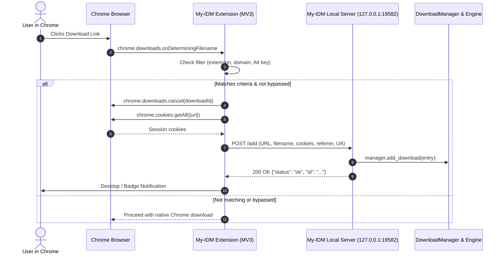

# Chrome & Chromium Browser Integration Architecture

Technical documentation for the browser integration subsystem connecting Google Chrome (and Chromium-based browsers like Edge, Brave, Opera, Vivaldi) to **My-IDM**.

---

## 🏛️ Architecture Overview

My-IDM integrates with Google Chrome using a **Manifest V3 Extension** communicating with a **Local REST Loopback Server** hosted directly inside the My-IDM desktop application.



---

## 🌐 Local REST Loopback Server

My-IDM runs an embedded asynchronous HTTP server on loopback (`127.0.0.1:19582`).

### Security Properties
- **Loopback Only**: Bound strictly to `127.0.0.1` (never `0.0.0.0`), preventing external network access.
- **CORS Support**: Permissive `Access-Control-Allow-Origin: *` to accept `fetch` calls originating from browser extension service workers.
- **Lightweight Lifecycle**: Managed by `DownloadManager`—starts automatically on application launch and cleanly terminates on exit.

### API Endpoints

#### 1. `GET /health`
Verifies server availability and returns application metadata.
- **Response `200 OK`**:
  ```json
  {
    "status": "online",
    "app": "My-IDM",
    "version": "1.0.0"
  }
  ```

#### 2. `POST /add`
Receives intercepted download payloads from the browser extension.
- **Request Headers**: `Content-Type: application/json`
- **Request Body**:
  ```json
  {
    "url": "https://example.com/files/archive.zip",
    "filename": "archive.zip",
    "referrer": "https://example.com/downloads",
    "user_agent": "Mozilla/5.0 (Windows NT 10.0; Win64; x64)...",
    "cookies": "session=xyz123; cf_clearance=...",
    "headers": {
      "Accept-Language": "en-US,en;q=0.9"
    },
    "save_dir": ""
  }
  ```
- **Response `200 OK`**:
  ```json
  {
    "status": "ok",
    "id": "down-uuid-1234",
    "message": "Download added to queue"
  }
  ```
- **Error Responses**:
  - `400 Bad Request`: Missing or invalid `url`.
  - `500 Internal Error`: Engine failed to queue download.

#### 3. `GET /config`
Returns active user preferences for browser interception.
- **Response `200 OK`**:
  ```json
  {
    "enabled": true,
    "intercept_types": ["zip", "7z", "iso", "exe", "msi", "mkv", "mp4", "mp3", "pdf", "tar", "gz"],
    "excluded_domains": ["bank.com", "intranet.local"]
  }
  ```

---

## 🧩 Chrome Extension (Manifest V3)

The extension is stored in [`browser_extension/`](file:///d:/Projects/my-idm/browser_extension) within the repository.

### Manifest Configuration (`manifest.json`)
```json
{
  "manifest_version": 3,
  "name": "My-IDM Download Integration",
  "version": "1.0.0",
  "description": "High-speed download interception and context menu integration for My-IDM.",
  "permissions": [
    "downloads",
    "cookies",
    "contextMenus",
    "storage"
  ],
  "host_permissions": [
    "<all_urls>"
  ],
  "background": {
    "service_worker": "background.js"
  },
  "action": {
    "default_popup": "popup.html",
    "default_icon": "icons/icon48.png"
  },
  "options_ui": {
    "page": "options.html",
    "open_in_tab": false
  }
}
```

### Core Features
1. **Automated Interception (`chrome.downloads.onDeterminingFilename`)**:
   - Listens for download attempts.
   - Evaluates filename extension against user-configured whitelist (`ZIP, 7Z, ISO, EXE, MKV, MP4, etc.`).
   - Cancels Chrome's internal download job immediately (`chrome.downloads.cancel()`).
   - Retrieves full cookie jar for the target URL using `chrome.cookies.getAll({ url })` to preserve authenticated sessions (Google Drive, MEGA, private trackers).
   - Forwards the request to `http://127.0.0.1:19582/add`.
2. **Context Menu Actions**:
   - Right-click any link, video, audio, or image element ➔ **"Download with My-IDM"**.
3. **Bypass Modifier Key**:
   - Holding <kbd>Alt</kbd> while clicking a link bypasses My-IDM and allows Chrome's native downloader to proceed.
4. **Offline Resilience**:
   - If My-IDM is closed or the local server is unreachable, the extension falls back to allowing native browser download or queueing into the user's backlog.

---

## 🚀 Local Unpacked Installation (No Store Required)

You do **not** need to publish or pay Google developer registration fees. The extension runs in Developer Mode:

1. Open Google Chrome (or Edge / Brave / Vivaldi).
2. Navigate to `chrome://extensions/` (or `edge://extensions/`).
3. Toggle on **Developer mode** in the top-right corner.
4. Click **Load unpacked**.
5. Select the [`browser_extension`](file:///d:/Projects/my-idm/browser_extension) folder from the My-IDM project directory.
6. The extension is installed with full permissions and automatically connects to My-IDM.

---

## ⚙️ GUI & Preferences Integration

In My-IDM:
- **Preferences ➔ Browser Integration**:
  - Toggle to enable/disable the background local REST server.
  - Port configuration (default: `19582`).
  - Buttons:
    - **"📁 Open Extension Folder"**: Opens Windows Explorer directly to the unpacked extension.
    - **"🌐 Open Chrome Extensions"**: Direct shortcut to configure browser extensions.
