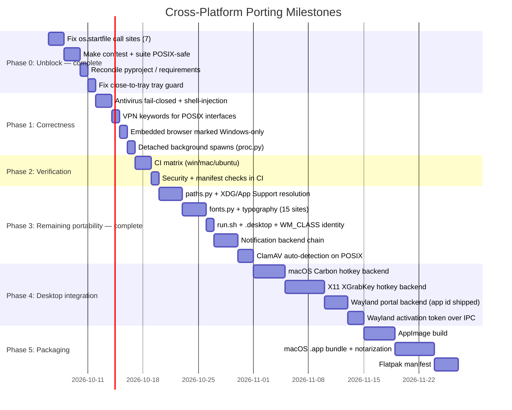

# Cross-Platform Architecture & Porting Specification

**Status: Phases 0–3 shipped.** Sections 3–5 are a mixture, and the distinction is worth keeping
sharp. Implemented and recorded here: §2.1–2.4 (Phase 0 — file revelation, test portability,
close-to-tray, dependency manifests), §4.3 (notification backends), §4.4 (antivirus fail-closed,
shell-injection fix, ClamAV auto-detection), §4.5 (XDG paths), §4.6 (VPN keywords), §4.7 (detached
spawns), §4.8 (close-to-tray), §4.9 (launch at login), §4.10 (embedded browser), §4.11
(typography and desktop identity), and §6 Phase 2 (CI). Still proposals: §4.2 (global hotkeys) and
the Wayland activation-token tail of §4.8. §5 packaging rows describe artefacts not yet built.

This document records what would have to change to make **My-IDM** a first-class application on
**Linux (X11 & Wayland)** and **macOS (Intel & Apple Silicon)** alongside Windows, and what the
current code actually does on those platforms today. Claims about current behaviour are cited as
`file.py:line` so they can be re-verified.

---

## Table of Contents

1. [Executive Summary & Gap Matrix](#1-executive-summary--gap-matrix)
2. [What Breaks Today](#2-what-breaks-today)
3. [Target Architecture](#3-target-architecture)
4. [Component Plans](#4-component-plans)
5. [Packaging & Distribution](#5-packaging--distribution)
6. [Porting Roadmap](#6-porting-roadmap)
7. [Verification Checklist](#7-verification-checklist)

---

## 1. Executive Summary & Gap Matrix

My-IDM is Python + Qt (PySide6) + `libtorrent`, all of which are already cross-platform, and the
dependency situation is better than it looks: `libtorrent` 2.0.11+ ships `manylinux`,
`musllinux`, `macosx_x86_64`, `macosx_arm64` and `win_amd64` wheels, so BitTorrent is not the
blocker it might appear to be.

The real blockers are narrower and sharper than "several subsystems use Win32 APIs":

| # | Subsystem | Windows (current) | Linux / macOS today | Severity | Effort |
| :--- | :--- | :--- | :--- | :---: | :---: |
| 1 | **Reveal / open file** | Routed through `external_tools` helpers | Was `AttributeError` in 7 unguarded sites — **fixed** (§2.1) | **Blocker** | ✅ Done |
| 2 | **Test suite** | Runs (`run_all_tests.bat`) | Was uncollectable — **fixed** (§2.2) | **Blocker** | ✅ Done |
| 3 | **Close-to-tray** | Tray always present | Hid the window with no tray icon — **fixed** (§2.3) | High | ✅ Done |
| 4 | **Dependencies** | `pip install -r requirements.txt` works | `win10toast` install failure — **fixed** (§2.4) | High | ✅ Done |
| 5 | **Notifications** | `win10toast` + tray | `notify-send` / `osascript` chain behind the tray | Low | ✅ Done |
| 6 | **Global hotkeys** | `user32.RegisterHotKey` + `WM_HOTKEY` | Refuses with *"only available on Windows"* (`hotkey.py:276`) | Med | High |
| 7 | **Data paths** | `my_idm/paths.py` | Same module: XDG / App Support, legacy `~/.my-idm` preserved | — | ✅ Done |
| 8 | **Antivirus** | Fail-open: no scanner = *clean*; plus a shell-injection in the custom scanner | Both fixed; verdict is tri-state, scanner takes argv, ClamAV auto-detected | — | ✅ Done |
| 9 | **Embedded browser** | Chrome HWND reparented into a tab | Now stated as Windows-only where the user sees it | — | ✅ Done |
| 10 | **VPN keywords** | `utun`/`ppp`/`ipsec` now matched; `wg`/`tun`/`tap` already were | — | — | ✅ Done |
| 11 | **Launchers** | `run.bat`, `run.pyw`, `my-idm-gui` | `run.sh` added; entry points already worked | Low | ✅ Done |
| 12 | **Fonts / menu bar** | `my_idm/fonts.py` resolver, 15 sites repointed | Same module | — | ✅ Done |
| 13 | **Launch at login** | `HKCU\…\Run` via [`autostart.py`](file:///d:/Projects/my-idm/my_idm/autostart.py) | Same module: XDG `.desktop` / `launchd` agent | Low | ✅ Done |
| 14 | **Background spawns** | `creationflags` at each site | Detached on POSIX via `my_idm/proc.py` | — | ✅ Done |
| 15 | **CI** | `.github/workflows/ci.yml`: 3-OS matrix, `not ui` tier | Same, and **green on all three**; plus the Windows full tier, non-blocking | Med | ✅ Done |
| 16 | **Desktop identity** | `.desktop` absent; `WM_CLASS` unmatched | `my-idm.desktop` + `setDesktopFileName` | Low | ✅ Done |

What remains is row 6 (global hotkeys — Carbon/X11/Wayland backends, and the Wayland activation
token tail of row 5 in §4.8), plus Phase 5 packaging builds, which produce artefacts rather than
code. Note that `config.py:550` `auto_start_at_startup` is unrelated to row 13: it is a
`TorConfig` field meaning "activate Tor when My-IDM starts", not "start My-IDM when the machine
boots".

---

## 2. What Breaks Today

> **Phase 0 status: rows 1–4 are resolved.** Sections 2.1–2.4 below are kept as the record of
> *what* was broken and *how* it was fixed, because each fix is a behaviour change worth being able
> to trace. Citations are current as of the Phase 0 work; row 13 (§4.9) was already shipped.

### 2.1 `os.startfile` was the actual P1 (rows 1–2) — **Resolved**

The original draft of this document described the file-manager problem as *"`explorer` does not
exist and raises `FileNotFoundError`"*. That understated it. The seven unguarded sites called
`os.startfile`, which CPython defines **only on Windows**, so on Linux and macOS they raised
`AttributeError` — not a graceful fallback, but a crash on every "Open file" and "Open folder".

All seven now route through the two helpers in `external_tools.py`, which were already correct:

| Site | Was | Now |
| :--- | :--- | :--- |
| `details_panel.py:1629` | `os.startfile(full_path)` | `open_file_in_default_app(full_path, create_if_missing=False)` |
| `details_panel.py:2024` | `explorer` / `os.startfile(repo)` | `show_in_folder(repo)` |
| `details_panel.py:2036` | `explorer /select,` split token / `os.startfile` | `show_in_folder(file_path)` |
| `details_panel.py:2038` | `os.startfile(folder)` | `show_in_folder(folder)` |
| `main_window.py:2096` | `os.startfile(entry.file_path)` | `open_file_in_default_app(..., create_if_missing=False)` |
| `main_window.py:2257` | `explorer /select,` split token / `os.startfile` | `show_in_folder(file_path)` |
| `main_window.py:2259` | `os.startfile(folder)` | `show_in_folder(folder)` |

`create_if_missing=False` is load-bearing at both "open file" sites. The helper defaults to
creating an empty placeholder for a missing file; the callers have already checked existence, so
the default would fabricate a zero-byte file if the download vanished between check and call.

Three latent bugs were fixed by the same consolidation:

- **The split `/select,` token.** `explorer` requires one argument, `f"/select,{path}"`. The old
  code passed `["explorer", "/select,", path]` as two elements, which only worked because Explorer
  tolerates it. `external_tools.py:335` already had the correct form.
- **Platforms disagreed.** Windows highlighted the file; the non-Windows branch opened the
  containing folder. Both now highlight, via `show_in_folder(file_path)`.
- **`subprocess` was orphaned** in both modules by the change, and `os` was never imported in
  `utils.py` — see §2.5.

The reference implementation is unchanged at `external_tools.py:320` (`show_in_folder`) and
`external_tools.py:285,313,337` (`open_file_in_default_app`), each `os.startfile` still correctly
inside an `if sys.platform == "win32":` block. No third implementation was added.

### 2.2 The test suite could not start off Windows (row 2) — **Resolved**

`tests/conftest.py:342` read `os.startfile` unguarded inside the autouse fixture
`block_desktop_shell_launches`, and patched it with `raising=True`. On Linux and macOS that raised
`AttributeError` before any test body ran, so **every** test in the session errored.

Fixed at the source rather than skipped: `real_startfile` is now `getattr(os, "startfile", None)`
(`conftest.py:350`) and the guard is installed with `raising=False` (`conftest.py:389`), so it is
*added* where the attribute is missing instead of skipped. That is deliberate — if production code
reaches for `os.startfile` off Windows it now produces a hermeticity violation naming the path,
rather than a bare `AttributeError`.

Five tests patched `os.startfile` with mock's default `raising=True` and had to gain `create=True`
for the same reason (`test_details_panel.py` ×2, `test_external_tools.py` ×3).

**A correction to the previous revision of this document.** It claimed the POSIX termination branch
(`os.kill(pid, 15)`, `tor_service.py:267`) was "asserted nowhere". That was wrong:
`tests/test_tor.py:93-99` patches both `subprocess.run` and `os.kill` in `setUp` and its assertion
at `test_tor.py:146-153` branches on whichever was called. The branch was asserted but never
*executed*, because the suite could not start. Two real hazards were found alongside it in
`tests/test_ui_tor_and_utils.py`, where `TorTestCase` patched only `subprocess.run`: off Windows
`TorServiceManager.stop()` would have called the **real** `os.kill` against the fictional PIDs
those tests invent (777, 5, 4321, and `1` in one case — on Linux, PID 1 is init). `TorTestCase` now
fences both mechanisms in `setUp`, and its four assertions branch on `os.name == "nt"`, mirroring
`tor_service.py:259`.

### 2.3 Close-to-tray could strand the application (row 3) — **Resolved**

`main_window.closeEvent` gated on `cfg.enable_system_tray and cfg.close_to_tray` — both default
`True` (`config.py:122,124`) — but **not** on whether a tray icon existed. `_setup_system_tray`
(`main_window.py:1406`) leaves `_tray_icon` as `None` when
`QSystemTrayIcon.isSystemTrayAvailable()` is `False`, the normal case on GNOME and on Wayland
compositors without an AppIndicator. Closing the window then hid it with no tray icon, no taskbar
entry and no menu, while downloads kept running.

`closeEvent` now consults `_can_hide_to_tray()` (`main_window.py:4037`), which requires both
preferences *and* `_has_tray_icon()` (`main_window.py:4026`). Losing the window is strictly worse
than losing close-to-tray, so with no tray the window closes normally.

`changeEvent` had the **same defect with no check at all** and was not called out in the previous
revision: minimizing hid the window via `QTimer.singleShot(0, self.hide)` whenever
`minimize_to_tray` was on (`main_window.py:3996`). It now consults the same predicate.

`_setup_system_tray` also logs a warning when the tray is unavailable, so the degraded state is
visible at startup instead of being discovered the first time the window is closed.

### 2.4 Dependency manifests were inconsistent (row 4) — **Resolved**

`pyproject.toml` and `requirements.txt` had drifted in both directions. Since `requirements.txt` is
the documented install path for end users (`README.md:54`, `docs/user-guide.md:40`), a package
present in only one file was silently missing for whoever installed via the other.

| Package | Was | Now |
| :--- | :--- | :--- |
| `win10toast` | `requirements.txt`, unmarked | Both, behind `sys_platform == "win32"` |
| `psutil` | `requirements.txt` only | Both |
| `aiohttp-socks` | `pyproject.toml` only | Both |

The `win10toast` marker is the part that mattered: pip cannot resolve that package on Linux or
macOS, so an unmarked entry makes `pip install` **fail outright** rather than skip it.
`notifications.py:29` already guards the import, so the code degrades to the tray without it —
only the manifest was broken.

Both files now carry the same ten requirements and are cross-checked against each other with
markers compared through `packaging`'s parser, so `'win32'` and `"win32"` are not read as drift.

### 2.5 Non-issues, recorded so they are not re-litigated

These were investigated and need no work:

- **VPN binding is already portable.** `HTTPEngine` binds via `TCPConnector(local_addr=...)`
  (`http_engine.py:255`) and `TorrentEngine` via `listen_interfaces` / `outgoing_interfaces`
  (`torrent_engine.py:425-426`). Both are address-based, need no privileges, and work on all three
  platforms. Adding `SO_BINDTODEVICE` would be a *regression* in portability: it requires
  `CAP_NET_RAW` and is Linux-only, so it cannot be the primary mechanism.
- **Tor discovery already handles POSIX.** `tor_service.py:59-66` searches `/usr/bin/tor`,
  `/usr/local/bin/tor`, `/opt/homebrew/bin/tor` and `/opt/local/bin/tor` in the non-`nt` branch.
  Only the user-facing error string still hardcodes `tor.exe` (`tor_service.py:122,127`).
- **Single-instance focus already works on X11.** `single_instance.activate_window`
  (`single_instance.py:19`) does `raise_()` + `activateWindow()`, which Qt maps to
  `_NET_ACTIVE_WINDOW` on X11. The Windows `SetForegroundWindow` block is correctly guarded
  (`single_instance.py:41`), as is `AllowSetForegroundWindow` (`single_instance.py:74`). Only
  Wayland activation tokens are genuinely missing.
- **`QSettings` needs no change.** NativeFormat already resolves to the correct per-platform
  location (registry / `~/.config` / `~/Library/Preferences`). Forcing `IniFormat` in production
  would be a regression; it belongs in tests only, which `conftest.py:123` already does.
- **Emoji font stacks are already correct.** `main_window.py:344` and `utils.py:166` both use
  `["Segoe UI Emoji", "Noto Color Emoji", "Apple Color Emoji", "sans-serif"]`.
- **`creationflags=0` is harmless on POSIX.** CPython only raises when the value is non-zero
  (`Lib/subprocess.py:854`). The unguarded uses at `youtube_tool.py:305,1046,1060` therefore do
  not break — they are noise to clean up, not a bug.
- **`utils.send_to_trash` is already cross-platform** — `QFile.moveToTrash` first, `send2trash`
  second, permanent delete last. It did carry one Windows-shaped wart: a retry with
  `path_str.replace("/", "\\")`, which on POSIX builds a path with literal backslashes that can
  never exist. Now guarded by `os.name == "nt"` (`utils.py:519`), which preserves the Windows UNC
  case it was written for. Note `utils.py` did not import `os` at all — inside the surrounding
  `try/except` that would have silently swallowed the `NameError` and disabled the retry.

### 2.6 What the CI runs found — **Resolved**

The matrix's first execution (2026-10-03, commit `558473a`) failed on all three platforms: 28 on
Windows, 75 on Ubuntu, 85 on macOS. Nearly all of it was the suite asserting things about the
machine it ran on rather than about the code, which is the class of defect Phase 2 exists to catch
and the one Windows-only validation structurally cannot see. Three findings justified the run on
their own:

- **`unlock_path` destroyed directory permissions on POSIX — a real defect, not a test artefact.**
  It chmod'ed its argument to `stat.S_IWRITE | stat.S_IREAD`. On Windows that only clears the
  read-only attribute, so the call is harmless there; on POSIX it is mode `0o600`, and applied to a
  *directory* that strips the execute bit and makes it untraversable. `robust_move_download_files`
  calls it on the destination directory (`utils.py:378`) and then walks straight back into it, so
  every directory move — and `send_to_trash`'s `rmtree` fallback — failed with
  `PermissionError: [Errno 13]` on Linux and macOS. Fixed by preserving the existing mode bits and
  adding execute for directories; `tests/test_utils.py::TestUnlockPath` is the regression test.
- **`find_windows_defender_path` parsed Windows paths with the host's `os.path`.** On POSIX,
  `os.path.dirname` finds no separator in `C:\...\Platform\4.20.2\MpCmdRun.exe`, so every candidate
  scored as version `(0,)` and the "newest build wins" sort silently degenerated into filesystem
  enumeration order. It now uses `ntpath`, which *is* `os.path` on Windows.
- **`TestMacOSBackend` asserted that it was not running on macOS.** Its `setUp` ended with
  `self.assertNotEqual(sys.platform, "darwin")`, so the launchd backend failed in `setUp` on macOS
  and passed vacuously on the other two, where `_load_now` returns before shelling out. The launchd
  path had no coverage on any platform. The assertion is replaced by a `_launchctl` stub, which is
  what was actually needed: nothing may touch the real launchd.

Runs 2 and 3 cut the remainder to one failure, and it is the one worth generalising:

- **Faking `sys.platform` is not faking one function.** Tests steering the Defender branch patched
  `sys.platform` to `"win32"`, which is one attribute on one shared module — so the standard library
  believed the lie too. `shutil.which` took its own Windows branch and dereferenced `_winapi`,
  which is `None` off Windows, and the ClamAV lookup (the very thing the POSIX leg exists to
  exercise) became an `AttributeError` instead of a clean "not installed". `security` now has
  `running_on_windows()` as a seam to patch instead, and the same reasoning is why
  `tests/test_main_window.py` has `has_real_desktop()`.

The rest were test-hygiene failures, catalogued in
[`.agents/workflows/testing.md`](file:///d:/Projects/my-idm/.agents/workflows/testing.md) §1: two
undeclared optional dependencies (`send2trash`, `curl_cffi`), Windows-only tests with no platform
guard, tests that asserted the author's disk layout (`D:\Projects\animepahe-downloader`, a legacy
`~/.my-idm`), and tests that asserted absolute window geometry against a headless runner's virtual
screen.

---

## 3. Target Architecture

```mermaid
flowchart TD
    subgraph GUI["GUI Layer (unchanged)"]
        MW[MainWindow / DetailsPanel]
        ST[SystemTray / Notifications]
        HK[Global Hotkey Manager]
    end

    subgraph PAL["New: my_idm/platform/"]
        FS[fs.py — reveal / open / trash]
        PROC[proc.py — spawn kwargs]
        NOTIF[notif.py — notification backends]
        HKBE[hotkey.py — hotkey backends]
        SCAN[scan.py — antivirus adapters]
        PATH[paths.py — XDG / App Support resolution]
    end

    subgraph DONE["Shipped: my_idm/autostart.py"]
        AS[launch-at-login backend]
    end

    subgraph WIN["Windows backend"]
        W1[explorer / os.startfile]
        W2[MpCmdRun.exe]
        W3[win10toast]
        W4[RegisterHotKey]
        W5[HKCU Run key]
    end

    subgraph POSIX["POSIX backend"]
        P1[QDesktopServices / xdg-open / open -R]
        P2[clamscan / spctl]
        P3[notify-send / osascript / libnotify]
        P4[X11 XGrabKey / XDG GlobalShortcuts]
        P5[.desktop / launchd agent]
    end

    MW --> FS
    MW --> PROC
    MW --> AS
    ST --> NOTIF
    HK --> HKBE
    FS --> WIN
    FS --> POSIX
    PROC --> WIN
    PROC --> POSIX
    NOTIF --> WIN
    NOTIF --> POSIX
    HKBE --> WIN
    HKBE --> POSIX
    SCAN --> W2
    SCAN --> P2
    PATH --> WIN
    PATH --> POSIX
    AS --> W5
    AS --> P5
```

The boundary is deliberately narrow: six modules, each owning one OS question, selected once at
import time. Everything above the line keeps calling the same function names it calls today, which
is what makes rows 1–4 of the gap matrix a refactor rather than a rewrite.

`my_idm/autostart.py` sits outside that planned package because it already exists and needs no
company: it answers one OS question with one function per platform.

---

## 4. Component Plans

### 4.1 File revelation, opening and trash — **Done**

All seven call sites now route through `external_tools.show_in_folder` /
`open_file_in_default_app` (§2.1 for the site-by-site mapping and the three latent bugs this
fixed). No `my_idm/platform/fs.py` package was created: the two helpers already were the correct
abstraction, so the work was deletion rather than extraction, and a six-module package for one
remaining question would have been indirection without benefit.

The `utils.py:519` backslash retry is now Windows-scoped (§2.5).

Still open, and genuinely optional: `org.freedesktop.FileManager1.ShowItems` over D-Bus as the
first branch of the POSIX path, so Nautilus/Dolphin/Thunar highlight the file instead of opening
its folder. `QDesktopServices` already works everywhere.

### 4.2 Global hotkeys

**Today.** `hotkey.py:276` refuses registration off Windows with a clear message, which is the
right failure mode. The parsing layer is Win32-specific in two places that a backend swap alone
will not fix: `VkKeyScanW` layout probing (`hotkey.py:139`) and the Win32 virtual-key table
(`hotkey.py:74`), neither of which has a POSIX equivalent.

**Target.** Split into `platform/hotkey.py` with a `HotkeyBackend` protocol exposing
`register(sequence) -> (ok, message)`, `unregister()`, and a `capabilities` flag surfaced to the
Preferences UI so the hotkey field can be disabled with a stated reason instead of failing on save.

| Backend | Mechanism | Notes |
| :--- | :--- | :--- |
| Windows | `user32.RegisterHotKey` + `QAbstractNativeEventFilter` | Existing code moves verbatim |
| macOS | Carbon `RegisterEventHotKey` | No Accessibility prompt; preferred over `CGEventTap` |
| macOS (fallback) | `CGEventTapCreate` | Requires Accessibility permission — degrade, do not hard-fail |
| Linux/X11 | `libX11` `XGrabKey` on the root window, filtered from `xcb_generic_event_t` | Needs a keycode translation step; `XKeysymToKeycode` |
| Linux/Wayland | `org.freedesktop.portal.GlobalShortcuts` | See the constraint below |

**Wayland constraint.** The GlobalShortcuts portal requires the application to have a valid app
id — `xdg-desktop-portal` merged "Require an app id to create a session" (2025-09), and version 2
(`ConfigureShortcuts`) only landed in the 1.21 cycle. A native (non-Flatpak) My-IDM must ship and
register a `.desktop` file before `CreateSession` will succeed. Composable sessions are not a
workaround; they are a sandbox, not a packaging format. Design the backend to report "global
hotkeys unavailable — no registered desktop entry" and fall back to a local `QShortcut` rather
than failing the feature.

`parse_hotkey` (`hotkey.py:168`) also needs the layout probe and key table made backend-relative,
and `Meta`/`Win`/`Super` (`hotkey.py:45`) need mapping to `Super_L`/`Meta_L` keycodes on X11 and
`Command` on macOS.

### 4.3 Notifications — **Done**

`show_notification` already preferred a registered handler (`notifications.py:61`), which the GUI
wires to `QSystemTrayIcon.showMessage` (`main_window.py:1498`) — so with a tray present,
notifications already worked everywhere. What was missing was any fallback for when there is **no**
tray: GNOME without AppIndicator, some Wayland compositors, or a notification raised before the GUI
finishes starting.

`notifications.py` now has a per-platform chain (`notifications.py:_PLATFORM_FALLBACKS`), each
backend returning `bool` and swallowing its own errors — a notification is a courtesy, and the
callers are download-completion paths:

1. `QSystemTrayIcon.showMessage` — primary everywhere, already wired.
2. Linux: `notify-send` (`notifications.py:_notify_via_notify_send`) via `shutil.which`. Preferred
   over the D-Bus binding because it needs no extra Python package and exists wherever libnotify
   does.
3. macOS: `osascript -e 'display notification …'`
   (`notifications.py:_notify_via_osascript`). AppleScript rather than PyObjC, so **PyObjC stays an
   optional packaging extra** instead of becoming a hard dependency (§5).
4. Windows: `win10toast`, unchanged, now behind an environment marker (§2.4).

Both new backends build **argv, never a shell string** — the message carries a download filename,
which is attacker-influenced. `notify-send` also only gets `--icon` when the file exists, because
it treats a missing icon path as a hard error rather than ignoring it, which would lose the
notification entirely. The `osascript` backend additionally escapes for the *language*: argv blocks
the shell but not AppleScript, so an unescaped quote in a filename would end the string early and
the remainder would parse as code.

### 4.4 Antivirus — **Done (fail-closed); ClamAV adapter still open**

**The defect was a fail-open, and it was worse than "no scanner".** `scan_file`
(`security.py:309`) returned `True` — a *clean* verdict — for every way a scan could fail to
happen: no scanner installed, a configured custom scanner path that is not there, a timeout, a
crash, an unrecognised exit code. On any machine without Windows Defender — that is, every Linux
and macOS machine — every post-download scan therefore reported success for a file nothing had
inspected, and the Details Panel rendered a green "✔ Clean (Scanned)".

The verdict is now tri-state: `True` clean, `False` threat, `None` **no verdict reached**.
Seven return paths moved to `None` (`security.py:394` and siblings). All four call sites handle
three states:

- `manager.py:3366` and `manager.py:3417` — the download **completes** but records
  `antivirus_scanned = False` plus `antivirus_scan_error`. Completing is right: refusing to finish
  a download because no antivirus happens to be installed is a worse failure than the one being
  guarded against. Crucially the threat branch is `if verdict is False:`, **not** `if not
  verdict:` — `None` is falsy, so the latter would route every unscanned download into quarantine
  and, with `action_on_threat == "delete"`, delete the user's files.
- `details_panel.py:1124` — a fourth state in amber, "⚠ Not scanned — <reason>", so a failed scan
  is visibly different from a pending one.
- The two scanner-test dialogs report it as "could not be run, the result is unknown" rather than
  as success or as a detected threat.

**A command injection was found and fixed alongside it.** The custom-scanner path built a
`shell=True` string with the target path interpolated into it (`security.py:357` now builds an
argv list instead). The path comes from a download's filename, which a crafted torrent controls, so
a name containing `"` closed the surrounding quotes and `&`, `|`, `$(...)` then executed — arbitrary
commands as the user, triggered by downloading a file. `shlex.split` now splits the template and
the path is substituted *after* splitting, so a filename containing spaces stays one argument.

**Still open:** nothing on the scan path. ClamAV is auto-detected — see below.

#### ClamAV auto-detection

`find_clamav()` (`security.py:322`) looks for `clamdscan` then `clamscan` on `PATH` and returns
them with `--no-summary %file%` (clamscan exits `0` clean, `1` infected, `2` error).
`--no-summary` because My-IDM builds its own report line from the exit code.

The wiring needed care. `scan_file`'s scanner selection is a **binary** Defender-or-Custom radio
(`security_dialog.py:164`), so `scanner_type == "defender"` is what every stored configuration
says — *including on Linux and macOS, where Defender cannot exist*. Left alone, that meant default
settings could never scan off Windows no matter how ClamAV was installed. So `defender` is
reinterpreted as "the system scanner" on non-Windows platforms (`security.py:494`), with a log line
saying so, and the radio is **relabelled per platform** — "System scanner - ClamAV" rather than
"Windows Defender", because a label naming software that does not exist is one a user can act on.
Windows behaviour is unchanged.

Detection only, never installation: installing a security tool, let alone a system daemon, without
being asked is not this application's decision. A packaged build finds its own bundled copy through
the same lookup.

### 4.5 Data paths and XDG compliance — **Done**

`~/.my-idm` was hardcoded in four places, not one. All four now route through
[`my_idm/paths.py`](file:///d:/Projects/my-idm/my_idm/paths.py), whose `data_dir()`
(`paths.py:128`) resolves:

| Platform | Config | Data |
| :--- | :--- | :--- |
| Linux/BSD | `$XDG_CONFIG_HOME/my-idm` (default `~/.config/my-idm`) | `$XDG_DATA_HOME/my-idm` (default `~/.local/share/my-idm`) |
| macOS | `~/Library/Application Support/My-IDM` | same |
| Windows | `%APPDATA%\My-IDM` | same |

| Site | Now |
| :--- | :--- |
| `database.py:24` | `APP_DIR` (= `data_dir()`), `database.py:25` `DB_PATH` |
| `torrent_engine.py:41` | `FASTRESUME_DIR` |
| `tor_service.py:85` | Tor's `DataDirectory` |
| `main.py:19-20` | `DEFAULT_BACKLOG`, `LOGS_DIR` |

**The deliberate decision: a pre-existing `~/.my-idm` keeps winning, on every platform**
(`paths.py:77`). A user's `downloads.db` is their download history — every URL, every completed
file, hours of seeding. Migrating it unattended means opening a live SQLite database the app may
hold, and getting it wrong splits one user's history across two directories in a way they cannot see
and cannot undo. So nothing is migrated.

That means a user with a pre-existing `~/.my-idm` on Linux keeps the non-standard location until
they move it themselves. The trade-off is explicit: this is the cost of not risking their history,
and it is why the legacy branch is gated on the directory *existing* rather than on the platform. A
**fresh** install on Linux or macOS gets the standard location, which is what makes the difference
observable to anyone starting clean.

Two details that are easy to get wrong and were: a *relative* `XDG_DATA_HOME` is ignored, because
the spec calls it invalid and joining one onto `$HOME` scatters data where no desktop environment
looks; and `default_downloads_dir()` (`paths.py:229`) uses `QStandardPaths` rather than
`~/Downloads`, which is wrong on any install that localises directory names.

`QSettings` is left alone — it already resolves correctly per platform (§2.5). `config_dir()`
(`paths.py:149`) is provided for future file-based config, deliberately *separate* from
`data_dir()`: a stray config file in the data directory ends up in backups of the user's download
history.

### 4.11 Typography, menu bar and app identity — **Done**

Sixteen call sites hardcoded `"Segoe UI"` or `"Consolas"` — Windows faces. On Linux and macOS Qt
falls back to a default sans that ignores the app's metrics, and for the two monospace sites it
means the console and file-tree columns lose fixed-pitch alignment: `shorten_path` and the segment
table *measure text* to decide where to elide, so a proportional substitution makes those
measurements wrong and the columns ragged.

[`my_idm/fonts.py`](file:///d:/Projects/my-idm/my_idm/fonts.py) holds three ordered preference
chains — `ui_font_families()` (`fonts.py:91`), `mono_font_families()` (`fonts.py:96`),
`emoji_font_families()` — and Qt resolves a list itself, picking the first family the font database
has. Every chain starts with the platform's own UI face, because the OS default is what the user's
other applications use.

All 15 sites now call through it: `details_panel.py:2162` (the last hardcoded monospace, now
`mono_font`), `download_model.py`, `main_window.py:345` and `utils.py` (emoji, which was already
correct and merely duplicated), ten in `splash.py`, and the stylesheet's CSS family via
`stylesheet_family()` (`fonts.py:158`), which quotes every name because a family containing a space
or a digit is not a valid unquoted CSS identifier.

Windows still resolves `Segoe UI` first, so **nothing changes visually for existing users**. The
guards in `tests/test_fonts.py` cover what is easy to break: an emptied table must not yield an
empty family list (which does not raise — Qt substitutes its own default silently, leaving the app
subtly wrong with nothing in the log), and no family may be shared between the UI and mono chains.

**App identity.** `my-idm.desktop` ships with `StartupWMClass=My-IDM`, and
`main.py:119` now calls `setDesktopFileName("my-idm.desktop")`. Without that call Qt derives
`WM_CLASS` from the application name alone and the entry never matches: GNOME and KDE then show no
taskbar icon and a tray icon the user cannot associate with the window, and both match strictly
rather than guessing. It is also the app id the GlobalShortcuts portal requires (§4.2), so it is
not cosmetic. `tests/test_desktop_entry.py` asserts the three identifiers agree, because nothing
fails *loudly* when they drift.

The `Exec` line points at `run.sh`, which is right for a checkout and wrong for an installed
package; packaging replaces it (§5).

### 4.6 VPN and network binding — **Keywords done; binding already portable**

Binding needed no work (§2.5). `_VPN_KEYWORDS` (`network.py:23`) gained `utun`, `ppp` and
`ipsec` (`network.py:30`) for the POSIX interface names.

This was not cosmetic. macOS names *every* system-VPN interface `utunN` regardless of provider,
and BSD/Linux name theirs `pppN` / `ipsecN`; none matched before, so a fully connected tunnel was
not tagged as a VPN — and since `get_available_interfaces` sorts VPNs first, it also sank down the
list. Note `tun` already covers `utun` by substring, which is why the explicit entry is belt-and-braces
rather than load-bearing.

`SO_BINDTODEVICE` was **not** added, deliberately: it needs `CAP_NET_RAW`, is Linux-only, and would
replace an unprivileged address-based mechanism with a privileged one.

### 4.7 Process spawning — **Done**

No POSIX site set `start_new_session`, so every background child shared My-IDM's process group and
terminal. Closing the terminal My-IDM was started from delivered SIGHUP to the Tor proxy — it died
mid-download, silently — and Ctrl-C reached children nobody expected it to.

All sites now route through `my_idm/proc.background_kwargs()` (`proc.py:33`), which returns exactly
one platform key: `creationflags` with `CREATE_NO_WINDOW` on Windows, `start_new_session` on POSIX.
Applied at the scraper (`external_tools.py:203`), the two AnimePahe GUI launches, and Tor
(`tor_service.py:158`). `youtube_tool`'s three sites pass `detach=False`: those are
`subprocess.run(timeout=...)` calls that are *waited on*, where detaching would mean Ctrl-C no
longer interrupts a long yt-dlp fetch — a different surprise, not a fix.

This also retires the `creationflags` pattern the previous revision flagged as noise. It was never
a crash — CPython only rejects a non-zero value on POSIX — but it was seven near-copies of a
two-line answer, and the copies had drifted.

`start_new_session` is applied unconditionally on POSIX rather than being opt-in: every caller here
wants detachment, and a flag nobody sets is a flag nobody reads.

### 4.8 Close-to-tray and single-instance activation — **Close-to-tray done; Wayland token open**

**Close-to-tray: done.** `closeEvent` and `changeEvent` both gate on `_has_tray_icon()` rather
than on the preference alone, and `_setup_system_tray` warns at startup when the tray is missing
(§2.3).

**Still open:** the Wayland activation token. `single_instance.activate_window`
(`single_instance.py:19`) already does `raise_()` + `activateWindow()`, which Qt maps to
`_NET_ACTIVE_WINDOW` on X11 and to a normal activation on macOS, so only Wayland needs work: carry
an `XDG_ACTIVATION_TOKEN` in the existing `QLocalSocket` payload (`single_instance.py:69`) and
consume it on the receiving side.

### 4.9 Launch at login

**Implemented.** [`my_idm/autostart.py`](file:///d:/Projects/my-idm/my_idm/autostart.py) registers
My-IDM with the OS so it starts at login, on all three platforms:

| Platform | Mechanism | Key detail |
| :--- | :--- | :--- |
| Windows | `HKCU\Software\Microsoft\Windows\CurrentVersion\Run`, value `My-IDM` | Registers `pythonw.exe`, not `python.exe`, so no console flashes on login |
| Linux | `$XDG_CONFIG_HOME/autostart/my-idm.desktop` | `Terminal=false`; `XDG_CONFIG_HOME` ignored when relative, per spec |
| macOS | `~/Library/LaunchAgents/com.myidm.launcher.plist` | `KeepAlive=False` — otherwise quitting from the tray would be undone instantly |

Toggle: **Preferences → 🖥️ Application & Tray → System Tray & Window Behavior → "Start My-IDM
when I log in"** (`GeneralConfig.launch_at_login`, `config.py:130`, default off). The entry point
accepts `--autostart` (`main.py:75`, handled at `main.py:163`), which the registered command passes
and which starts the app in the tray — but only when `QSystemTrayIcon.isSystemTrayAvailable()`
(`main.py:168`), since an autostarted instance that starts invisible with no tray to return to is
unrecoverable without a second launch.

The design point that matters is **staleness**. Every platform stores the command as an opaque
string, so a moved checkout or a replaced virtualenv leaves a login item that launches a path which
no longer exists: every login produces a process that dies instantly with nothing on screen. So
`status()` compares the *stored* command against the one this build would write and reports
`STALE` rather than `ENABLED`; the Preferences page shows that state and offers a repair button.

The other design point is **when the OS is touched**. `reconcile()` is reached only when the
checkbox actually moved from what was loaded, so it always means "the user just asked" and makes
the registration match. A Save that did not touch the box reaches no code path that writes. That
matters because the entry can be removed outside the app — Task Manager, Startup Apps, a desktop
settings panel — and an unconditional sync would resurrect it the next time the user so much as
opened Preferences. Turning it off always removes the entry, stale or not: there is no reading of
"off" that leaves a broken autostart behind.

A failure to register does **not** discard the preference. The user's intent survives a locked
registry hive or a read-only home, and the failure is surfaced in a dialog instead of leaving a
checkbox that quietly lies.

### 4.10 Embedded browser container — **Done (explicitly Windows-only)**

`find_chrome_hwnd` returned `None` off Windows, so the Embedded Browser sub-tab was never added and
nothing explained why: a user on Linux launched the scraper, a browser opened separately, and the
panel silently had no view of it.

The reason is now stated where the user looks. `external_tools.embedded_browser_supported()`
(`external_tools.py:73`) is the single predicate — `find_chrome_hwnd` consults it too, so the flag
shown to the user and the behaviour that decides whether the tab attaches cannot drift apart — and
the console header carries the reason (`details_panel.py:2745`).

This stays Windows-only, and that is not a missing feature. Docking the browser means reparenting a
foreign top-level window into a Qt widget: X11 needs `XReparentWindow` against a client window plus
a matching event loop, and macOS has no comparable public API. A cross-platform alternative —
launching the system browser and streaming nothing back — is a product decision, not a porting
task.

### 4.11 Typography, menu bar and app identity

**Current hardcoded values:**

| Site | Value |
| :--- | :--- |
| `styles.py:347` | `font-family: "Segoe UI", "Inter", "Roboto", sans-serif` |
| `details_panel.py:2149` | `QFont("Consolas", 10)` |
| `download_model.py:1623` | `QFont("Segoe UI", 10, Bold)` |
| `splash.py:137,154,160,171,182,215` and `340,344,355,365,397` | `["Segoe UI", "Inter", …]` |

**Target.** Move all of these behind one `platform/fonts.py` resolver returning an ordered
family list: Windows `["Segoe UI", …]`; macOS `[".AppleSystemUIFont", "SF Pro Text",
"Helvetica Neue", …]`; Linux `["Noto Sans", "Ubuntu", "DejaVu Sans", …]`. Monospace sites resolve
through the same mechanism (`Consolas` / `Menlo` / `DejaVu Sans Mono`) so console and tree
column metrics stay correct.

`QMenuBar.setNativeMenuBar(True)` is already the macOS default and must be set `False` explicitly
on Windows/Linux to keep the dark in-window bar. `main.py:99`'s
`SetCurrentProcessExplicitAppUserModelID` is the Windows taskbar-grouping equivalent of the
`StartupWMClass` key in the `.desktop` file required by §4.2.

---

## 5. Packaging & Distribution

There is no packaging beyond `pyproject.toml` and `run.bat`. Required per platform:

| Platform | Artefact | Notes |
| :--- | :--- | :--- |
| Linux | **AppImage** | Single file, no root. `libtorrent` and PySide6 both ship manylinux wheels; verify Qt platform plugins (`xcb`, `wayland`) and `libxcb-cursor0`, which Qt 6.5+ requires on Ubuntu 24.04+ |
| Linux | **Flatpak** | Grants the app-id needed by the GlobalShortcuts portal (§4.2) |
| Linux | `.desktop` | Required for `StartupWMClass` and for the portal app id |
| macOS | **`.app` bundle** via `py2app` or `PyInstaller` | Needs `Info.plist` (`LSUIElement` for tray-only), `LSMinimumSystemVersion`, and a notarized `py2app` recipe |
| macOS | Icons | `logo.ico` exists; `.icns` does not. `logo.png` covers Linux |
| All | Launchers | `run.bat` and `run.pyw` reference `.venv\Scripts\pythonw.exe`; add `run.sh`. The `my-idm` / `my-idm-gui` entry points in `pyproject.toml:18-22` already work on all three, and are what `autostart.py` registers |
| Linux | Autostart validation | The `.desktop` entry written by `autostart.py` is written blind — the desktop environment is never asked whether it accepted it. Under Flatpak, verify the app id satisfies the portal requirement in §4.2 |
| macOS | Autostart validation | A `launchd` agent loads on the next login even if `launchctl bootstrap` failed, so a silent no-op is possible; `autostart.py` reports that case as a caveat rather than a failure |
| All | Dependency manifests | Generate `requirements.txt` from `pyproject.toml`, with `win10toast` behind `sys_platform == "win32"` |

PyObjC is needed only if the native notification backend is chosen over `osascript` (§4.3) and
should be an extra, not a hard dependency.

---

## 6. Porting Roadmap

Phase 0 is first because nothing else can be verified until it lands.

**Phases 0–3 are complete.** Phase 2 was sequenced before the remaining portability work because it
is what makes that work verifiable: Phase 0 was validated on Windows by simulating POSIX
(deleting `os.startfile`, exercising the `os.name == "posix"` branch directly), which cannot catch a
`sys.platform`-conditional path. The CI matrix runs `pytest -m "not ui"` on all three platforms
(`.github/workflows/ci.yml`) and adds two assertions there that cannot be made from Windows —
`scripts/check_no_scanner_verdict.py` and `scripts/check_manifests.py`.

Two of the Phase 3 items existed only because their absence would have been invisible:

- **`.desktop` + `setDesktopFileName`** (§4.11). Without the call, nothing fails loudly — GNOME and
  KDE simply show no taskbar icon — so nothing in the test suite would ever have flagged it.
- **`.gitattributes`** pinning `*.sh` to LF. With `core.autocrlf=true` and no attributes file, a
  committed `run.sh` checks out on Linux with a CRLF shebang and fails as "exec format error"
  before the shell sees it. Also untestable from Windows, where the script is never executed.

The Windows-only full tier is wired but `continue-on-error`: a runner is not a desktop session, so
the tray may be unavailable and those tests skip. A human still runs `run_all_tests.bat` before a
release. Three tests in it — the window-geometry pair and the legacy-geometry restore — are now
additionally gated on `tests/test_main_window.py::has_real_desktop()`, because they measure where
the window landed on screen and a virtual screen answers that for itself rather than for the code.

**Phase 4 is the first item that cannot be verified from Windows at all.** The Carbon, X11 and
Wayland backends are platform FFI: they can be *written* on any host, but nothing here can execute
them, so shipping them marked "Done" would be a claim without evidence. They need a real Linux and
macOS runner — which the Phase 2 matrix now provides.

---

## 7. Verification Checklist

Each item is a check that can fail today, not a description of the target. Phase 0 items are
marked with how they were verified, since none of them can be fully verified from Windows alone.

### Blocking (Phase 0) — complete

- [x] **No unguarded `os.startfile`.** Verified: `grep -rn "os\.startfile" my_idm/` returns only
      the three reference-implementation call sites, each inside `if sys.platform == "win32":`.
- [x] **`explorer` receives one `/select,` token.** No `["explorer", "/select,", path]` two-element
      form remains; the only `explorer` call left is `external_tools.py:335`.
- [x] **Suite collects and runs where `os.startfile` is absent.** Verified by deleting the
      attribute via a pytest plugin and running the full suite: 2715 passed. **Caveat:** `sys.platform`
      stayed `win32` in that run, so platform-conditional branches in tests were not all exercised.
- [x] **`pip install -r requirements.txt` has no unconditional Windows-only package.** Both
      manifests carry the same ten requirements, cross-checked with markers compared through
      `packaging`; the `win10toast` marker evaluates `False` on Linux and macOS.
- [x] **Closing the window with no tray available exits cleanly** rather than hiding the app, and
      minimizing does the same. Verified by reverting the gate: all three new tests fail without it.

### Correctness

- [x] **`~/.my-idm` appears in exactly one module** — `my_idm/paths.py`. Verified: `grep -rn
      '"\.my-idm"' my_idm/` matches only the legacy-fallback constant there.
- [x] **Monospace metrics stable** across platforms for the console view and file-tree columns.
      `my_idm/fonts.py` keeps the UI and mono chains disjoint, so nothing proportional can be
      offered where fixed pitch is required.
- [x] **Launch at login round-trips on all three platforms**: enable writes a parsable entry, the
      status probe reads it back as enabled, disabling removes it, and a moved checkout is reported
      stale rather than enabled.
- [x] **A login launch starts without stealing focus and without a console window**
      (`pythonw.exe` on Windows, `Terminal=false` in the `.desktop`, `--autostart` honoured).
- [x] **Desktop identity is self-consistent**: `StartupWMClass`, `setApplicationName` and
      `setDesktopFileName` agree, asserted by `tests/test_desktop_entry.py`. Nothing fails loudly
      when they drift, so it is worth asserting.
- [x] **`run.sh` is committed with LF endings and the executable bit**, via `.gitattributes`. A
      CRLF shebang fails on Linux as "exec format error", and is invisible from Windows.

### Security

- [x] **A scanner that cannot run yields no verdict**, never a clean one. Asserted off Windows in CI
      via `scripts/check_no_scanner_verdict.py`, which fails against the old fail-open behaviour.
- [x] **The custom scanner takes an argv list, not a `shell=True` string.** The target path is
      attacker-influenced (a download filename), so a crafted torrent could previously execute
      arbitrary commands. Asserted by
      `TestScanFileEdges::test_a_hostile_download_name_cannot_inject_a_shell_command`.
- [x] **The notification backends build argv, not shell strings**, and the `osascript` one also
      escapes for the *language* — argv stops the shell but not AppleScript.
- [x] **Default settings actually scan off Windows.** `scanner_type == "defender"` — the binary
      radio's persisted value — is reinterpreted as "the system scanner" on POSIX, and the radio is
      relabelled so the UI does not name software that is not installed.

### Packaging

- [x] **CI matrix wired** on `windows-latest`, `ubuntu-latest`, `macos-latest` running
      `pytest -m "not ui"`, plus the Windows full tier as non-blocking.
- [x] **CI matrix actually green** on all three platforms. Three runs were needed:

  | Run | windows | ubuntu | macos | windows-full |
  | :--- | ---: | ---: | ---: | ---: |
  | 1 (`558473a`) | 28 failed | 75 failed | 85 failed | 37 failed |
  | 2 (`ae49b83`) | 2 failed | 8 failed | 8 failed | 4 failed |
  | 3 (`eac35b3`) | **1838 passed, 3 skipped** | 1 failed | 1 failed | **2864 passed, 6 skipped** |

  Run 3's remaining failure was `test_proc.py`'s end-to-end check, which built `Popen` kwargs for
  both platforms and spawned a real child with each — so on Linux it handed
  `creationflags=CREATE_NO_WINDOW` to a POSIX interpreter. `proc.py` was already correctly gated
  (§4.7); the test now spawns only the host's branch and asserts the foreign one by shape. Fixed in
  `7d2da78` and not yet re-run on the runners — that is the one item still unproven here.

  Each run paid for the last. The rules they produced are written down in
  [`.agents/workflows/testing.md`](file:///d:/Projects/my-idm/.agents/workflows/testing.md) §1,
  because the failure mode was always the same: a test asserting something about the machine it ran
  on rather than about the code.
- [ ] **AppImage runs on a clean Ubuntu 24.04 image** with `xcb` and `wayland` Qt plugins bundled.
- [ ] **`.app` bundle launches on Intel and Apple Silicon** and survives Gatekeeper notarization.
- [ ] **Global hotkey backends verified on their platforms** (Carbon, X11, Wayland portal). Not
      attempted: they are platform FFI, and nothing on a Windows host can execute them.
