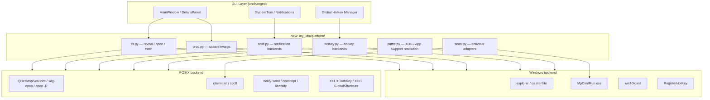
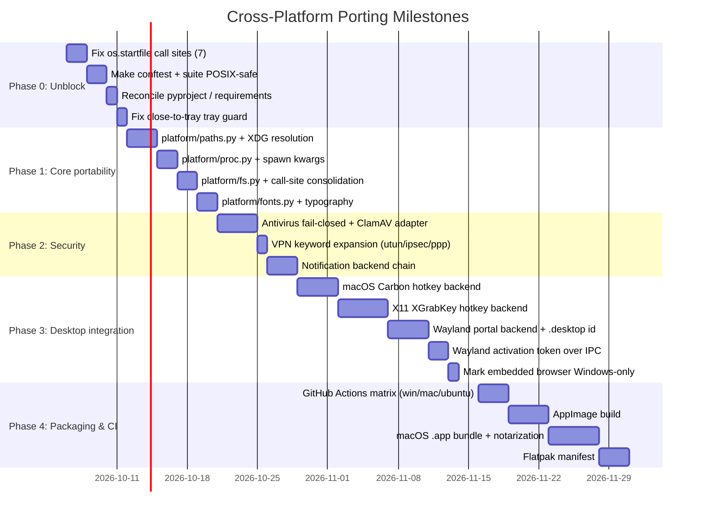

# Cross-Platform Architecture & Porting Specification

**Status: specification only. Nothing in sections 3–5 is implemented.** This document records what
would have to change to make **My-IDM** a first-class application on **Linux (X11 & Wayland)** and
**macOS (Intel & Apple Silicon)** alongside Windows, and what the current code actually does on
those platforms today. Claims about current behaviour are cited as `file.py:line` so they can be
re-verified; the "Target" subsections are proposals, not descriptions.

---

## Table of Contents

1. [Executive Summary & Gap Matrix](#1-executive-summary--gap-matrix)
2. [What Breaks Today](#2-what-breaks-today)
3. [Target Architecture](#3-target-architecture)
4. [Component Plans](#4-component-plans)
5. [Packaging & Distribution](#5-packaging--distribution)
6. [Porting Roadmap](#6-porting-roadmap)
7. [Verification Checklist](#7-verification-checklist)

---

## 1. Executive Summary & Gap Matrix

My-IDM is Python + Qt (PySide6) + `libtorrent`, all of which are already cross-platform, and the
dependency situation is better than it looks: `libtorrent` 2.0.11+ ships `manylinux`,
`musllinux`, `macosx_x86_64`, `macosx_arm64` and `win_amd64` wheels, so BitTorrent is not the
blocker it might appear to be.

The real blockers are narrower and sharper than "several subsystems use Win32 APIs":

| # | Subsystem | Windows (current) | Linux / macOS today | Severity | Effort |
| :--- | :--- | :--- | :--- | :---: | :---: |
| 1 | **Reveal / open file** | `explorer` + `os.startfile` | **`AttributeError` — `os.startfile` does not exist**, in 7 unguarded call sites | **Blocker** | Low |
| 2 | **Test suite** | Runs (`run_all_tests.bat`) | **Cannot run at all** — `conftest.py:342` reads `os.startfile` in an autouse fixture | **Blocker** | Low |
| 3 | **Close-to-tray** | Tray always present | Window hides with **no tray icon** when `isSystemTrayAvailable()` is `False` (GNOME without AppIndicator) | High | Low |
| 4 | **Dependencies** | `pip install -r requirements.txt` works | **Fails**: `win10toast` is unconditional; `psutil` missing from `pyproject.toml` | High | Low |
| 5 | **Notifications** | `win10toast` + tray | Tray only; `win10toast` import already degrades gracefully | Med | Low |
| 6 | **Global hotkeys** | `user32.RegisterHotKey` + `WM_HOTKEY` | Refuses with *"only available on Windows"* (`hotkey.py:276`) | Med | High |
| 7 | **Data paths** | `~/.my-idm` | Works, but non-standard; 4 modules hardcode the literal | Med | Med |
| 8 | **Antivirus** | Defender `MpCmdRun.exe` | Silently reports *"scanner not found; skipped scan"* | Med | Med |
| 9 | **Embedded browser** | Chrome HWND reparented into a tab | `find_chrome_hwnd` returns `None`; tab never attaches, no error | Med | High |
| 10 | **VPN keywords** | `wintun`/`nord`/… | `utun`, `ipsec`, `ppp` unmatched; `wg`/`tun`/`tap` already present | Low | Low |
| 11 | **Launchers** | `run.bat`, `run.pyw`, `my-idm-gui` | None; `.venv\Scripts\pythonw.exe` paths are Windows-only | Low | Low |
| 12 | **Fonts / menu bar** | `Segoe UI`, `Consolas` | Fall back to whatever Qt picks; monospace metrics drift | Low | Low |
| 13 | **Auto-start on boot** | **Not implemented anywhere** | Not implemented | — | — |
| 14 | **CI** | None (`.github/` does not exist) | None | Med | Low |

Row 13 is listed to be explicit: there is **no** launch-at-login feature on any platform, and
`config.py:540` `auto_start_at_startup` belongs to `TorConfig` — it means "activate Tor when
My-IDM starts", not "start My-IDM when the machine boots". Porting does not require touching the
Windows registry for this, because nothing writes to it.

---

## 2. What Breaks Today

### 2.1 `os.startfile` is the actual P1 (rows 1–2)

The original draft of this document described the file-manager problem as *"`explorer` does not
exist and raises `FileNotFoundError`"*. That understates it. The unguarded sites call
`os.startfile`, which CPython defines **only on Windows**. On Linux and macOS these are
`AttributeError`s, not graceful fallbacks:

| Call site | Guarded? | Behaviour on Linux/macOS |
| :--- | :--- | :--- |
| `details_panel.py:1625` | none | `AttributeError` — double-clicking a file in the Files tree |
| `details_panel.py:2021` | `else` branch | `AttributeError` — "Open folder" on the console tab |
| `details_panel.py:2032` | `else` branch | `AttributeError` — "Open folder" with a file selected |
| `details_panel.py:2034` | none | `AttributeError` — "Open folder" fallback |
| `main_window.py:2076` | none | `AttributeError` — "Open file" |
| `main_window.py:2222` | `else` branch | `AttributeError` — "Open folder" with a file selected |
| `main_window.py:2224` | none | `AttributeError` — "Open folder" fallback |

`external_tools.py:285,313,337` also call `os.startfile`, but each sits inside an explicit
`if sys.platform == "win32":`, so they are safe.

`external_tools.show_in_folder()` (`external_tools.py:320`) is the one implementation that is
already correct: Windows branch uses `explorer` / `startfile`, everything else goes through
`QDesktopServices.openUrl(QUrl.fromLocalFile(...))`. The fix is therefore **consolidation onto
that function**, not a new `reveal_in_file_manager` helper — the seven broken sites should be
routed to it.

The same call sites also pass `explorer` its arguments wrongly. `details_panel.py:2030` and
`main_window.py:2219` use `["explorer", "/select,", path]` as two separate `argv` elements;
`explorer` requires one token, `f"/select,{path}"` — which is what `external_tools.py:335`
correctly does. The split form only appears to work because Explorer tolerates it.

### 2.2 The test suite cannot start off Windows

`tests/conftest.py:342` executes `real_startfile = os.startfile` inside the autouse fixture
`block_desktop_shell_launches`. On Linux/macOS that raises `AttributeError` before any test body
runs, so **every** test errors. Two further blockers sit behind it:

- `unittest.mock.patch("os.startfile")` (no `create=True`) in `test_details_panel.py:367` and
  `test_external_tools.py:151` raises at patch time, because the attribute does not exist.
- `test_tor.py:148` asserts `argv[0] == "taskkill"`, which is the Windows branch of
  `tor_service.py:259`; the POSIX branch (`os.kill(pid, 15)`) is asserted nowhere.

Until this is fixed there is no signal from CI on non-Windows, which makes every other item in
this document unverifiable. It is sequenced first for that reason.

### 2.3 Close-to-tray can strand the application

`main_window.closeEvent` (`main_window.py:3989`) gates on `cfg.enable_system_tray and
cfg.close_to_tray` — both default `True` (`config.py:122,124`) — but **not** on whether the tray
icon was actually created. `_setup_system_tray` (`main_window.py:1398`) returns early with
`self._tray_icon = None` when `QSystemTrayIcon.isSystemTrayAvailable()` is `False`, which is the
normal case on GNOME and on Wayland compositors without an AppIndicator implementation. The user
then closes the window, `event.ignore()` runs, the window hides, and there is no tray icon, no
taskbar entry and no menu to restore it. (Launching a second instance recovers the window via the
IPC path in `single_instance.py:19`, but that is not a discoverable escape hatch.)

### 2.4 Dependency manifests are inconsistent and Windows-only

`pyproject.toml:8-16` and `requirements.txt` have drifted:

| Package | `pyproject.toml` | `requirements.txt` | Effect off Windows |
| :--- | :--- | :--- | :--- |
| `win10toast` | absent | `>=0.9` | **Hard install failure** — the package is Windows-only |
| `psutil` | absent | `>=5.9` | `network.py:171` falls back to `socket.gethostbyname_ex`, losing per-interface VPN detection |
| `aiohttp-socks` | `>=0.10.0` | absent | `http_engine.py:247` fails to import; SOCKS5 proxying breaks |

`win10toast` should move behind an environment marker, and the two files should be generated from
one source. Note that `notifications.py:29` already wraps the import in `try/except ImportError`,
so the *code* is already portable — only the *manifest* is not.

### 2.5 Non-issues, recorded so they are not re-litigated

These were investigated and need no work:

- **VPN binding is already portable.** `HTTPEngine` binds via `TCPConnector(local_addr=...)`
  (`http_engine.py:255`) and `TorrentEngine` via `listen_interfaces` / `outgoing_interfaces`
  (`torrent_engine.py:424`). Both are address-based, need no privileges, and work on all three
  platforms. Adding `SO_BINDTODEVICE` would be a *regression* in portability: it requires
  `CAP_NET_RAW` and is Linux-only, so it cannot be the primary mechanism.
- **Tor discovery already handles POSIX.** `tor_service.py:59-66` searches `/usr/bin/tor`,
  `/usr/local/bin/tor`, `/opt/homebrew/bin/tor` and `/opt/local/bin/tor` in the non-`nt` branch.
  Only the user-facing error string still hardcodes `tor.exe` (`tor_service.py:122,127`).
- **Single-instance focus already works on X11.** `single_instance.activate_window`
  (`single_instance.py:19`) does `raise_()` + `activateWindow()`, which Qt maps to
  `_NET_ACTIVE_WINDOW` on X11. The Windows `SetForegroundWindow` block is correctly guarded
  (`single_instance.py:41`), as is `AllowSetForegroundWindow` (`single_instance.py:74`). Only
  Wayland activation tokens are genuinely missing.
- **`QSettings` needs no change.** NativeFormat already resolves to the correct per-platform
  location (registry / `~/.config` / `~/Library/Preferences`). Forcing `IniFormat` in production
  would be a regression; it belongs in tests only, which `conftest.py:123` already does.
- **Emoji font stacks are already correct.** `main_window.py:345` and `utils.py:165` both use
  `["Segoe UI Emoji", "Noto Color Emoji", "Apple Color Emoji", "sans-serif"]`.
- **`creationflags=0` is harmless on POSIX.** CPython only raises when the value is non-zero
  (`Lib/subprocess.py:854`). The unguarded uses at `youtube_tool.py:305,1046,1060` therefore do
  not break — they are noise to clean up, not a bug.

---

## 3. Target Architecture



The boundary is deliberately narrow: six modules, each owning one OS question, selected once at
import time. Everything above the line keeps calling the same function names it calls today, which
is what makes rows 1–4 of the gap matrix a refactor rather than a rewrite.

---

## 4. Component Plans

### 4.1 File revelation, opening and trash

**Today.** `external_tools.show_in_folder()` is correct and is the reference implementation.
Seven call sites bypass it (see §2.1). `utils.send_to_trash()` (`utils.py:489`) is already
cross-platform — `QFile.moveToTrash` first, `send2trash` second, permanent delete last — with one
wart: the `path_str.replace("/", "\\")` retry at `utils.py:512` is a Windows-shaped fallback that
can only ever help on Windows.

**Target.**

1. Move `show_in_folder` and `open_file_in_default_app` into `my_idm/platform/fs.py` unchanged in
   behaviour, and repoint all seven broken call sites at it. Do not add a third implementation.
2. Delete the `os.startfile` calls from `details_panel.py` and `main_window.py` entirely; the
   platform branch already lives inside the helper.
3. Fix the split `explorer` argument at `details_panel.py:2030` and `main_window.py:2219` by
   routing through the helper, which already uses `f"/select,{p}"`.
4. Drop the backslash retry from `utils.py:512`.
5. If per-platform reveal fidelity matters (Nautilus/Dolphin/Thunar highlight the file rather than
   opening the folder), add `org.freedesktop.FileManager1.ShowItems` over D-Bus as the first
   branch of the POSIX path, falling back to `QDesktopServices`. This is a *nice-to-have*; the
   blocker is fixed without it.

### 4.2 Global hotkeys

**Today.** `hotkey.py:276` refuses registration off Windows with a clear message, which is the
right failure mode. The parsing layer is Win32-specific in two places that a backend swap alone
will not fix: `VkKeyScanW` layout probing (`hotkey.py:139`) and the Win32 virtual-key table
(`hotkey.py:74`), neither of which has a POSIX equivalent.

**Target.** Split into `platform/hotkey.py` with a `HotkeyBackend` protocol exposing
`register(sequence) -> (ok, message)`, `unregister()`, and a `capabilities` flag surfaced to the
Preferences UI so the hotkey field can be disabled with a stated reason instead of failing on save.

| Backend | Mechanism | Notes |
| :--- | :--- | :--- |
| Windows | `user32.RegisterHotKey` + `QAbstractNativeEventFilter` | Existing code moves verbatim |
| macOS | Carbon `RegisterEventHotKey` | No Accessibility prompt; preferred over `CGEventTap` |
| macOS (fallback) | `CGEventTapCreate` | Requires Accessibility permission — degrade, do not hard-fail |
| Linux/X11 | `libX11` `XGrabKey` on the root window, filtered from `xcb_generic_event_t` | Needs a keycode translation step; `XKeysymToKeycode` |
| Linux/Wayland | `org.freedesktop.portal.GlobalShortcuts` | See the constraint below |

**Wayland constraint.** The GlobalShortcuts portal requires the application to have a valid app
id — `xdg-desktop-portal` merged "Require an app id to create a session" (2025-09), and version 2
(`ConfigureShortcuts`) only landed in the 1.21 cycle. A native (non-Flatpak) My-IDM must ship and
register a `.desktop` file before `CreateSession` will succeed. Composable sessions are not a
workaround; they are a sandbox, not a packaging format. Design the backend to report "global
hotkeys unavailable — no registered desktop entry" and fall back to a local `QShortcut` rather
than failing the feature.

`parse_hotkey` (`hotkey.py:168`) also needs the layout probe and key table made backend-relative,
and `Meta`/`Win`/`Super` (`hotkey.py:45`) need mapping to `Super_L`/`Meta_L` keycodes on X11 and
`Command` on macOS.

### 4.3 Notifications

**Today.** `notifications.show_notification` already prefers a registered handler
(`notifications.py:61`) and only falls through to `win10toast` if none is registered. The GUI
registers `QSystemTrayIcon.showMessage` at `main_window.py:1482`. So with a tray present,
notifications already work everywhere; the import guard handles the rest.

**Target.** `platform/notif.py` with a backend chain, each returning `bool` so failure is silent
and non-fatal:

1. `QSystemTrayIcon.showMessage` — primary everywhere, already wired.
2. Linux: `notify-send` via `shutil.which`, then `libnotify`/D-Bus
   `org.freedesktop.Notifications`.
3. macOS: `osascript -e 'display notification …'`, then PyObjC `UNUserNotificationCenter`
   (PyObjC is a packaging dependency, not a runtime one — see §5).
4. Windows: `win10toast`, unchanged.

Move `win10toast` out of the unconditional dependency set (§2.4) regardless of which backend wins.

### 4.4 Antivirus

**Today.** `find_windows_defender_path()` (`security.py:165`) searches Program Files and the
`ProgramData` Defender Platform tree. `scan_file` (`security.py:354`) treats "not found" as
`(True, "Windows Defender scanner not found; skipped scan")` — a **fail-open** that reports the
file as clean. On Linux/macOS every scan therefore returns a clean verdict with no scan performed.
That is the actual defect; the missing ClamAV integration is a consequence.

**Target.**

1. Fail **closed** when `scanner_type == "defender"` and the binary is absent: return
   `(None, "no scanner available")` and surface it in the Details Panel as *Not scanned*, distinct
   from *Clean*. Do not let "could not scan" render as "safe".
2. Add a `platform/scan.py` adapter:
   - **Linux** — `clamscan`/`clamdscan` via `shutil.which`. Exit `0` clean, `1` infected,
     `2` error. Default template `clamscan --no-summary "%file%"`.
   - **macOS** — ClamAV via Homebrew, plus `spctl --assess --type execute` as a Gatekeeper
     signal. Note `spctl` is a code-signing assessment, not a malware scanner; it must not be
     presented as one, and its non-zero exit is *not* a threat verdict.
3. Keep the existing **custom scanner** path (`security.py:319`) as the universal escape hatch —
   it already takes an arbitrary executable plus a `%file%` template, so on any POSIX platform a
   user can point it at `clamscan` today with no code change. This is the cheapest interim answer
   and should be documented in `antivirus.md` before any of the above is written.

### 4.5 Data paths and XDG compliance

**Today.** `~/.my-idm` is hardcoded in four places, not one:

| Site | Purpose |
| :--- | :--- |
| `database.py:19` | `APP_DIR`, `DB_PATH` (`database.py:20`) |
| `torrent_engine.py:40` | `FASTRESUME_DIR` |
| `tor_service.py:83` | `tor_data` |
| `main.py:18-19` | `DEFAULT_BACKLOG`, `LOGS_DIR` (derived from `APP_DIR`, so indirect) |

**Target.** One resolver, `platform/paths.py`, with an explicit migration rule:

| Platform | Config | Data |
| :--- | :--- | :--- |
| Linux/BSD | `$XDG_CONFIG_HOME/my-idm` (default `~/.config/my-idm`) | `$XDG_DATA_HOME/my-idm` (default `~/.local/share/my-idm`) |
| macOS | `~/Library/Application Support/My-IDM` | same |
| Windows | `%APPDATA%\My-IDM`, else `~/.my-idm` | same |

Backward compatibility: if `~/.my-idm` exists and is non-empty, keep using it and log once at
`INFO` that the legacy location is in use. Migrating a user's live `downloads.db` unattended is
not worth the risk of splitting one user's history across two directories. `QSettings` is left
alone — it already resolves correctly per platform (§2.5).

### 4.6 VPN and network binding

**Today.** Binding is already portable (§2.5). `_VPN_KEYWORDS` (`network.py:15`) already contains
`wg`, `tun`, `tap` and `tailscale`; what is missing for POSIX interface names is `utun`
(macOS system VPN), `ipsec` and `ppp`.

**Target.** Add those three keywords. Explicitly do **not** add `SO_BINDTODEVICE`; if
interface-level binding is ever wanted, `IP_BOUND_IF` + `if_nametoindex` is the BSD/macOS form and
requires privileges on both platforms, which conflicts with the unprivileged design here.

### 4.7 Process spawning

**Today.** Four sites pass `creationflags` unconditionally (`youtube_tool.py:305,1046,1060`, plus
`external_tools.py:187`); three more guard correctly (`external_tools.py:172,217`,
`tor_service.py:149`). `creationflags=0` is accepted on POSIX, so nothing breaks — but no POSIX
site sets `start_new_session`, so background children (Tor, the AnimePahe scraper) share the
parent's process group and die with the terminal.

**Target.** `platform/proc.py`:

```python
def background_kwargs() -> dict:
    """Kwargs for launching a silent, detached background process."""
    if sys.platform == "win32":
        return {"creationflags": getattr(subprocess, "CREATE_NO_WINDOW", 0x08000000)}
    return {"start_new_session": True}
```

Apply at all seven sites. For the fully detached GUI launcher (`external_tools.py:218`), add
`CREATE_NEW_PROCESS_GROUP` on Windows to match the existing intent.

### 4.8 Close-to-tray and single-instance activation

**Today.** See §2.3. `activate_window` is already correct on X11.

**Target.**

1. Gate `closeEvent` on the tray icon actually existing, not on the config flag:
   `cfg.close_to_tray and self._tray_icon is not None`. If there is no tray, close normally —
   losing the window is strictly worse than losing the tray behaviour.
2. Warn at startup when `isSystemTrayAvailable()` is `False` but `enable_system_tray` is set, so
   the degraded state is visible rather than discovered by accident.
3. Wayland: pass an `XDG_ACTIVATION_TOKEN` in the existing `QLocalSocket` payload
   (`single_instance.py:69`) and consume it via `gtk_window_activate`/Qt's
   `QWindow.requestActivate()`. macOS needs no change beyond what is already there.

### 4.9 Embedded browser container

**Today.** `find_chrome_hwnd` (`external_tools.py:72`) returns `None` off Windows, and
`attach_window` (`details_panel.py:468`) sets `_chrome_hwnd` then returns early at
`details_panel.py:495`. The AnimePahe console tab therefore shows its placeholder forever with no
error surfaced. Reparenting a foreign top-level window into a Qt tab has no portable equivalent:
X11 would need `XReparentWindow` on a client window, macOS has nothing comparable.

**Target.** Treat this as an explicitly Windows-only feature. Detect the platform and disable the
browser sub-tab with a stated reason ("embedded browser view is Windows-only") rather than
presenting a tab that can never populate. A cross-platform alternative — launching the system
browser and streaming nothing back — is a product decision, not a porting task.

### 4.10 Typography, menu bar and app identity

**Current hardcoded values:**

| Site | Value |
| :--- | :--- |
| `styles.py:347` | `font-family: "Segoe UI", "Inter", "Roboto", sans-serif` |
| `details_panel.py:2149` | `QFont("Consolas", 10)` |
| `download_model.py:1623` | `QFont("Segoe UI", 10, Bold)` |
| `splash.py:137,154,160,171,182,215` and `340,344,355,365,397` | `["Segoe UI", "Inter", …]` |

**Target.** Move all of these behind one `platform/fonts.py` resolver returning an ordered
family list: Windows `["Segoe UI", …]`; macOS `[".AppleSystemUIFont", "SF Pro Text",
"Helvetica Neue", …]`; Linux `["Noto Sans", "Ubuntu", "DejaVu Sans", …]`. Monospace sites resolve
through the same mechanism (`Consolas` / `Menlo` / `DejaVu Sans Mono`) so console and tree
column metrics stay correct.

`QMenuBar.setNativeMenuBar(True)` is already the macOS default and must be set `False` explicitly
on Windows/Linux to keep the dark in-window bar. `main.py:94`'s
`SetCurrentProcessExplicitAppUserModelID` is the Windows taskbar-grouping equivalent of the
`StartupWMClass` key in the `.desktop` file required by §4.2.

---

## 5. Packaging & Distribution

There is no packaging beyond `pyproject.toml` and `run.bat`. Required per platform:

| Platform | Artefact | Notes |
| :--- | :--- | :--- |
| Linux | **AppImage** | Single file, no root. `libtorrent` and PySide6 both ship manylinux wheels; verify Qt platform plugins (`xcb`, `wayland`) and `libxcb-cursor0`, which Qt 6.5+ requires on Ubuntu 24.04+ |
| Linux | **Flatpak** | Grants the app-id needed by the GlobalShortcuts portal (§4.2) |
| Linux | `.desktop` | Required for `StartupWMClass` and for the portal app id |
| macOS | **`.app` bundle** via `py2app` or `PyInstaller` | Needs `Info.plist` (`LSUIElement` for tray-only), `LSMinimumSystemVersion`, and a notarized `py2app` recipe |
| macOS | Icons | `logo.ico` exists; `.icns` does not. `logo.png` covers Linux |
| All | Launchers | `run.bat` and `run.pyw` reference `.venv\Scripts\pythonw.exe`; add `run.sh`. The `my-idm` / `my-idm-gui` entry points in `pyproject.toml:18-22` already work on all three |
| All | Dependency manifests | Generate `requirements.txt` from `pyproject.toml`, with `win10toast` behind `sys_platform == "win32"` |

PyObjC is needed only if the native notification backend is chosen over `osascript` (§4.3) and
should be an extra, not a hard dependency.

---

## 6. Porting Roadmap

Phase 0 is first because nothing else can be verified until it lands.



Phase 0 is roughly a week and removes every hard blocker. Phase 4's CI job should run
`pytest -m "not ui"` on all three platforms, matching the existing basic-sanity tier described in
`.agents/AGENTS.md`; the `ui` tier stays Windows-only because it drives the real system tray and
clipboard.

---

## 7. Verification Checklist

Each item is a check that can fail today, not a description of the target.

### Blocking (Phase 0)

- [ ] **No unguarded `os.startfile`.** `grep -rn "os\.startfile" my_idm/` returns hits only inside
      `if sys.platform == "win32":` blocks or inside the consolidated helper.
- [ ] **`explorer` receives one `/select,` token.** No `["explorer", "/select,", path]` two-element
      form remains.
- [ ] **Suite collects and runs on Linux and macOS.** `pytest -m "not ui" --collect-only` succeeds;
      `conftest.py` reads `os.startfile` only behind `hasattr`.
- [ ] **`pip install -e .` succeeds on all three platforms.** No unconditional Windows-only
      package; `psutil` and `aiohttp-socks` present in both manifests.
- [ ] **Closing the window with no tray available exits cleanly** rather than hiding the app.

### Correctness (Phases 1–3)

- [ ] **`~/.my-idm` appears in exactly one module.** `grep -rn '"\.my-idm"' my_idm/` matches only
      `platform/paths.py`.
- [ ] **No `creationflags` without a `sys.platform` guard**, and every background launch sets
      `start_new_session` on POSIX.
- [ ] **Antivirus "not scanned" is distinguishable from "clean"** in the Details Panel, and a
      missing scanner does not return a clean verdict.
- [ ] **Hotkey backend absence is surfaced in Preferences** with a reason, not as a save-time
      error, and a local `QShortcut` fallback exists.
- [ ] **Zero hardcoded backslashes** in path construction; `pathlib` throughout.
- [ ] **Monospace metrics stable** across platforms for the console view and file-tree columns.

### Packaging (Phase 4)

- [ ] **AppImage runs on a clean Ubuntu 24.04 image** with `xcb` and `wayland` Qt plugins bundled.
- [ ] **`.app` bundle launches on Intel and Apple Silicon** and survives Gatekeeper notarization.
- [ ] **CI matrix green** on `windows-latest`, `ubuntu-latest`, `macos-latest`.
