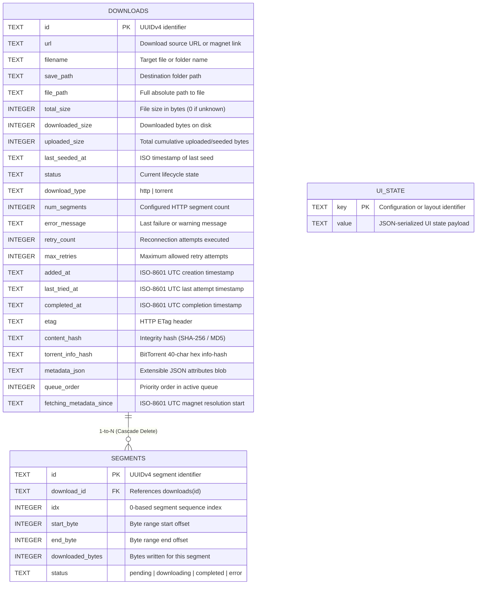

# Database Architecture & Schema Specification

This document provides the canonical technical specification for the **My-IDM** persistence layer, including table schemas, constraints, indexing strategies, metadata JSON contracts, migration lifecycle, and data synchronization patterns.

---

## 🏛️ Overview & Storage Model

My-IDM utilizes an embedded **SQLite** database (`downloads.db`) situated in the application configuration directory:

```
Windows: %USERPROFILE%\.my-idm\downloads.db
POSIX:   ~/.my-idm/downloads.db
```

### Key Characteristics

- **WAL Journaling**: Configured with `PRAGMA journal_mode=WAL` (Write-Ahead Logging) to allow concurrent readers without blocking SQLite writes.
- **Foreign Key Enforcement**: Configured with `PRAGMA foreign_keys=ON` to enforce relational integrity and cascade deletions.
- **Thread Safety**: Initialized with `sqlite3.connect(..., check_same_thread=False)`. Database operations are synchronous and executed from background manager/engine threads without blocking the main Qt GUI event loop.
- **State Separation**: Clear boundary between **persisted database columns** (stored on disk) and **transient runtime fields** (speeds, peer counts, ETAs computed during active transfers).

---

## 📊 Entity-Relationship Diagram



---

## 📑 Table Schemas

### 1. `downloads` Table

The primary entity table storing download tasks, progress state, connection parameters, and security reports.

| Column                    | Type      | Nullable | Default    | Description                                                                                  |
| :--------------------------| :----------| :--------:| :-----------| :---------------------------------------------------------------------------------------------|
| `id`                      | `TEXT`    | **NO**   | *None*     | **PRIMARY KEY**. Unique UUIDv4 string.                                                       |
| `url`                     | `TEXT`    | **NO**   | *None*     | Source URL (`http://`, `https://`), magnet URI (`magnet:?xt=...`), or local `.torrent` path. |
| `filename`                | `TEXT`    | **NO**   | `''`       | Resolved file name or torrent root display name.                                             |
| `save_path`               | `TEXT`    | **NO**   | `''`       | Target directory where the download is stored.                                               |
| `file_path`               | `TEXT`    | **NO**   | `''`       | Full normalized path to the downloaded file or root folder on disk.                          |
| `total_size`              | `INTEGER` | **NO**   | `0`        | Expected file/payload size in bytes (`0` for chunked streams or unresolved magnets).         |
| `downloaded_size`         | `INTEGER` | **NO**   | `0`        | Bytes written and verified on disk.                                                          |
| `uploaded_size`           | `INTEGER` | **NO**   | `0`        | Total cumulative uploaded/seeded bytes to peers in the swarm.                                |
| `status`                  | `TEXT`    | **NO**   | `'queued'` | Lifecycle status (see [Status Values](#status-values)).                                      |
| `download_type`           | `TEXT`    | **NO**   | `'http'`   | Protocol type: `'http'` (direct/multi-segment) or `'torrent'` (BitTorrent).                  |
| `num_segments`            | `INTEGER` | **NO**   | `8`        | Number of parallel HTTP segment connections configured for this download.                    |
| `error_message`           | `TEXT`    | **NO**   | `''`       | Descriptive error message when status is `'error'` or alert warnings.                        |
| `retry_count`             | `INTEGER` | **NO**   | `0`        | Number of automatic retries performed so far.                                                |
| `max_retries`             | `INTEGER` | **NO**   | `5`        | Maximum retry attempts before transitioning to `'error'`.                                    |
| `added_at`                | `TEXT`    | **NO**   | `''`       | ISO-8601 UTC timestamp when the download was added.                                          |
| `last_tried_at`           | `TEXT`    | **NO**   | `''`       | ISO-8601 UTC timestamp of the most recent connection attempt.                                |
| `completed_at`            | `TEXT`    | **NO**   | `''`       | ISO-8601 UTC timestamp when the download finished successfully.                              |
| `etag`                    | `TEXT`    | **NO**   | `''`       | HTTP `ETag` response header used for resume validation.                                      |
| `content_hash`            | `TEXT`    | **NO**   | `''`       | Checksum/hash of the file content for integrity verification.                                |
| `torrent_info_hash`       | `TEXT`    | **NO**   | `''`       | Lowercase 40-character hexadecimal BitTorrent SHA-1 info-hash.                               |
| `metadata_json`           | `TEXT`    | **NO**   | `'{}'`     | Extensible JSON object storing subsystem-specific attributes.                                |
| `queue_order`             | `INTEGER` | **NO**   | `0`        | Sequential order position in the active download queue (`1` = highest).                      |
| `fetching_metadata_since` | `TEXT`    | **NO**   | `''`       | ISO-8601 UTC timestamp when magnet metadata fetching began.                                  |
| `last_seeded_at`          | `TEXT`    | **NO**   | `''`       | ISO-8601 UTC timestamp of the most recent seed. Stamped when a seed session begins — on `TorrentEngine.start_seeding()` and on the completion→seeding transition — and backfilled from libtorrent's `last_seen_complete` only when that is strictly newer. Torrents only; empty for HTTP/YouTube rows and for every row that predates this column. |

> `last_seeded_at` was **appended** as the final column, never inserted, so every pre-existing
> logical index is unchanged. The migration is the usual idempotent `PRAGMA table_info` guard:
> `ALTER TABLE downloads ADD COLUMN last_seeded_at TEXT NOT NULL DEFAULT ''` runs only when the
> column is absent, so existing rows are left untouched and read back with `''`.
> There is deliberately **no** `source` column — the Source table column is derived from
> `metadata_json` at display time (see [`table-views.md`](table-views.md#source-derivation)), which
> classifies existing rows with no backfill.

#### Status Values

| Status | Description |
| :--- | :--- |
| `'queued'` | Waiting in queue for an available concurrent download slot. |
| `'downloading'` | Actively downloading payload data. |
| `'paused'` | Paused by the user; retains incomplete chunks on disk. |
| `'stopped'` | Stopped by the user; excluded from queue rotation and auto-resume. |
| `'completed'` | All payload bytes downloaded and verified (100% progress). |
| `'seeding'` | BitTorrent payload complete; actively uploading to peers in the swarm. |
| `'checking'` | Validating existing file chunks on disk against torrent hash or HTTP segments. |
| `'fetching_metadata'` | Resolving BitTorrent metadata (`.torrent` info dictionary) via DHT/PEX. |
| `'stalled'` | Active download with zero transfer speed and no connected seeds/peers (>45s). |
| `'suspended'` | BitTorrent magnet metadata resolution timed out (> configured days, default 1); excluded from active concurrency rotation and queue order. |
| `'scanning'` | Antivirus engine (Windows Defender / custom CLI) actively analyzing file. |
| `'threat_detected'` | Malware detected by antivirus scanner; file flagged or quarantined. |
| `'file_not_found'` | Target file was moved, renamed, or deleted outside of My-IDM. |
| `'error'` | Unrecoverable failure or retry exhaustion. |

---

### 2. `segments` Table

Stores byte ranges and progress for parallel chunked HTTP downloads.

| Column | Type | Nullable | Default | Description |
| :--- | :--- | :---: | :--- | :--- |
| `id` | `TEXT` | **NO** | *None* | **PRIMARY KEY**. Unique UUIDv4 string. |
| `download_id` | `TEXT` | **NO** | *None* | **FOREIGN KEY** referencing `downloads(id)` with `ON DELETE CASCADE`. |
| `idx` | `INTEGER` | **NO** | *None* | 0-based index of the segment (e.g. `0` to `num_segments - 1`). |
| `start_byte` | `INTEGER` | **NO** | `0` | Byte offset where this segment begins. |
| `end_byte` | `INTEGER` | **NO** | `0` | Byte offset where this segment ends (`0` if open-ended). |
| `downloaded_bytes` | `INTEGER` | **NO** | `0` | Bytes downloaded and written to file for this segment. |
| `status` | `TEXT` | **NO** | `'pending'` | Segment status: `'pending'`, `'downloading'`, `'completed'`, `'error'`. |

---

### 3. `ui_state` Table

A lightweight key-value store used to preserve desktop GUI layout, window coordinates, and dialog geometries across application sessions.

| Column | Type | Nullable | Default | Description |
| :--- | :--- | :---: | :--- | :--- |
| `key` | `TEXT` | **NO** | *None* | **PRIMARY KEY**. Distinct UI state key. |
| `value` | `TEXT` | **NO** | *None* | JSON-serialized string containing the configuration payload. |

#### Standard `ui_state` Keys

| Key | Format | Description |
| :--- | :--- | :--- |
| `'window_state'` | JSON Object | Stores window geometry and visual configuration: `x`, `y`, `width`, `height`, `is_maximized`, `column_widths` (mapping of column index to pixel width), `header_state` (hex-encoded QHeaderView state), `splitter_sizes` (vertical splitter proportions), `details_visible` (bool), `details_height` (int height in pixels), `details_state` (JSON object storing `current_tab`), `sort_column` (int), and `sort_order` (int Qt.SortOrder). |
| `'preferences_dialog_size'` | JSON Object | Stores `{"width": int, "height": int}` for restoring resized preferences dialog window dimensions. |

---

## ⚡ Indexing Strategy

To guarantee sub-millisecond query performance on large download histories:

```sql
-- Fast lookup and cascade deletion of HTTP segment records
CREATE INDEX IF NOT EXISTS idx_segments_download ON segments(download_id);

-- URL-based lookup for duplicate detection and backlog imports
CREATE INDEX IF NOT EXISTS idx_downloads_url ON downloads(url);

-- BitTorrent info-hash lookups for magnet matching and deduplication
CREATE INDEX IF NOT EXISTS idx_downloads_infohash ON downloads(torrent_info_hash);

-- Fast retrieval and sorting of active queue ordering
CREATE INDEX IF NOT EXISTS idx_downloads_queue_order ON downloads(queue_order);
```

---

## 📦 Metadata JSON Schema (`metadata_json`)

The `metadata_json` column in `downloads` holds an extensible dictionary managed via Python's [`_MetadataDict`](file:///d:/Projects/my-idm/my_idm/database.py) wrapper. Changes made to the dictionary automatically serialize back to `metadata_json`.

### Schema Specification

```json
{
  "files": [
    {
      "index": 0,
      "path": "Ubuntu-24.04/ubuntu-24.04-desktop-amd64.iso",
      "name": "ubuntu-24.04-desktop-amd64.iso",
      "size": 6075949056,
      "downloaded": 6075949056,
      "progress": 100.0,
      "priority": 4,
      "priority_label": "Normal",
      "status": "completed"
    }
  ],
  "trackers": [
    {
      "tier": 0,
      "url": "https://torrent.ubuntu.com/announce",
      "status": "Working",
      "seeds": 124,
      "peers": 42,
      "send_stats": true
    }
  ],
  "peer_list": [
    {
      "ip": "198.51.100.24:6881",
      "client": "qBittorrent/4.6.3",
      "progress": 0.852,
      "down_speed": 1245000,
      "up_speed": 34000,
      "flags": "DUXE"
    }
  ],
  "seeding_since": "2026-09-24T14:30:00Z",
  "seeds": 124,
  "peers": 42,
  "total_seeds": 850,
  "total_peers": 310,
  "bandwidth_allocation": "normal",
  "explicit_filename": true,
  "next_retry_at": 1789916672.45,
  "retry_delay": 5.0,
  "headers": {
    "Authorization": "Bearer token...",
    "User-Agent": "Custom-Agent"
  },
  "referer": "https://example.com/download-page",
  "security_warning": "Warning: Executable file (.exe) detected.",
  "use_curl_cffi": false,
  "antivirus_scanned": true,
  "antivirus_report": "Windows Defender: Clean (Threat exclusions matched: HackTool)",
  "threat_detected": false
}
```

### Field Definitions

| Field | Type | Subsystem | Description |
| :--- | :--- | :--- | :--- |
| `files` | `Array<Object>` | BitTorrent | Multi-file tree storing file records with `index`, `path`, `name`, `size`, `downloaded`, `progress`, `priority` (0 = do not download, 1 = low, 4 = normal, 7 = high), `priority_label` (`'Do Not Download'`, `'Low'`, `'Normal'`, `'High'`), and granular `status` (`'completed'`, `'downloading'`, `'skipped'`, `'paused'`, `'pending'`). |
| `trackers` | `Array<Object>` | BitTorrent | Announced tracker list with `tier`, `url`, `status` (`'Working'`, `'Contacting'`, `'Error'`), `seeds`, `peers`, and `send_stats` flag. |
| `peer_list` | `Array<Object>` | BitTorrent | Connected peers snapshot with `ip`, `client`, `progress` (0.0 to 1.0), `down_speed` (B/s), `up_speed` (B/s), and formatted BitTorrent `flags` (`S`, `D`, `U`, `O`, `K`, `E`, `H`, `X`, `I`). |
| `seeding_since` | `String` | BitTorrent | ISO-8601 UTC timestamp recorded when the torrent entered `'seeding'` status. Used to evaluate elapsed seeding time against `TorrentConfig.seeding_time_limit_minutes`. |
| `seeds` / `peers` | `Integer` | BitTorrent | Number of currently connected seeders and leechers in the active session. |
| `total_seeds` / `total_peers` | `Integer` | BitTorrent | Total estimated swarm count aggregated from tracker scrapes and DHT peer exchanges. |
| `bandwidth_allocation` | `String` | Bandwidth | Torrent priority tier: `'low'`, `'normal'`, or `'high'`. |
| `explicit_filename` | `Boolean` | Engine | `true` if the user manually specified or renamed the download name; suppresses automatic title overwrites from HTTP headers or torrent info dictionaries. |
| `next_retry_at` | `Float` | Retries | Epoch timestamp (seconds) until which the download manager will skip retrying this entry (exponential backoff window). |
| `retry_delay` | `Float` | Retries | Current exponential backoff interval in seconds. |
| `headers` | `Object` | HTTP | Custom HTTP request headers provided by the user or backlog directive. |
| `referer` | `String` | HTTP | Custom HTTP Referer header URL passed to network engine requests. |
| `security_warning` | `String` | Security | Pre-download URL / file inspection warnings (e.g., dangerous extensions or high-risk formats). |
| `use_curl_cffi` | `Boolean` | HTTP | Forces TLS/browser impersonation via `curl_cffi` rather than `aiohttp`. |
| `antivirus_scanned` | `Boolean` | Security | `true` once post-download scanning has completed. |
| `antivirus_report` | `String` | Security | Scanner output, engine name, or exclusion match details. |
| `threat_detected` | `Boolean` | Security | `true` if malware or PUAs were detected and quarantined. |

### File Trashing & Priority Invariant
When a user sets a file's priority to 0 ("Do Not Download") in the GUI:
1. If the file has already been partially or fully downloaded on disk and the user confirms deletion, the physical file on disk is moved to the OS recycle bin/trash via `send2trash`.
2. The `files` record in `metadata_json` is immediately synchronized:
   ```python
   f["priority"] = 0
   f["priority_label"] = "Do Not Download"
   f["downloaded"] = 0
   f["progress"] = 0.0
   f["status"] = "skipped"
   ```
3. If the user later re-checks the file (`priority > 0`):
   - The status is updated to `'pending'` or `'downloading'`.
   - If the torrent was in `'completed'` or `'seeding'` state, it automatically resumes downloading the missing wanted file chunks.

---

## 💾 Libtorrent Fastresume & Filesystem Cache

BitTorrent resume states are stored cooperatively between the SQLite database and binary fastresume files on disk:

```
Windows: %USERPROFILE%\.my-idm\fastresume\<download_id>.fastresume
POSIX:   ~/.my-idm/fastresume/<download_id>.fastresume
```

### Lifecycle & Storage Invariants
- **Generation**: Generated by `libtorrent` during session checkpoints, pauses, stops, and graceful shutdown via `lt.save_resume_data()`. When the `save_resume_data_alert` fires, the bencoded payload is written to `FASTRESUME_DIR / f"{entry.id}.fastresume"`.
- **Content**: Contains validated piece bitmasks, physical chunk allocation maps, per-file priorities, and unchoke/choke state.
- **Startup Restoration**: On application launch, [`TorrentEngine.load_torrents()`](file:///d:/Projects/my-idm/my_idm/torrent_engine.py) queries all `'torrent'` entries from the database. If a corresponding `.fastresume` file exists, its buffer is injected into `lt.add_torrent_params.resume_data`. This bypasses expensive piece re-checking on disk and immediately restores the exact file priorities and download progress.
- **Deletion Cleanup**: When an entry is permanently removed via [`Database.delete_download(download_id)`](file:///d:/Projects/my-idm/my_idm/database.py#L409) or manager purge, any corresponding `.fastresume` file on disk is deleted.

---

## 🔄 Migrations & Self-Healing

The database engine includes automated schema migrations and consistency self-healing executed inside [`Database.open()`](file:///d:/Projects/my-idm/my_idm/database.py#L174):

### 1. In-Place Schema Migration
When opening existing databases from older releases, `PRAGMA table_info(downloads)` inspects existing columns:
```python
cursor = self._conn.execute("PRAGMA table_info(downloads)")
cols = [r["name"] for r in cursor.fetchall()]
if "queue_order" not in cols:
    self._conn.execute("ALTER TABLE downloads ADD COLUMN queue_order INTEGER NOT NULL DEFAULT 0")
if "torrent_info_hash" not in cols:
    self._conn.execute("ALTER TABLE downloads ADD COLUMN torrent_info_hash TEXT NOT NULL DEFAULT ''")
if "metadata_json" not in cols:
    self._conn.execute("ALTER TABLE downloads ADD COLUMN metadata_json TEXT NOT NULL DEFAULT '{}'")
if "fetching_metadata_since" not in cols:
    self._conn.execute("ALTER TABLE downloads ADD COLUMN fetching_metadata_since TEXT NOT NULL DEFAULT ''")
if "uploaded_size" not in cols:
    self._conn.execute("ALTER TABLE downloads ADD COLUMN uploaded_size INTEGER NOT NULL DEFAULT 0")
if "last_seeded_at" not in cols:
    self._conn.execute("ALTER TABLE downloads ADD COLUMN last_seeded_at TEXT NOT NULL DEFAULT ''")
```

Every guard is **additive and idempotent** — it runs only when the column is missing, and a `NOT NULL
DEFAULT` keeps existing rows valid without a backfill. New columns are always **appended** (never
inserted mid-table) so that logical column indices stay stable for the UI state persisted in
`ui_state`.
```

### 2. Orphaned Segment Pruning
Cleans up any dangling segment records whose parent download was removed:
```sql
DELETE FROM segments WHERE download_id NOT IN (SELECT id FROM downloads);
```

### 3. Completed Size Invariant Repair
Repairs legacy or interrupted records where completed downloads erroneously retained zero or partial `downloaded_size`:
```sql
UPDATE downloads SET downloaded_size = total_size
WHERE status IN ('completed', 'seeding') AND total_size > 0 AND (downloaded_size <= 0 OR downloaded_size < total_size);
```

### 4. Row Normalization
When instantiating [`DownloadEntry`](file:///d:/Projects/my-idm/my_idm/database.py#L36) from a database row, `_row_to_entry()` normalizes path separators and ensures that if a file is marked completed or seeding:
- `downloaded_size` is normalized to `total_size`.
- If `total_size <= 0`, inspects the physical file on disk (`os.stat().st_size`) to recover the exact byte count.
- The computed property `entry.progress` returns `100.0%` unconditionally whenever `status IN ('completed', 'seeding')`.
- Restores transient swarm counts (`entry.seeds`, `entry.peers`, `entry.total_seeds`, `entry.total_peers`) from `metadata_json`.

---

## 🛠️ Python Database API Reference

The [`Database`](file:///d:/Projects/my-idm/my_idm/database.py) class exposes high-level helper methods:

```python
db = Database(db_path=None)  # Defaults to ~/.my-idm/downloads.db
db.open()
```

### Download Operations

- `add_download(entry: DownloadEntry) -> DownloadEntry`: Inserts a new record, generates a UUID if missing, sets `added_at`, and assigns the next queue order position.
- `update_download(entry: DownloadEntry)`: Persists all mutable columns for the given entry ID.
- `update_progress(download_id: str, downloaded_size: int, status: str | None = None)`: Efficient single-query progress update.
- `update_status(download_id: str, status: str, error_message: str = "")`: Updates status, sets `completed_at` (if completed) or `last_tried_at` (if downloading), and commits.
- `increment_retry(download_id: str) -> int`: Increments retry counter and updates `last_tried_at`.
- `delete_download(download_id: str)`: Deletes the download and cascades deletion of all associated segments.
- `move_download(download_id: str, new_save_path: str, new_file_path: str)`: Updates directory and full path locations for relocated files.
- `get_recent_save_paths(limit: int = 5) -> list[str]`: Retrieves distinct recent save paths ordered by usage recency.
- `get_download(download_id: str) -> Optional[DownloadEntry]`: Retrieves a single download by ID.
- `get_all_downloads() -> list[DownloadEntry]`: Retrieves all downloads ordered by `added_at DESC`.
- `find_by_url(url: str) -> Optional[DownloadEntry]`: Searches for an existing entry with matching URL.
- `find_by_info_hash(info_hash: str) -> Optional[DownloadEntry]`: Searches for an existing entry with matching BitTorrent info-hash.

### Queue Ordering

- `get_next_queue_order() -> int`: Returns `MAX(queue_order) + 1`.
- `update_queue_order(download_id: str, new_order: int)`: Sets an explicit queue order position.
- `swap_queue_order(id1: str, id2: str)`: Swaps queue order positions between two entries.

### Segment Operations

- `add_segments(segments: list[SegmentEntry])`: Batch-inserts parallel segment records.
- `get_segments(download_id: str) -> list[SegmentEntry]`: Retrieves all segments for a download ordered by `idx ASC`.
- `update_segment(segment_id: str, downloaded_bytes: int, status: str)`: Updates progress and status for an individual chunk.
- `delete_segments(download_id: str)`: Deletes all segments associated with a download ID.

### UI & Layout State

- `set_ui_state(key: str, value: Any)`: Stores JSON-serialized UI state with `ON CONFLICT(key) DO UPDATE`.
- `get_ui_state(key: str, default: Any = None) -> Any`: Retrieves and parses JSON state by key.
- `save_window_state(state: dict)` / `get_window_state() -> dict`: Dedicated helpers for main window geometry, column widths, sort order, and details panel state.
- `save_preferences_window_size(width: int, height: int)` / `get_preferences_window_size() -> dict`: Dedicated helpers for preferences dialog window dimensions.

