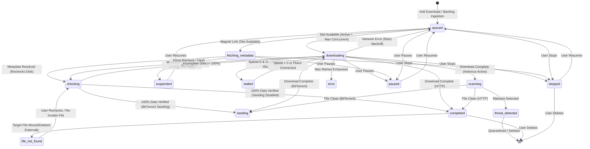

# Architecture Guide

Technical documentation for developers working on the My-IDM codebase.

---

## Table of Contents

- [Overview](#overview)
- [Module Map](#module-map)
- [Threading Model](#threading-model)
- [Data Flow](#data-flow)
- [Download Lifecycle & State Machine](#download-lifecycle--state-machine)
- [Concurrency & Queue Prioritization](#concurrency--queue-prioritization)
- [Database & Persistence Subsystem](#database--persistence-subsystem)
- [HTTP Engine Internals](#http-engine-internals)
- [BitTorrent Engine Subsystem](#bittorrent-engine-subsystem)
- [VPN & Network Privacy Subsystem](#vpn--network-privacy-subsystem)
- [Tor Privacy Subsystem](#tor-privacy-subsystem)
- [Antivirus & Security Subsystem](#antivirus--security-subsystem)
- [Backlog Processing Subsystem](#backlog-processing-subsystem)
- [Browser Integration Subsystem](#browser-integration-subsystem)
- [External Tools Subsystem](#external-tools-subsystem)
- [Window Lifecycle & System Tray Subsystem](#window-lifecycle--system-tray-subsystem)
- [Preferences & Configuration Architecture](#preferences--configuration-architecture)
- [Dynamic Filename Resolution & Crash Resilience](#dynamic-filename-resolution--crash-resilience)
- [GUI Architecture](#gui-architecture)
- [Key Design Decisions](#key-design-decisions)
- [Adding New Features](#adding-new-features)

---

## Overview

My-IDM follows a layered architecture with clear separation of concerns:

```
┌─────────────────────────────────────────────────┐
│                    GUI Layer                     │
│  MainWindow → DownloadTableModel → Delegates    │
│                    Dialogs                       │
├─────────────────────────────────────────────────┤
│               Manager Layer                      │
│         DownloadManager (QObject)                │
│   Orchestrates engines, DB, and GUI signals      │
├─────────────────────────────────────────────────┤
│               Engine Layer                       │
│     HTTPEngine          TorrentEngine            │
│   (asyncio/aiohttp)     (libtorrent)             │
├─────────────────────────────────────────────────┤
│               Data Layer                         │
│          Database (SQLite)                       │
│    DownloadEntry    SegmentEntry                 │
└─────────────────────────────────────────────────┘
```

---

## Module Map

```
my_idm/
├── __init__.py          # Package metadata, version string
├── main.py              # Entry point, CLI arg parsing, app setup
├── config.py            # General preferences (default directory, segments, concurrency)
├── database.py          # SQLite persistence, data classes
├── http_engine.py       # Segmented HTTP downloads with aiohttp
├── torrent_engine.py    # libtorrent wrapper for torrents
├── network.py           # Network interface info, proxy config, kill switch
├── network_dialog.py    # Network & VPN configuration dialog
├── security.py          # Antivirus scanners, URL inspection, quarantine
├── security_dialog.py   # Antivirus & malware security settings dialog
├── settings_dialog.py   # Unified Preferences dialog (General, Network, Security)
├── manager.py           # Central orchestrator (QObject with signals)
├── main_window.py       # QMainWindow with toolbar, menus, table, splitter
├── details_panel.py     # Bottom panel (Overview, Files, Peers, Trackers, Segments)
├── download_model.py    # QAbstractTableModel (13 columns)
├── delegates.py         # DownloadNameDelegate and ProgressBarDelegate for QTableView
├── dialogs.py           # AddDownloadDialog, MoveDialog, DeleteDialog
├── single_instance.py   # Single-instance enforcement via QLocalServer / QLocalSocket IPC
└── styles.py            # Dark theme QSS stylesheet, color palette
```

### Dependency Graph

```
main.py
  ├── single_instance.py
  ├── database.py
  ├── config.py
  ├── network.py
  ├── security.py
  ├── manager.py
  │     ├── database.py
  │     ├── config.py
  │     ├── network.py
  │     ├── security.py
  │     ├── http_engine.py
  │     │     └── database.py
  │     └── torrent_engine.py
  │           └── database.py
  ├── main_window.py
  │     ├── manager.py
  │     ├── settings_dialog.py
  │     ├── network_dialog.py
  │     ├── security_dialog.py
  │     ├── download_model.py
  │     │     ├── database.py (DownloadEntry)
  │     │     └── styles.py (Colors)
  │     ├── delegates.py
  │     │     └── styles.py (Colors)
  │     └── dialogs.py
  │           └── config.py
  └── styles.py
```

---

## Threading Model

My-IDM uses three execution contexts:

### 1. Qt Main Thread

- All GUI operations (widget updates, signal handling, user interaction)
- The `QApplication` event loop runs here
- `DownloadManager` lives here as a `QObject`
- Torrent polling timer (`_torrent_timer`, 1-second interval) runs here
- Retry timer (`_retry_timer`, 10-second interval) runs here

### 2. asyncio Background Thread

- A dedicated `threading.Thread` named `"idm-async"` runs an `asyncio` event loop
- All `aiohttp` I/O happens on this loop
- `HTTPEngine` coroutines run here
- Communication with the main thread:
  - **Main → Async**: `asyncio.run_coroutine_threadsafe(coro, loop)` to schedule downloads
  - **Async → Main**: Engine callbacks are invoked from the async thread; they call `DownloadManager` methods that emit Qt signals (which are cross-thread safe)

### 3. SQLite Thread Safety

- SQLite is opened with `check_same_thread=False` and `journal_mode=WAL`
- WAL mode allows concurrent reads with a single writer
- The `Database` class is accessed from both the main thread and the async thread
- Individual operations are atomic and committed immediately

```
┌──────────────────┐   signals    ┌──────────────────┐
│   Qt Main Thread │ ◄─────────── │  asyncio Thread  │
│                  │              │                  │
│  MainWindow      │  run_coro   │  HTTPEngine      │
│  DownloadManager │ ──────────► │  aiohttp tasks   │
│  TorrentEngine   │              │                  │
│  (polling timer) │              │                  │
└──────────────────┘              └──────────────────┘
         │                                │
         │        ┌──────────┐            │
         └───────►│  SQLite  │◄───────────┘
                  │   (WAL)  │
                  └──────────┘
```

---

## Data Flow

### Adding a Download

```
User clicks "Add URL"
  → AddDownloadDialog shown
  → User enters URL and clicks "Download"
  → MainWindow._on_add()
  → DownloadManager.add_download(url, save_path, segments)
    → Deduplication check: Database.find_by_url(url)
    → If duplicate and incomplete: resume existing entry
    → If new: Database.add_download(entry)
    → Emit download_added signal
    → _start_entry(entry):
        → If HTTP: asyncio.run_coroutine_threadsafe(http.add(entry))
        → If Torrent: torrent.add_torrent(entry)
  ← MainWindow._on_download_added(download_id)
    → DownloadTableModel.add_entry(entry)
```

### Progress Updates

```
# HTTP path:
aiohttp downloads chunk
  → HTTPEngine._emit_progress(id, downloaded, total, speed, eta)
  → DownloadManager._on_http_progress(...)  [callback, async thread]
  → Emit progress_updated signal           [cross-thread Qt signal]
  → MainWindow._on_progress_updated(...)   [main thread slot]
  → DownloadTableModel.update_progress(...)
  → dataChanged signal → QTableView repaints

# Torrent path:
QTimer fires every 1 second
  → DownloadManager._poll_torrents()
  → TorrentEngine.poll_all()
    → For each handle: handle.status()
    → TorrentEngine._progress_cb(...)
    → DownloadManager._on_torrent_progress(...)
    → Emit progress_updated signal
    → [same as HTTP from here]
```

### Automatic Retry Flow

```
Download fails with exception
  → HTTPEngine._run_download() catches it
  → HTTPEngine._handle_retry(entry, error_msg)
    → Database.increment_retry(id)
    → If retries < max_retries:
        → Database.update_status(id, "queued")
        → Emit status "queued"
    → Else:
        → Database.update_status(id, "error")
        → Emit status "error"

Every 10 seconds:
  → DownloadManager._process_retry_queue()
  → For each entry where status == "queued" and retry_count > 0:
    → _start_entry(entry)  [re-dispatch to engine]
```

---

## Download Lifecycle & State Machine

Every download entry in My-IDM progresses through a state machine managed by `DownloadManager` and synchronized with the SQLite database.



### Lifecycle States

| State | Protocol | Description | Active Slot? |
| :--- | :--- | :--- | :---: |
| `queued` | HTTP & Torrent | Awaiting available concurrent transfer slot or retry backoff window. | No |
| `downloading` | HTTP & Torrent | Actively streaming payload chunks across network sockets. | **Yes** |
| `fetching_metadata` | Torrent | Resolving magnet URI metadata via DHT/PEX before file allocation. | **Yes** |
| `stalled` | Torrent | Active transfer with 0 B/s speed and no connected peers for >45s. | **Yes** |
| `checking` | HTTP & Torrent | Validating on-disk chunks against torrent piece hash or HTTP segments. | **Yes** |
| `scanning` | HTTP & Torrent | Post-download antivirus scan running via Windows Defender or custom CLI. | No |
| `threat_detected` | HTTP & Torrent | Malicious signature detected; file quarantined or removed. | No |
| `completed` | HTTP & Torrent | Download finished and 100% verified on disk. | No |
| `seeding` | Torrent | BitTorrent payload complete; uploading to peers in the swarm. | No |
| `paused` | HTTP & Torrent | Paused by user; network connections closed, progress halted. | No |
| `stopped` | HTTP & Torrent | Stopped by user; excluded from automatic startup resumption. | No |
| `suspended` | Torrent | Metadata resolution timed out (> configured days); paused with 0 network usage. | No |
| `file_not_found` | HTTP & Torrent | Downloaded target file missing from configured destination path. | No |
| `error` | HTTP & Torrent | Unrecoverable failure or retry attempts exhausted. | No |

> [!NOTE]
> For dedicated, separate state diagrams for the HTTP and BitTorrent engines, detailed transition matrices, retry backoff algorithms, and fallback flows, refer to the [**State Machines & Lifecycle Architecture**](state-machines.md).

---

## Concurrency & Queue Prioritization

My-IDM enforces concurrency limits and strict queue priority ordering:

1. **Active Concurrency Counting**:
   - Downloads in `downloading`, `checking`, `fetching_metadata`, and `stalled` states consume concurrency slots.
   - Any currently dispatching entries (`_starting_downloads`) are counted to prevent race conditions during rapid batch additions.
2. **Queue Slot Allocation**:
   - If active downloads reach `max_concurrent_downloads`, newly added or resumed downloads remain in `queued`.
   - When an active download finishes (`completed`, `seeding`), pauses, stops, errors, or is deleted—or when the user increases the concurrency limit—`_process_queue()` automatically starts the next queued item.
3. **Priority Ordering Rules**:
   - Queued downloads are sorted by `(queue_order if queue_order > 0 else 999999, added_at or "")`.
   - Lower order numbers represent higher priority (`order 1` starts first).
   - Among items with equal or unassigned queue order, earlier additions are prioritized; the latest added download is processed last.
   - On application startup, downloads are auto-resumed in strict ascending queue order.
4. **Strict Pause State Protection**:
   - Paused, stopped, and suspended downloads are fully halted at the engine level (`lt.torrent_flags.auto_managed` unset and handle paused).
   - In-flight or lingering progress callbacks for paused/stopped/suspended tasks are immediately discarded and never emitted to the GUI or database.

---

## Database & Persistence Subsystem

My-IDM relies on SQLite configured with Write-Ahead Logging (`journal_mode=WAL`) and `check_same_thread=False` for atomic, concurrent local persistence across application sessions.

The persistence layer models three primary entities:
- **`downloads`**: Primary download records, status values, cryptographic hashes, queue order positions, and extensible attributes stored in `metadata_json`.
- **`segments`**: Parallel HTTP chunk ranges, byte offsets, downloaded totals, and per-segment states.
- **`ui_state`**: Key-value store persisting window geometries, splitter proportions, details panel visibility, and header column widths.

Data models are represented in memory using dataclasses ([`DownloadEntry`](file:///d:/Projects/my-idm/my_idm/database.py) and [`SegmentEntry`](file:///d:/Projects/my-idm/my_idm/database.py)), providing computed properties for progress calculations, dynamic metadata wrapping, and status representations.

> [!NOTE]
> For the exhaustive specification covering SQL column definitions, migration mechanics, query indexing strategy, CRUD APIs, and the full `metadata_json` contract, refer to the dedicated [**Database Architecture & Schema Specification**](database.md).

---

## HTTP Engine Internals

### Segmented Download Flow

```
_run_download(entry)
  │
  ├── _probe_url(url)           # HEAD request
  │     └── Returns: supports_range, total_size, etag, filename
  │
  ├── If supports_range AND total_size > 256 KiB:
  │     └── _segmented_download(entry, cancel_evt)
  │           ├── Load existing segments from DB (for resume)
  │           │   OR create new segments + pre-allocate file
  │           ├── For each incomplete segment:
  │           │     └── _download_one_segment(entry, seg, ...)
  │           │           ├── Range: bytes={start+downloaded}-{end}
  │           │           ├── Write chunks via f.seek(offset)
  │           │           ├── Update progress aggregate
  │           │           └── Retry loop (5 attempts, exp backoff)
  │           └── If _FallbackToSingle raised:
  │                 └── Delete segments, reset progress
  │
  └── Else (or on fallback):
        └── _single_download(entry, cancel_evt)
              ├── Resume from existing file size
              ├── Range: bytes={existing_size}-
              └── Append to file (or overwrite if server ignores range)
```

### Key Constants

| Constant | Value | Purpose |
|----------|-------|---------|
| `DEFAULT_SEGMENTS` | 8 | Number of parallel connections |
| `CHUNK_SIZE` | 64 KiB | Read buffer per iteration |
| `MAX_RETRIES_PER_SEGMENT` | 5 | Retry limit per segment |
| `RETRY_BASE_DELAY` | 1.0s | Exponential backoff base |
| `CONNECT_TIMEOUT` | 30s | TCP connection timeout |
| `READ_TIMEOUT` | 60s | Socket read timeout |

### Fallback Triggers

The segmented download falls back to single-stream when:
- `HEAD` response doesn't include `Accept-Ranges: bytes`
- Content-Length is unknown or too small (< 256 KiB)
- Any segment receives HTTP 416 (Range Not Satisfiable)
- Any segment receives HTTP 403 (Forbidden)
- Server returns 200 instead of 206 on a range request (segment index > 0)

### Pause/Resume Mechanism

**Pause:**
1. `cancel_evt.set()` — signals all active coroutines
2. Each segment saves its `downloaded_bytes` to the `segments` table
3. The active `aiohttp` task awaits completion (5s timeout, then cancel)
4. Status set to `"paused"`

**Resume:**
1. Load segments from DB with their saved offsets
2. Skip segments where `status == "completed"`
3. For each remaining segment, request `Range: bytes={start + downloaded_bytes}-{end}`
4. Continue writing at the correct file offset

---

## BitTorrent Engine Subsystem

BitTorrent downloads in My-IDM are managed by [`TorrentEngine`](file:///d:/Projects/my-idm/my_idm/torrent_engine.py), an abstraction layer wrapping `libtorrent`:
- **Alert Dispatching**: Periodically polls session alerts (`save_resume_data_alert`, DHT status, peer metadata) to update database state and GUI progress.
- **Asynchronous Metadata Resolution**: Resolves magnet URIs via DHT and PEX. Enforces a configurable timeout (`metadata_fetch_timeout_days`, default 1 day) that pauses handles, releases queue slots, and transitions stuck magnets to `'suspended'`.
- **Fastresume State Persistence**: Caches bencoded resume buffers (`~/.my-idm/fastresume/<id>.fastresume`) verified cryptographically against info-hashes to allow instantaneous session resumption without re-checking payloads.
- **Granular File Prioritization**: Allows skipping files (`Priority 0`) or prioritizing specific files (`Priority 7`) in multi-file torrent archives.

> [!NOTE]
> For complete details on swarm diagnostics, fastresume alert matching, piece allocation, and tracker tiers, refer to the dedicated [**BitTorrent Engine Architecture**](torrent.md).

---

## VPN & Network Privacy Subsystem

My-IDM provides native network adapter binding and IP leak prevention:
- **Socket Interface Binding**: Routes HTTP `aiohttp.TCPConnector` sockets and libtorrent listen/outgoing interfaces exclusively through a configured physical or virtual adapter (e.g. WireGuard, OpenVPN, Wintun).
- **Instant Kill Switch**: Actively monitors bound adapter status. If the VPN interface disconnects, the kill switch instantly pauses active downloads, halts the retry queue, and notifies the user via status bar badges.
- **Proxy Support**: Full support for HTTP and SOCKS5 proxies with optional authentication.

> [!NOTE]
> For the complete kill switch state machine, heuristic VPN detection, and proxy testing procedures, refer to the dedicated [**VPN & Network Privacy Architecture**](vpn.md).

---

## Tor Privacy Subsystem

My-IDM provides integrated Tor onion routing for maximum privacy:
- **Tor Service Manager**: Manages background `tor.exe` process lifecycle, automatic binary discovery, and port availability.
- **Selective Routing**: Configurable routing of HTTP downloads, torrent traffic, or both through local SOCKS5 proxy (`127.0.0.1:9050`).
- **Startup Gating & Clean Teardown**: Ensures Tor is verified reachable before routing traffic and guarantees background process termination upon application exit.

> [!NOTE]
> For Tor SOCKS5 routing, daemon lifecycle management, and privacy leak prevention, refer to the dedicated [**Tor Network Privacy Architecture**](tor.md).

---

## Antivirus & Security Subsystem

My-IDM implements a two-phase defense model to protect against malicious downloads:
- **Pre-Download Safety Inspection**: Inspects URLs, double extensions (e.g. `.pdf.exe`), bare IP hosts, and queries online reputation via VirusTotal v3 before writing bytes.
- **Post-Download Antivirus Scanning**: Automatically triggers asynchronous background scans upon completion using Windows Defender (`MpCmdRun.exe`) or configurable CLI scanners without blocking the UI thread.
- **Automated Remediation**: Configurable actions on detected threats (alert warning, `.quarantine_malware` isolation, or file deletion).

> [!NOTE]
> For scanner discovery logic, command-line arguments, VirusTotal API mechanics, and quarantine formatting, refer to the dedicated [**Antivirus & Security Architecture**](antivirus.md).

---

## Backlog Processing Subsystem

My-IDM supports unattended bulk download ingestion via text-based backlog queues:
- **Multi-Location Auto-Discovery**: Periodically scans project and user directories for `backlog.txt` files.
- **Flexible Directive Syntax**: Supports pipe-delimited paths, custom filenames, referer headers, and directory directives.
- **Auto-Clearing Lifecycle**: Processed lines are atomically cleared on success while failed lines are preserved for manual inspection.

> [!NOTE]
> For backlog file syntax, multi-directory polling, and line-level persistence rules, refer to the dedicated [**Backlog Processing Architecture**](backlog.md).

---

## Preferences & Configuration Architecture

Configuration in My-IDM is centralized across three coordinated layers:

```
┌────────────────────────────────────────────────────────────────────────┐
│                        Preferences System                              │
├────────────────────────────────────────────────────────────────────────┤
│  GeneralConfig  │ default_save_path, remember_last, segments, retries  │
│  NetworkConfig  │ interface_name, interface_ip, kill_switch, proxy     │
│  SecurityConfig │ scan_before, scan_after, scanner_type, virustotal    │
├────────────────────────────────────────────────────────────────────────┤
│                          Storage Layer                                 │
│            QSettings("MyIDM", "My-IDM") / Registry & ini               │
│               [General]       [Network]       [Security]               │
└────────────────────────────────────────────────────────────────────────┘
```

### Effective Save Path Resolution

When a download is added without an explicit save path:
1. If `remember_last_save_path` is enabled and `last_save_path` is a valid directory, `last_save_path` is used.
2. Otherwise, `default_save_path` is used if valid.
3. Falls back to the operating system's standard `~/Downloads` directory.

### Unified Settings Dialog

- **`my_idm/settings_dialog.py:SettingsDialog`** provides a comprehensive 3-tab interface:
  - **📁 General & Downloads**: Default folder picker, "Open Folder" shortcut, segments, concurrency, and startup behavior.
  - **🌐 Network & VPN**: Interface picker, kill switch, and proxy configuration with connection test.
  - **🛡️ Antivirus & Security**: Pre-download rules, VirusTotal API, scanner selection, and scanner diagnostic test.
- Navigation shortcuts: `Tools → Preferences…` (<kbd>Ctrl</kbd>+<kbd>,</kbd>) opens tab 0; `Tools → VPN & Network Settings…` opens tab 1; `Tools → Antivirus & Security Settings…` opens tab 2.

---

## Dynamic Filename Resolution & Crash Resilience

### Dynamic Filename Resolution

Downloads often start with generic or hashed URLs (e.g. `/download?id=12345` or magnet info-hashes). My-IDM dynamically discovers and updates the true filename:
1. **HTTP Headers**:
   - Parses `Content-Disposition` according to **RFC 6266** and **RFC 5987** (`filename*="UTF-8''..."`).
   - Follows HTTP 3xx redirects to inspect the terminal URL path.
2. **Torrent Metadata**:
   - Resolves the true name once the `.torrent` metadata exchange completes.
3. **Reactive Signal Propagation**:
   - Engine calls `filename_cb(download_id, resolved_name)`.
   - `DownloadManager` emits `filename_resolved(download_id, resolved_name)` to Qt main thread.
   - `DownloadTableModel.refresh_entry()` updates the UI without resetting the table scroll or selection.

### Crash Resilience & Auto-Resume

- **SQLite WAL Mode**: State is continually flushed to `~/.my-idm/downloads.db`.
- **Per-Segment Offset Tracking**: Incomplete HTTP downloads store byte progress per segment.
- **Startup Recovery**: When `auto_resume_startup` is enabled in `GeneralConfig`, `DownloadManager.start()` queries SQLite for any downloads left in `"downloading"` or `"checking"` states and automatically resumes them without losing downloaded chunks.

---

## GUI Architecture

### Widget Hierarchy

```
QMainWindow (MainWindow)
  ├── QMenuBar
  │     ├── File (Add Download, Add Torrent, Load Backlog, Exit)
  │     ├── Edit (Resume, Pause, Delete, Move, Recheck)
  │     ├── View (📋 Details Panel [F4], Select All, Sort By)
  │     ├── Tools (Preferences, VPN & Network Settings, Antivirus & Security Settings)
  │     └── Help (About)
  ├── QToolBar
  │     └── [➕ Add Download] | [▶ Play][⏸ Pause] | [🗑 Delete][📂 Move][🔄 Recheck] | [📄 Open File][📁 Open Folder] | [📋 Details Panel][⚙️ Preferences]
  ├── QSplitter (central widget, vertical orientation)
  │     ├── QTableView (top pane)
  │     │     ├── Model: DownloadTableModel
  │     │     ├── Delegate: DownloadNameDelegate (Name column)
  │     │     ├── Source Domain column (cyan URL hostname)
  │     │     └── Delegate: ProgressBarDelegate (Progress column)
  │     └── DetailsPanel (bottom pane, collapsible)
  │           ├── Header (Icon, Title, Transfer Type Badge, Open Folder, Close)
  │           └── QTabWidget
  │                 ├── Tab 0: 📋 Overview (Metrics grid: Status, Sizes, Speeds, ETA, Swarm/Segments, Path, Hash, Malware scan)
  │                 ├── Tab 1: 📁 Files (QTableWidget: #, Path, Size, Progress Bar, Priority QComboBox [High/Normal/Low/Skip], Status)
  │                 ├── Tab 2: 👥 Peers & Swarm (QTableWidget: IP:Port, Client, Progress %, Down Speed, Up Speed, Flags)
  │                 ├── Tab 3: 📡 Trackers (QTableWidget: Tier, URL, Status, Send Stats)
  │                 └── Tab 4: 🧩 Segments (QTableWidget: Segment #, Byte Range, Downloaded, Progress Bar, Status)
  └── QStatusBar
        ├── Status label
        ├── VPN / Network badge (clickable)
        ├── Speed label
        └── Count label
```

### Details Panel Architecture

The bottom details panel provides real-time, in-depth telemetry for the download selected in the primary table:

1. **Splitter & Resizing**:
   - `MainWindow` hosts `self._splitter = QSplitter(Qt.Orientation.Vertical)`.
   - The splitter position and panel visibility are preserved in `QSettings("MyIDM", "My-IDM")` via `splitter_state` and `details_visible`.
   - Users can toggle the panel with <kbd>F4</kbd>, the toolbar button, the `View` menu, or the panel's close button.

2. **Telemetry & Query Delegation**:
   - `DownloadManager` exposes inspection endpoints:
     - `get_download_files(download_id: str) -> list[dict]`
     - `set_torrent_file_priority(download_id: str, file_index: int, priority: int) -> bool`
     - `get_torrent_peers(download_id: str) -> list[dict]`
     - `get_torrent_trackers(download_id: str) -> list[dict]`
     - `get_download_segments(download_id: str) -> list[SegmentEntry]`
   - For torrents, `TorrentEngine` translates queries directly into libtorrent's `torrent_handle` APIs (`file_progress()`, `file_priorities()`, `get_peer_info()`, `trackers()`).
   - For HTTP downloads, `Database.get_segments()` returns active chunk ranges and downloaded byte counts.

3. **Live Sync & UI Performance**:
   - A dedicated 1-second `QTimer` in `MainWindow` drives periodic updates while keeping the UI responsive.
   - Signal connections on `_on_status_changed` and `_on_filename_resolved` trigger immediate refreshes when state changes occur.
   - When updating file tables, cell widgets (such as the priority `QComboBox` and `QProgressBar`) maintain their state to prevent cursor flickering or unnecessary re-renders.

### Model-View Architecture

```
DownloadTableModel (QAbstractTableModel)
  │
  ├── _entries: list[DownloadEntry]     # In-memory data
  ├── _id_to_row: dict[str, int]        # Fast lookup
  │
  ├── load_entries([entries])            # Full reset (startup)
  ├── add_entry(entry)                   # Insert row
  ├── remove_entry(download_id)          # Remove row
  ├── update_progress(id, ...)           # Efficient partial update
  ├── update_status(id, status)          # Status + color update
  └── refresh_entry(id, entry)           # Full row refresh
```

### Column Definitions

Defined in the `Col` class as integer constants:

```python
class Col:
    QUEUE = 0          # Active queue position
    NAME = 1           # Filename or URL[:60]
    SOURCE_DOMAIN = 2  # Extracted URL hostname
    SIZE = 3           # humanize.naturalsize(total_size)
    PROGRESS = 4       # dict → ProgressBarDelegate
    STATUS = 5         # Capitalized status with color
    SPEED = 6          # Speed or upload speed
    ETA = 7            # Estimated time remaining
    SEEDS_PEERS = 8    # "S:5 P:12" or "8 seg"
    ADDED = 9          # ISO → "YYYY-MM-DD HH:MM"
    LAST_TRIED = 10    # ISO → "YYYY-MM-DD HH:MM"
    COMPLETED = 11     # ISO → "YYYY-MM-DD HH:MM"
    SAVE_PATH = 12     # Directory path
```

### Source Domain Column

The `SOURCE_DOMAIN` column displays the hostname extracted from each download URL or magnet tracker/webseed. It is rendered separately from the filename in the `NAME` column, formatted with a cyan foreground role, and supports sorting. The `NAME` column remains dedicated to the filename or fallback URL, while its decoration role provides file-type and Tor routing icons.

### ProgressBarDelegate

The progress column uses a custom `QStyledItemDelegate` that:

1. Receives a `dict` with `{"progress": float, "status": str}` from the model
2. Draws a rounded rectangle background track
3. Fills a proportional rounded rectangle with a gradient based on status color
4. Overlays the percentage text in bold

Colors per status:
- Downloading → `#1f6feb` (blue)
- Completed → `#238636` (green)
- Scanning → `#39c5bb` (cyan)
- Threat Detected → `#da3633` (red)
- Paused → `#9e6a03` (amber)
- Error → `#da3633` (red)
- Seeding → `#8957e5` (purple)

### Interactive Table Sorting Architecture

`DownloadTableModel.sort(column, order)` implements data-type-aware comparator logic:
- **Col.NAME**: Natural case-insensitive string sorting.
- **Col.SOURCE_DOMAIN**: Case-insensitive hostname sorting.
- **Col.SIZE**: Numerical comparison based on `entry.total_size` in bytes.
- **Col.PROGRESS**: Float percentage comparison `entry.progress`.
- **Col.STATUS**: String comparison of localized status string.
- **Col.SPEED**: Float bytes-per-second comparison `entry.speed`.
- **Col.ETA**: Smart ETA sorting — active downloads with numeric ETA rank before inactive ones (`—`).
- **Col.ADDED / LAST_TRIED / COMPLETED**: Datetime-aware comparisons with uncompleted downloads sorted to the bottom.
- **Selection Preservation**: Before sorting, row IDs of selected items are remembered; after sorting, QItemSelectionModel re-selects the corresponding rows at their new visual indexes.

### Column Width Persistence

1. **Restoration**: On startup, `MainWindow._setup_table()` checks `QSettings("MyIDM", "My-IDM")` for `column_widths`. If present, applies each saved width to the table header.
2. **Persistence**: The header's `sectionResized` signal connects to `MainWindow._save_column_widths()`, saving interactive width adjustments immediately to `QSettings`.

### Signal Flow

```
DownloadManager signals:
  progress_updated(str, int, int, float, float, int, int, float)
    → MainWindow._on_progress_updated → model.update_progress

  status_changed(str, str, str)
    → MainWindow._on_status_changed → model.update_status

  filename_resolved(str, str)
    → MainWindow._on_filename_resolved → model.refresh_entry

  download_added(str)
    → MainWindow._on_download_added → model.add_entry

  download_removed(str)
    → MainWindow._on_download_removed → model.remove_entry

  download_moved(str)
    → MainWindow._on_download_moved → model.refresh_entry

  network_config_changed(object)
    → MainWindow._update_vpn_status_badge

  threat_detected(str, str)
    → MainWindow._on_threat_detected → QMessageBox warning
```

---

## Browser Integration Subsystem

My-IDM provides a zero-install-friction browser extension workflow using an unpacked Manifest V3 Chrome extension communicating with an embedded loopback REST server.

### Architecture Overview

```
┌────────────────────────────────┐         REST HTTP (127.0.0.1:19582)        ┌────────────────────────────────┐
│   Chrome Browser (MV3)         │ ─────────────────────────────────────────> │   My-IDM Core                  │
│                                │                                            │                                │
│ • downloads.onDeterminingFilename                                           │ • browser_server.py (aiohttp)  │
│ • contextMenus ("Download")    │ <───────────────────────────────────────── │ • DownloadManager.add_url()    │
│ • cookies.getAll()             │           {"status": "ok", "id": "..."}    │ • Cookie & Header propagation  │
└────────────────────────────────┘                                            └────────────────────────────────┘
```

1. **Loopback Server (`browser_server.py`)**: Runs on `http://127.0.0.1:19582` within the asyncio thread.
   - `GET /health` — Heartbeat verification and status reporting.
   - `POST /add` — Ingests download URLs with target filename, cookies, referrer, and user-agent.
   - `GET /config` — Queries user settings (e.g. bypass extensions or auto-download toggles).
2. **Manifest V3 Extension (`browser_extension/`)**:
   - Intercepts browser download initiations, cancels Chrome's built-in download, queries exact session cookies for the domain via `chrome.cookies.getAll()`, and posts to My-IDM.
   - Bypassed if the user holds <kbd>Alt</kbd> during click or if file types match user bypass list.
   - Provides right-click context menu: **"Download with My-IDM"** for links and media.
3. For exhaustive details, see [**Browser Integration Architecture**](browser-integration.md).

---

## External Tools Subsystem

My-IDM allows integration with companion scrapers and download tools (e.g., AnimePahe downloader).

1. **Process Management**:
   - `ExternalToolsManager` launches CLI scrapers as subprocesses, streaming logs directly into real-time buffers.
2. **Embedded Console & Browser Subtabs**:
   - The bottom panel features an embedded real-time Console tab to view live stdout/stderr.
   - Web-based tools or automation views can be docked inside an embedded browser subtab.
3. **Status Bar Indicators**:
   - A dedicated footer badge indicates tool status, allows toggling background execution, and triggers quick log inspection.

---

## Window Lifecycle & System Tray Subsystem

My-IDM supports persistent background operations through Windows system tray integration, window minimize/close event interception, desktop completion notifications, and one-click global queue controls.

1. **System Tray Integration (`QSystemTrayIcon`)**:
   - Resides in the Windows notification area with dynamic Show/Hide window toggling, Pause All Downloads, Resume All Downloads, Preferences, and Exit controls.
2. **Minimize & Close Interceptions**:
   - `changeEvent` intercepts window minimization and routes it to the tray without taskbar clutter.
   - `closeEvent` intercepts window close (`X` button), ignoring termination and keeping downloads and swarm seeding running in the background.
3. **Clean Teardown**:
   - `MainWindow._exit_app()` bypasses close-to-tray, gracefully flushes SQLite states, halts background threads (`HTTPEngine`, `TorrentEngine`, `TorServiceManager`), and closes cleanly.
4. For exhaustive details, see [**Window Lifecycle & System Tray Architecture**](window-system-tray.md).

---

## Key Design Decisions

### Why asyncio in a separate thread?

Qt has its own event loop. Rather than using `qasync` (which can have compatibility issues), we run a vanilla `asyncio` loop in a daemon thread. Communication is achieved via:
- `asyncio.run_coroutine_threadsafe()` for main → async
- Qt signals (thread-safe) for async → main

### Why synchronous SQLite instead of aiosqlite?

The original plan included `aiosqlite`, but synchronous SQLite with `check_same_thread=False` is simpler and sufficient:
- Individual DB operations are fast (< 1ms)
- WAL mode prevents write locks from blocking reads
- The complexity of async DB access isn't justified for this workload

### Why callbacks instead of signals in engines?

The HTTP and Torrent engines use plain Python callbacks instead of Qt signals because:
- They run in non-Qt threads (asyncio loop)
- The manager translates callbacks → Qt signals for thread safety
- This keeps the engines decoupled from Qt

### Why pre-allocate files for segmented downloads?

The file is `truncate()`d to its full size before downloading begins. This allows multiple segments to `seek()` and write to their assigned offsets concurrently without conflicts, using `open(file, "r+b")`.

---

## Adding New Features

### Adding a New Column

1. Add a constant to `Col` in `download_model.py` and update `HEADERS` list
2. Add display logic in `DownloadTableModel._display_data()`
3. Set column width in `MainWindow._setup_ui()`
4. If needed, add a field to `DownloadEntry` in `database.py`

### Adding a New Download Engine

1. Create `my_idm/new_engine.py` with `start()`, `stop()`, `add()`, `pause()`, `resume()`, `cancel()` methods
2. Accept a `Database` instance and progress/status callbacks
3. Register it in `DownloadManager.__init__()`
4. Update `_detect_type()` and `_start_entry()` in `manager.py`
5. Add polling if the engine doesn't push updates

### Adding a New Action

1. Create a `QAction` in `MainWindow._setup_actions()`
2. Add it to the toolbar in `_setup_toolbar()` and/or menu in `_setup_menubar()`
3. Add it to the context menu in `_show_context_menu()`
4. Implement the handler method (e.g., `_on_new_action()`)
5. If it needs manager support, add a method to `DownloadManager`
