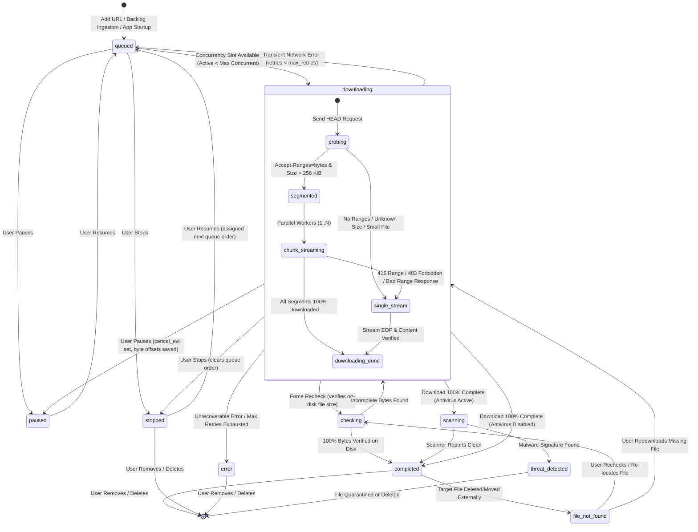
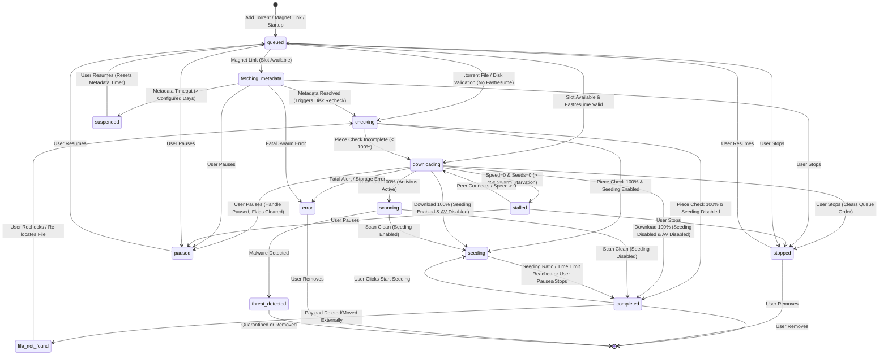

# State Machines & Lifecycle Architecture: HTTP vs BitTorrent

This document provides dedicated, comprehensive state diagrams and transition specifications for both transfer engines in **My-IDM**:
1. **HTTP Engine** ([`my_idm.http_engine.HTTPEngine`](file:///d:/Projects/my-idm/my_idm/http_engine.py)) — multi-segment parallel HTTP/HTTPS streaming with asyncio.
2. **BitTorrent Engine** ([`my_idm.torrent_engine.TorrentEngine`](file:///d:/Projects/my-idm/my_idm/torrent_engine.py)) — peer-to-peer swarm transfer with `libtorrent`.

Both engines are orchestrated by [`DownloadManager`](file:///d:/Projects/my-idm/my_idm/manager.py) and backed by SQLite persistence ([`my_idm.database.Database`](file:///d:/Projects/my-idm/my_idm/database.py)).

---

## Table of Contents

- [Overview](#overview)
- [HTTP Download State Machine](#http-download-state-machine)
  - [HTTP State Diagram](#http-state-diagram)
  - [HTTP State Definitions](#http-state-definitions)
  - [HTTP State Transition Matrix](#http-state-transition-matrix)
  - [HTTP Retry & Backoff Mechanics](#http-retry--backoff-mechanics)
  - [HTTP Segmented to Single-Stream Fallback](#http-segmented-to-single-stream-fallback)
- [BitTorrent Swarm State Machine](#bittorrent-swarm-state-machine)
  - [BitTorrent State Diagram](#bittorrent-state-diagram)
  - [BitTorrent State Definitions](#bittorrent-state-definitions)
  - [BitTorrent State Transition Matrix](#bittorrent-state-transition-matrix)
  - [BitTorrent Metadata Lifecycle & Suspended State](#bittorrent-metadata-lifecycle--suspended-state)
  - [BitTorrent Seeding & Upload Bandwidth Control](#bittorrent-seeding--upload-bandwidth-control)
  - [Fastresume & Piece Verification Lifecycle](#fastresume--piece-verification-lifecycle)
- [Side-by-Side Protocol Comparison](#side-by-side-protocol-comparison)
  - [State Presence & Slot Allocation Matrix](#state-presence--slot-allocation-matrix)
  - [Core Differences Summary](#core-differences-summary)
- [Architectural References](#architectural-references)

---

## Overview

While HTTP and BitTorrent transfers share a common representation in the GUI (`DownloadEntry`), their underlying mechanics, failure modes, concurrency requirements, and network protocols differ substantially:

| Dimension | HTTP / HTTPS | BitTorrent Swarm |
| :--- | :--- | :--- |
| **Transport Model** | Client-to-server (TCP/TLS) | Decentralized peer-to-peer swarm (TCP/uTP/UDP) |
| **Concurrency Unit** | Fixed parallel segment chunks (default: 8) | Dynamic peer connections across swarm |
| **Integrity Model** | Optional Content-Length / Range validation | SHA-1 / SHA-256 cryptographic piece hashing |
| **Pre-Allocation** | File sparse truncated before parallel write | Piece map allocation via storage allocation mode |
| **Post-Download** | Terminal state reached (`completed`) | Uploads payload to swarm peers (`seeding`) |
| **Startup Discovery** | Direct HTTP HEAD/GET probe | DHT, PEX, LSD, and multi-tier tracker announces |
| **Stall Condition** | Connection timeout or HTTP error code | Swarm starvation (0 seeds, 0 B/s for >45s) |

---

## HTTP Download State Machine

The HTTP engine manages file transfers over HTTP/1.1 and HTTP/2 using `aiohttp` on a dedicated asyncio background thread (`idm-async`). It supports dynamic probe negotiation, automatic multi-segment chunking, fallback to single-stream download, exponential backoff retries, and post-download security inspection.

### HTTP State Diagram



### HTTP State Definitions

- **`queued`**: Download is registered in SQLite but waiting for an active concurrency slot (`len(active_downloads) >= max_concurrent_downloads`) or waiting for a retry backoff timer to expire. Consumes **0** concurrency slots.
- **`downloading`**: Actively executing on the `idm-async` thread. Pre-allocates target file, manages parallel chunk connections, streams bytes to disk, and updates progress aggregates. Consumes **1** concurrency slot.
- **`paused`**: User requested pause. `cancel_evt` is triggered; segment offsets are committed to SQLite; open network sockets are closed. In-flight callbacks are suppressed. Consumes **0** concurrency slots.
- **`stopped`**: User requested stop. Transfers halt immediately and `queue_order` is set to `0`. Excluded from automatic startup resumption. Consumes **0** concurrency slots.
- **`checking`**: Verifies local file size and segment integrity against target size. Consumes **1** concurrency slot.
- **`scanning`**: Download finished writing to disk; asynchronous background thread runs configured antivirus scanner (Windows Defender or custom CLI). Consumes **0** concurrency slots.
- **`threat_detected`**: Security scanner detected malware. Target file is isolated in quarantine or deleted. Consumes **0** concurrency slots.
- **`completed`**: File successfully written, verified, and scanned clean. Final file modification timestamp set. Consumes **0** concurrency slots.
- **`file_not_found`**: The destination file on disk was moved, renamed, or deleted outside of My-IDM. Consumes **0** concurrency slots.
- **`error`**: Fatal error occurred (e.g. HTTP 404, disk full, or retry limit exceeded). Consumes **0** concurrency slots.

### HTTP State Transition Matrix

| Source State | Target State | Trigger Condition | Concurrency Slot | Database / Engine Action |
| :--- | :--- | :--- | :---: | :--- |
| `[*]`, New | `queued` | User adds HTTP/HTTPS URL or backlog line | None | Creates `DownloadEntry`, calculates queue order. |
| `queued` | `downloading` | Concurrency check passes (`active < max`) | Consumes slot | Calls `HTTPEngine.add()`, schedules async task. |
| `downloading` | `queued` | Connection drop, timeout, or transient error | Releases slot | Increments `retry_count`, calculates `next_retry_at`. |
| `downloading` | `error` | `retry_count >= max_retries` or 404/410 HTTP error | Releases slot | Updates status to `'error'`, records error text. |
| `downloading` | `paused` | User clicks Pause | Releases slot | Sets `cancel_evt`, flushes segment offsets to DB. |
| `paused` | `queued` | User clicks Resume | None | Updates status to `'queued'`, awaits dispatcher. |
| `downloading` | `stopped` | User clicks Stop | Releases slot | Halts task, unsets queue order (`queue_order = 0`). |
| `stopped` | `queued` | User clicks Resume | None | Re-assigns tail queue order, marks `'queued'`. |
| `downloading` | `scanning` | All segments complete & AV enabled | Releases slot | Launches background daemon scan thread (`scan-<id>`). |
| `downloading` | `completed` | All segments complete & AV disabled | Releases slot | Marks `'completed'`, records completion timestamp. |
| `scanning` | `completed` | Antivirus scan returns exit code 0 (clean) | None | Updates scan status to `'clean'`, marks completed. |
| `scanning` | `threat_detected`| Antivirus detects malware signature | None | Quarantines file, sets status `'threat_detected'`. |
| `completed` | `file_not_found` | User attempts to open file missing on disk | None | Updates status to `'file_not_found'`. |
| `file_not_found`| `checking` | User clicks Force Recheck | Consumes slot | Verifies disk path and existing byte boundaries. |

### HTTP Retry & Backoff Mechanics

When an active HTTP download experiences a transient error (socket timeout, connection reset, HTTP 500/502/503/504), My-IDM prevents network thundering herds using exponential backoff:

$$\text{delay} = \text{retry\_base\_delay} \times (2^{\text{retry\_count} - 1})$$

1. **Failure Interception**: `HTTPEngine._run_download()` intercepts network exceptions (`aiohttp.ClientError`, `asyncio.TimeoutError`).
2. **Backoff Scheduling**:
   - `Database.increment_retry(download_id)` increments `retry_count`.
   - If `retry_count < max_retries` (default: 5), status is set to `'queued'`.
   - The timestamp for `next_retry_at` is updated in the database.
3. **Queue Re-Processing**:
   - The 10-second `QTimer` (`_retry_timer`) runs `DownloadManager._process_retry_queue()`.
   - Any queued download whose `next_retry_at <= now` is dispatched if concurrency slots allow.
4. **Permanent Failure**:
   - Once retries are exhausted, the download transitions to `'error'` and notifications are displayed.

### HTTP Segmented to Single-Stream Fallback

My-IDM dynamically adapts to server capabilities:

```
Probing URL with HEAD request:
  ├── Server returns 200 OK + "Accept-Ranges: bytes" + Content-Length > 256 KiB
  │     └── PROCEED with Segmented Download (N connections, default: 8)
  │
  └── Server returns no Accept-Ranges OR Content-Length missing/small
        └── FALLBACK to Single-Stream Download (1 connection)

During Segmented Download:
  ├── Any segment receives HTTP 416 (Range Not Satisfiable)
  ├── Any segment receives HTTP 403 (Forbidden)
  └── Non-zero segment receives HTTP 200 instead of HTTP 206 Partial Content
        └── ABORT Segmented: Drop chunk metadata, switch to Single-Stream
```

---

## BitTorrent Swarm State Machine

The BitTorrent engine manages peer-to-peer swarms using `libtorrent`. It supports `.torrent` file parsing, magnet URI discovery via DHT/PEX, asynchronous metadata resolution, metadata timeouts, piece validation, stalled swarm detection, seeding uploads, and fastresume caching.

### BitTorrent State Diagram



### BitTorrent State Definitions

- **`queued`**: Awaiting an active concurrency slot. Handle is paused or not yet added to session. Consumes **0** concurrency slots.
- **`fetching_metadata`**: Connecting to DHT, PEX, and trackers to resolve the torrent descriptor dictionary for a magnet URI. Consumes **1** concurrency slot.
- **`suspended`**: Magnet metadata resolution remained stalled longer than `metadata_fetch_timeout_days` (default: 1 day). The handle is paused with `auto_managed=False` (0 network traffic), and `queue_order` is set to `0`, yielding the slot to queued downloads. Consumes **0** concurrency slots.
- **`checking`**: Verifying piece hashes against existing disk data, either during initial fastresume validation or manual **Force Recheck**. Consumes **1** concurrency slot.
- **`downloading`**: Actively requesting and receiving piece blocks from swarm peers. Consumes **1** concurrency slot.
- **`stalled`**: Download has 0 B/s transfer speed and 0 connected seeds for over 45 consecutive seconds. Consumes **1** concurrency slot (remains active to discover new peers).
- **`scanning`**: Payload download finished 100%; post-download antivirus scan running asynchronously. Consumes **0** concurrency slots.
- **`seeding`**: 100% of torrent payload downloaded and verified; serving upload pieces to swarm peers. **Does NOT consume a downloading concurrency slot.**
- **`paused`**: User requested pause on downloading/queued torrent. Handle paused via `handle.pause(flags=graceful_pause)`, auto-managed flag cleared, lingering progress callbacks discarded. Consumes **0** concurrency slots.
- **`stopped`**: User requested stop on downloading/queued torrent. Handle stopped, queue order cleared. Consumes **0** concurrency slots.
- **`threat_detected`**: Security scanner detected infected files within torrent payload. Consumes **0** concurrency slots.
- **`completed`**: Download finished, verified, and seeding terminated or disabled. Consumes **0** concurrency slots.
- **`file_not_found`**: Verified payload files missing from download path. Consumes **0** concurrency slots.
- **`error`**: libtorrent alert fatal failure (e.g. disk write failure, corrupt torrent file). Consumes **0** concurrency slots.

### BitTorrent State Transition Matrix

| Source State | Target State | Trigger Condition | Concurrency Slot | Engine / Manager Action |
| :--- | :--- | :--- | :---: | :--- |
| `[*]`, New | `queued` | Magnet link or `.torrent` file added | None | Adds entry to DB with queue order position. |
| `queued` | `fetching_metadata` | Slot available & entry is magnet link | Consumes slot | Calls `TorrentEngine.add_torrent()`, polls DHT/PEX. |
| `queued` | `downloading` | Slot available & `.torrent` has metadata | Consumes slot | Resumes handle (`handle.resume()`), unchokes peers. |
| `fetching_metadata` | `suspended` | `now - fetching_metadata_since > timeout` | Releases slot | Pauses handle, unsets `auto_managed`, sets `queue_order=0`. |
| `suspended` | `queued` | User clicks Resume | None | Resets `fetching_metadata_since`, queues entry. |
| `fetching_metadata` | `checking` | Metadata received via DHT/PEX | Slot maintained | Resolves name/file tree, invokes `handle.force_recheck()` to inspect on-disk files. |
| `downloading` | `stalled` | Speed = 0 & Seeds = 0 for > 45 seconds | Slot maintained | Emits status `'stalled'`; keeps searching DHT/trackers. |
| `stalled` | `downloading` | Speed > 0 or seeds connect | Slot maintained | Emits status `'downloading'`. |
| `downloading` | `checking` | User triggers Force Recheck | Slot maintained | Calls `handle.force_recheck()`, begins piece hashing. |
| `checking` | `downloading` | Piece checking completes (< 100%) | Slot maintained | Resumes piece downloading from incomplete offsets. |
| `downloading` | `scanning` | 100% pieces verified & AV enabled | Releases slot | Triggers async antivirus scanner thread. |
| `downloading` | `seeding` | 100% pieces verified & seeding enabled | Releases slot | Updates status to `'seeding'`, applies upload rate limits. |
| `downloading` | `completed` | 100% pieces verified & seeding disabled | Releases slot | Unsets handle or pauses, marks `'completed'`. |
| `seeding` | `completed` | Seeding ratio/timer reached, or user clicks Pause / Stop | None | Halts handle seeding, marks `'completed'`. |
| `completed` | `seeding` | User clicks Start Seeding in context menu | None | Resumes handle, applies upload limits, marks `'seeding'`. |
| Any Downloading | `paused` | User clicks Pause | Releases slot | Calls `handle.pause()`, clears auto-managed flag. |
| `paused` | `queued` | User clicks Resume | None | Sets status `'queued'`, awaits queue processor. |
| Any Downloading | `stopped` | User clicks Stop | Releases slot | Pauses handle, sets `queue_order = 0`. |
| `completed` | `completed` | User clicks Pause or Stop | None | No-op (terminal completed state is preserved). |

> [!NOTE]
> **Completed State Idempotence**: Invoking Pause or Stop on a transfer that is already in the `completed` state is a no-op (the transfer remains safely completed). Invoking Pause or Stop on an actively `seeding` transfer halts upload activity and transitions it cleanly to `completed`.

### BitTorrent Metadata Lifecycle & Suspended State

When a magnet link is added, it has only a cryptographic info-hash and tracker URIs:

```
User adds magnet:?xt=urn:btih:<hash>
  │
  ├── Entry marked "queued" (queue_order assigned)
  ├── When concurrency slot opens:
  │     ├── Transitions to "fetching_metadata"
  │     ├── fetching_metadata_since = now (persisted in metadata_json)
  │     └── Connects to DHT swarm + announces to trackers
  │
  ├── Swarm peer transmits metadata:
  │     ├── metadata_received_alert received
  │     ├── Dynamic filename resolved from torrent name
  │     ├── File hierarchy parsed & saved to database
  │     ├── fetching_metadata_since cleared
  │     ├── handle.force_recheck() invoked to verify existing files on disk
  │     └── Transitions to "checking"
  │           ├── 100% verified on disk ──> "seeding" (or "completed")
  │           └── < 100% verified ────────> "downloading"
  │
  └── No peers provide metadata for > metadata_fetch_timeout_days (default: 1 day):
        ├── Transitions to "suspended"
        ├── libtorrent handle.pause(flags=graceful_pause)
        ├── lt.torrent_flags.auto_managed cleared (0 network usage)
        ├── queue_order reset to 0 (frees slot for active queue)
        └── Suspended state preserved across app reboots
```

### BitTorrent Seeding & Upload Bandwidth Control

Once a torrent finishes downloading 100% of its pieces, it transitions into the **Seeding Subsystem**:

1. **Non-Blocking Concurrency**:
   - `DownloadManager._process_queue()` defines active downloading states as:
     $$\text{ACTIVE\_STATES} = \{\text{'downloading'}, \text{'checking'}, \text{'fetching\_metadata'}, \text{'stalled'}\}$$
   - Because `'seeding'` is **excluded** from `ACTIVE_STATES`, transitioning to seeding immediately yields a concurrency slot, allowing the next queued download to begin downloading.
2. **Bandwidth Throttling**:
   - Configurable in BitTorrent Settings (`max_seeding_speed` and `download_to_seeding_ratio`).
   - If a global download speed limit $D$ is configured with ratio $R$, the derived limit is $U_{\text{ratio}} = D / R$.
   - The effective upload limit applied to the libtorrent session or handle is:
     $$U_{\text{effective}} = \min(U_{\text{configured}}, U_{\text{ratio}}) \quad (\text{for non-zero values})$$

### Fastresume & Piece Verification Lifecycle

To avoid lengthy SHA-1 hashing of multi-gigabyte files on startup, My-IDM maintains bencoded `.fastresume` files:

```
Torrent in Progress / Pausing:
  ├── handle.save_resume_data(flags=only_if_modified)
  ├── libtorrent emits save_resume_data_alert
  ├── Matches alert handle with download_id and info_hash
  └── Atomically writes ~/.my-idm/fastresume/<id>.fastresume

Application Startup / Resuming:
  ├── Loads ~/.my-idm/fastresume/<id>.fastresume
  ├── Cryptographic Integrity Check:
  │     └── Validates cached info-hash matches entry URL / torrent
  ├── Match PASS:
  │     └── lt.read_resume_data() bypasses re-check; instant download
  └── Match FAIL / Missing Cache:
        └── Enters "checking" state; full piece verification from disk
```

---

## Side-by-Side Protocol Comparison

### State Presence & Slot Allocation Matrix

| State Name | HTTP Engine | BitTorrent Engine | Consumes Concurrency Slot? | Description |
| :--- | :---: | :---: | :---: | :--- |
| `queued` | ✅ | ✅ | **No** | Waiting in queue or waiting on backoff timer. |
| `downloading` | ✅ | ✅ | **Yes** | Actively streaming bytes or requesting swarm pieces. |
| `fetching_metadata` | ❌ | ✅ | **Yes** | Resolving magnet link metadata via DHT/PEX. |
| `suspended` | ❌ | ✅ | **No** | Metadata fetch timed out; paused, 0 bandwidth, order=0. |
| `stalled` | ❌ | ✅ | **Yes** | Swarm starved (0 B/s & 0 seeds for >45s). |
| `checking` | ✅ | ✅ | **Yes** | Validating disk bytes or cryptographic piece hashes. |
| `scanning` | ✅ | ✅ | **No** | Post-download antivirus scan running in background. |
| `seeding` | ❌ | ✅ | **No** | Uploading completed payload to peer swarm. |
| `threat_detected` | ✅ | ✅ | **No** | Malicious content detected; isolated or removed. |
| `completed` | ✅ | ✅ | **No** | Transfer 100% verified on disk and clean. |
| `paused` | ✅ | ✅ | **No** | User halted transfer; sockets closed, offsets saved. |
| `stopped` | ✅ | ✅ | **No** | User stopped transfer; excluded from startup auto-resume. |
| `file_not_found` | ✅ | ✅ | **No** | Completed file missing from destination folder. |
| `error` | ✅ | ✅ | **No** | Terminal failure or retry attempts exhausted. |

### Core Differences Summary

1. **State Space Asymmetry**:
   - BitTorrent includes 4 exclusive states: `fetching_metadata`, `suspended`, `stalled`, and `seeding`.
   - HTTP uses sub-states within `downloading` (`probing`, `segmented`, `single_stream`) rather than exposing separate top-level states.
2. **Active Concurrency Slot Accounting**:
   - In HTTP, only `downloading` and `checking` consume concurrency slots.
   - In BitTorrent, `downloading`, `checking`, `fetching_metadata`, and `stalled` consume slots.
   - In both engines, `scanning`, `seeding`, `paused`, `stopped`, and `suspended` **never** consume downloading slots.
3. **Pause & Resume Implementation**:
   - **HTTP**: Cooperative cancellation via `asyncio.Event` (`cancel_evt`). Each segment saves its current byte offset to the `segments` table in SQLite before closing the connection. Resuming issues HTTP range headers for `bytes={offset}-{end}`.
   - **BitTorrent**: Direct call to `libtorrent.torrent_handle.pause()`. Session saves bencoded piece bitmasks into fastresume files. Resuming invokes `handle.resume()` with cached piece maps.
4. **Retry Dynamics**:
   - **HTTP**: Discrete attempt counter (`retry_count`) with exponential backoff algorithm handled by `DownloadManager._retry_timer`.
   - **BitTorrent**: Autonomous continuous peer retry managed internally by `libtorrent` session; if a tracker or peer fails, the swarm engine continuously fails over to alternate peers, DHT nodes, and fallback trackers.

---

## Architectural References

- [`my_idm.manager.DownloadManager`](file:///d:/Projects/my-idm/my_idm/manager.py) — Central state orchestrator and Qt signal hub.
- [`my_idm.http_engine.HTTPEngine`](file:///d:/Projects/my-idm/my_idm/http_engine.py) — Segmented asyncio HTTP engine.
- [`my_idm.torrent_engine.TorrentEngine`](file:///d:/Projects/my-idm/my_idm/torrent_engine.py) — libtorrent swarm transfer engine.
- [`my_idm.database.Database`](file:///d:/Projects/my-idm/my_idm/database.py) — SQLite schema, transitions, and `metadata_json` storage.
- [BitTorrent Engine Architecture](torrent.md) — Swarm telemetry, trackers, and file priorities.
- [System Architecture](main.md) — High-level threading model and component workflows.
