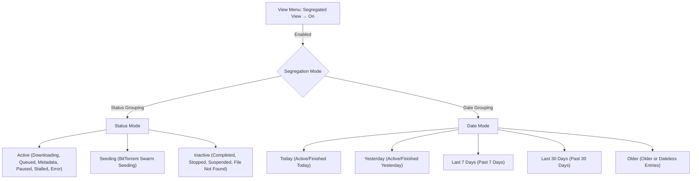

# Table Views & Segregation Architecture

This document provides a comprehensive technical guide to the primary and auxiliary table views in My-IDM, covering model-view architecture, custom delegates, interactive sorting, header spanning, status and date segregation engines, and persistent state lifecycle.

---

## 🏛️ Architecture Overview

My-IDM employs a decoupled Qt Model-View architecture powered by PySide6:

```
┌────────────────────────────────────────────────────────────────────────┐
│                              MainWindow                                │
│  ┌──────────────────────────────────────────────────────────────────┐  │
│  │ CustomHeaderView (Column visibility, sizing, reset, persistence) │  │
│  ├──────────────────────────────────────────────────────────────────┤  │
│  │ QTableView (Primary Download Table)                              │  │
│  │  ├── Model: DownloadTableModel (QAbstractTableModel)            │  │
│  │  │    ├── Filtering: Status filters, Type filters                │  │
│  │  │    ├── Sorting: Type-aware comparator logic                   │  │
│  │  │    └── Segregation Engine: Status-based OR Date-based         │  │
│  │  ├── Delegates:                                                  │  │
│  │  │    ├── ProgressBarDelegate (Col.PROGRESS)                     │  │
│  │  │    └── DownloadNameDelegate (Col.NAME)                        │  │
│  │  └── Spanning: Full-row section headers via setSpan()           │  │
│  └──────────────────────────────────────────────────────────────────┘  │
│  ┌──────────────────────────────────────────────────────────────────┐  │
│  │ DetailsPanel (Collapsible Bottom Panel)                          │  │
│  │  ├── FilesTableWidget (Multi-file torrent priorities)            │  │
│  │  ├── PeersTableWidget (Swarm peer metrics)                       │  │
│  │  ├── TrackersTableWidget (Tracker tier diagnostics)              │  │
│  │  └── SegmentsTableWidget (HTTP segmented chunks)                 │  │
│  └──────────────────────────────────────────────────────────────────┘  │
└────────────────────────────────────────────────────────────────────────┘
```

---

## 📊 Primary Download Table Columns

The main download table exposes 13 columns indexed by the `Col` class:

| Column | Index | Header | Width | Alignment | Description |
| :--- | :---: | :--- | :---: | :--- | :--- |
| `QUEUE` | 0 | `#` | 45 px | Center | Active queue order (1, 2, 3...) or expand/collapse indicator (`▼` / `▶`) in section headers. |
| `NAME` | 1 | `Name` | 270 px | Left | Filename or resource title with type icon (`📦`, `🎬`, `🧲`) and Tor routing badge (`🧅`). YouTube downloads additionally show an engine tooltip on hover. |
| `SOURCE_DOMAIN` | 2 | `Source Domain` | 160 px | Left | Normalized domain/hostname extracted from the source URL or magnet tracker. |
| `SIZE` | 3 | `Size` | 90 px | Right | Total size formatted via `humanize.naturalsize()` (e.g., `450.2 MiB`). |
| `PROGRESS` | 4 | `Progress` | 160 px | Center | Custom progress bar drawn by `ProgressBarDelegate` with status-based gradient. |
| `STATUS` | 5 | `Status` | 135 px | Left | Capitalized status text with status-specific semantic color coding. |
| `SPEED` | 6 | `Speed` | 110 px | Right | Active transfer rate (`12.4 MiB/s`) or seeding upload rate (`1.2 MiB/s`). |
| `ETA` | 7 | `ETA` | 85 px | Right | Estimated time remaining (`4m 12s`, `1h 05m`), or `—` when paused/inactive. |
| `SEEDS_PEERS` | 8 | `Seeds / Peers` | 110 px | Right | Connected seeds/peers (`S:15 P:42`) for torrents, or segment count (`8 seg`) for HTTP. |
| `ADDED` | 9 | `Added` | 130 px | Center | Localized ISO-8601 datetime (`YYYY-MM-DD HH:MM`) of creation. |
| `LAST_TRIED` | 10 | `Last Tried` | 130 px | Center | Localized datetime of most recent connection/transfer attempt. |
| `COMPLETED` | 11 | `Completed` | 130 px | Center | Localized datetime of successful download completion. |
| `SAVE_PATH` | 12 | `Save Path` | 200 px | Left | Target destination path shortened with leaf-node priority. |
| `LAST_SEEDED` | 14 | `Last Seeded` | 130 px | Center | When the torrent last started or completed a seed. `—` for non-torrents. |
| `SOURCE` | 15 | `Source` | 100 px | Left | Where the download originated: `Chrome`, `Firefox`, `Edge`, `AnimePahe`, or `YouTube`. Blank for manually added and legacy rows. |

### Column Tail & Upgrades

Four columns are pinned to the right-hand tail, in this display order:

```
… SAVE_PATH, SOURCE_DOMAIN, FILE_NAME, LAST_SEEDED, SOURCE
```

The order is defined once, in `_DEFAULT_TAIL_COLUMNS` (`main_window.py`), and applied by
`_apply_default_tail_order()` from three places: startup, **View → Reset View**, and the stale-state
heal described below. That helper sweeps slots in ascending order, because `moveSection()` shifts
everything between the source and the target — placing a tail column that currently sits *left* of
its slot would otherwise push an already-placed neighbour back out of position.

`LAST_SEEDED` and `SOURCE` were **appended** (indices 14 and 15) rather than inserted, so every
pre-existing logical index is unchanged and the persisted `column_widths`, `header_state`, and
`sort_column` in `ui_state` keep addressing the same columns.

`ui_state` also records `column_count`. On restore, if the stored count differs from `Col.COUNT`, the
state predates an append: `QHeaderView.restoreState()` only describes the sections that existed
then, so the new columns can land anywhere. The tail helper is re-applied, which pins them to the end
while preserving the user's own ordering of the older columns. Once the state is re-saved with the
current count, custom ordering is respected as-is.

### `Source` Derivation
Resolved at display time from `metadata_json` rather than stored in its own column, so existing rows
classify immediately with no migration or backfill (`resolve_download_source()` in
`download_model.py`):

| Value | Key |
|---|---|
| `YouTube` | `source_type` starts with `youtube` |
| `AnimePahe` | `added_by` contains `animepahe` — written by `load_backlog()` from AnimePahe's `# AnimePahe Download` comment above the URL |
| `Chrome` / `Firefox` / `Edge` | `source == "browser_extension"`, then matched against `user_agent` |
| *(blank)* | Everything else, including manual adds and legacy rows |

Edge is matched on `Edg/` (and legacy `Edge/`) **before** Chrome, because Edge's User-Agent also
advertises `Chrome/`.

---

## 🗂️ Segregated Views & Grouping Models

In addition to standard flat-list display, My-IDM provides **Segregated Views**, dividing the download table into collapsible, full-row-spanning sections.

### 1. View Modes

My-IDM supports two distinct segregation modes configured under **View → 🗂️ Segregated View**:



#### A. Status-Based Segregation (`status`)
Partitions downloads according to operational lifecycle state:
1. **Active**: Items in `fetching_metadata`, `queued`, `downloading`, `paused`, `stalled`, `checking`, `scanning`, `threat_detected`, or `error`.
2. **Seeding**: Items actively seeding in the BitTorrent swarm (`seeding`).
3. **Inactive**: Terminated items in `completed`, `stopped`, `file_not_found`, or `suspended`.

#### B. Date-Based Segregation (`date`)
Partitions downloads into relative temporal buckets determined by the **latest** available timestamp among:
- `entry.added_at`
- `entry.completed_at`
- `entry.last_tried_at`

The categorization algorithm (`get_entry_date_category`):
```python
def get_entry_date_category(entry: DownloadEntry, now_dt: Optional[datetime] = None) -> str:
    latest_dt = get_entry_latest_timestamp(entry)
    if latest_dt is None:
        return SECTION_DATE_OLDER

    if now_dt is None:
        now_dt = datetime.now().astimezone()

    today = now_dt.date()
    entry_date = latest_dt.date()
    diff_days = (today - entry_date).days

    if diff_days <= 0:
        return SECTION_DATE_TODAY
    elif diff_days == 1:
        return SECTION_DATE_YESTERDAY
    elif diff_days <= 7:
        return SECTION_DATE_LAST_7_DAYS
    elif diff_days <= 30:
        return SECTION_DATE_LAST_30_DAYS
    else:
        return SECTION_DATE_OLDER
```

### 2. Section Header Spanning & Interactions

- **Full-Row Spans**: `MainWindow._apply_table_spans()` calls `self._table.setSpan(row, 0, 1, Col.COUNT)` for every section header index discovered via `model.get_section_header_row_indices()`.
- **Display Role**: The header row renders:
  ```
  ▼   ACTIVE (4)
  ▶   OLDER (12)
  ```
- **Visual Styling**:
  - Background: `#1e2330`
  - Font: `Segoe UI`, 10 pt Bold
  - Colors:
    - Active / Today: Accent Cyan (`#388bfd` / `#58a6ff`)
    - Seeding / Yesterday: Purple (`#8957e5` / `#bc8cff`)
    - Last 7 Days: Warm Amber (`#ffb74d`)
    - Last 30 Days: Soft Blue (`#64b5f6`)
    - Inactive / Older: Muted Blue-Gray (`#8fa0b5`)
- **Toggling**: Clicking or double-clicking any header row triggers `model.toggle_section_collapsed(row)`, which toggles the section ID in `_collapsed_sections`, triggers `_reapply_filter()`, and immediately updates table spans.

### 3. Header Context Menu

Right-clicking any section header opens a contextual management menu:
- **Expand / Collapse '[Title]' Section**: Toggles the targeted section.
- **Expand All Sections**: Expands all sections in the active view mode.
- **Collapse All Sections**: Collapses all sections in the active view mode.
- **Switch to Date / Status Grouping**: Quick toggle between segregation modes.

---

## 💾 State Persistence Lifecycle

All table view configuration and segregation states are persisted in the SQLite `ui_state` table (`Database.set_ui_state` / `Database.get_ui_state`):

| Key | Type | Description |
| :--- | :---: | :--- |
| `segregated_view_enabled` | `bool` | Whether segregated view partitioning is enabled (`True`) or flat list is active (`False`). |
| `segregated_view_mode` | `str` | Active grouping mode: `"status"` or `"date"`. |
| `segregated_active_collapsed` | `bool` | Status mode: Active section collapsed state. |
| `segregated_seeding_collapsed` | `bool` | Status mode: Seeding section collapsed state. |
| `segregated_inactive_collapsed` | `bool` | Status mode: Inactive section collapsed state. |
| `segregated_date_today_collapsed` | `bool` | Date mode: Today section collapsed state. |
| `segregated_date_yesterday_collapsed` | `bool` | Date mode: Yesterday section collapsed state. |
| `segregated_date_last_7_days_collapsed` | `bool` | Date mode: Last 7 Days section collapsed state. |
| `segregated_date_last_30_days_collapsed` | `bool` | Date mode: Last 30 Days section collapsed state. |
| `segregated_date_older_collapsed` | `bool` | Date mode: Older section collapsed state. |
| `column_widths` | `dict` | JSON mapping of column indices to interactive pixel widths. |
| `column_visibility` | `dict` | JSON mapping of column indices to visibility booleans. |

On application launch:
1. `MainWindow` queries `segregated_view_enabled` and `segregated_view_mode`.
2. Restores collapsed status for all status and date section keys.
3. Configures `DownloadTableModel.set_segregated_view(enabled, mode=mode)`.
4. Invokes `_apply_table_spans()` to paint section headers immediately.

---

## 🎨 Custom Item Delegates

### 1. `ProgressBarDelegate` (`my_idm.delegates`)
Renders color-coded progress bars for `Col.PROGRESS`:
- Receives a model dictionary: `{"progress": float, "status": str}`.
- Paints an anti-aliased dark background trough (`#21262d`).
- Draws a proportional fill rectangle with rounded corners (`radius = 3px`).
- Gradient fill color mapped to status:
  - Downloading: Blue (`#1f6feb` → `#388bfd`)
  - Completed: Green (`#238636` → `#2ea043`)
  - Seeding: Purple (`#8957e5` → `#a371f7`)
  - Paused: Amber (`#9e6a03` → `#d29922`)
  - Error / Threat: Red (`#da3633` → `#f85149`)
  - Scanning: Cyan (`#39c5bb` → `#56d4c8`)
- Centers bold percentage text (`85.4%`) with automatic contrast handling.

### 2. `DownloadNameDelegate` (`my_idm.delegates`)
Renders filename and file metadata in `Col.NAME`:
- Eliminates redundant string tags (e.g. `(Tor 🧅)`) when Tor routing is visually indicated by decoration role icons.
- Ensures text clipping with clean ellipsis (`...`) during horizontal window compaction.

---

## 🔍 Interactive Sorting & Filtering

### 1. Data-Type Aware Sorting
`DownloadTableModel._entry_sort_key(entry, col, ascending)` applies specialized comparator logic:
- **`Col.QUEUE`**: Active queue items sort by priority number; inactive items sort to the bottom.
- **`Col.NAME` / `Col.SOURCE_DOMAIN`**: Case-insensitive alphanumeric collation.
- **`Col.SIZE` / `Col.SPEED`**: Numeric comparison of integer bytes / float bps.
- **`Col.PROGRESS`**: Float percentage value.
- **`Col.ETA`**: Active transfers with numerical ETA rank before inactive (`—`).
- **`Col.ADDED` / `Col.LAST_TRIED` / `Col.COMPLETED`**: Chronological comparison with empty timestamps pushed to the bottom.

### 2. Persistent Selection Remapping
Before executing sort operations, `DownloadTableModel.sort()` captures all persistent selection model indices:
```python
old_ids = [e.id for e in self._entries]
self._apply_sort()
self._rebuild_index()

old_indexes = self.persistentIndexList()
new_indexes = [self.index(self._id_to_row[old_ids[idx.row()]], idx.column()) for idx in old_indexes]
self.changePersistentIndexList(old_indexes, new_indexes)
```
This ensures active row selections and focus rectangles are preserved seamlessly across sorting cycles.

### 3. Status, Type & Size Filtering
`DownloadTableModel.set_status_filter(allowed)`, `set_type_filter(allowed)` and
`set_size_filter(allowed)` enable real-time view filtering without database round-trips:
- Filtering is evaluated dynamically in `_matches_filter(entry)`.
- When filtering changes, `_reapply_filter()` regenerates active entries, recalculates section counts, and refreshes the table.
- Each filter collapses to "no filter" once every option is selected, so a fully-ticked popup
  restores the unfiltered list.
- `clear_filters()` resets the header filters only; it deliberately leaves the toolbar
  search query alone so clearing a status filter cannot wipe what the user is typing.

### 4. Toolbar Quick Search
The toolbar search box (`MainWindow._search_edit`, styled `QLineEdit#toolbar_search`) filters
the table by free text via `set_search_query()`:
- Matching is case-insensitive against the filename, the original name, the URL, and the
  extracted source domain, so `example5` finds `https://example5.com/file.zip`.
- It composes with the header filters — `_matches_filter()` evaluates the search first and then
  the type/size/status filters, so all must agree for a row to stay visible.
- `is_filtered()` reports the search as a filter too, which keeps the "filters active"
  indicator honest.
- Empty input is a no-op, so clearing the box restores the previous view without a rebuild.

---

## 📋 Details Panel Auxiliary Table Views

When any download row is selected, `DetailsPanel` (`my_idm/details_panel.py`) populates diagnostic telemetry across four auxiliary table views:

### 1. Files Table (`FilesTableWidget`)
- Used for multi-file BitTorrent downloads.
- Columns: `#`, `Path`, `Size`, `Progress`, `Priority`, `Status`.
- Features an interactive Priority `QComboBox` (`High`, `Normal`, `Low`, `Skip`) communicating directly with `TorrentEngine.set_file_priorities()`.
- Cell widgets are retained during progress updates to prevent UI flickering.

### 2. Peers Table (`PeersTableWidget`)
- Swarm diagnostics displaying connected BitTorrent peers.
- Columns: `IP:Port`, `Client`, `Progress %`, `Down Speed`, `Up Speed`, `Flags`.
- Populated from `libtorrent` peer info metrics during engine poll ticks.

### 3. Trackers Table (`TrackersTableWidget`)
- BitTorrent tracker swarm health.
- Columns: `Tier`, `URL`, `Status`, `Peers`, `Seeds`, `Scrapes`.
- Shows live tracker response statuses, fail counts, and next announce timers.

### 4. Segments Table (`SegmentsTableWidget`)- Multi-segment HTTP transfer diagnostics.
- Columns: `Segment #`, `Byte Range`, `Downloaded`, `Progress`, `Speed`, `Status`.
- Displays individual segment worker threads, range offsets, and chunk progress bars.
