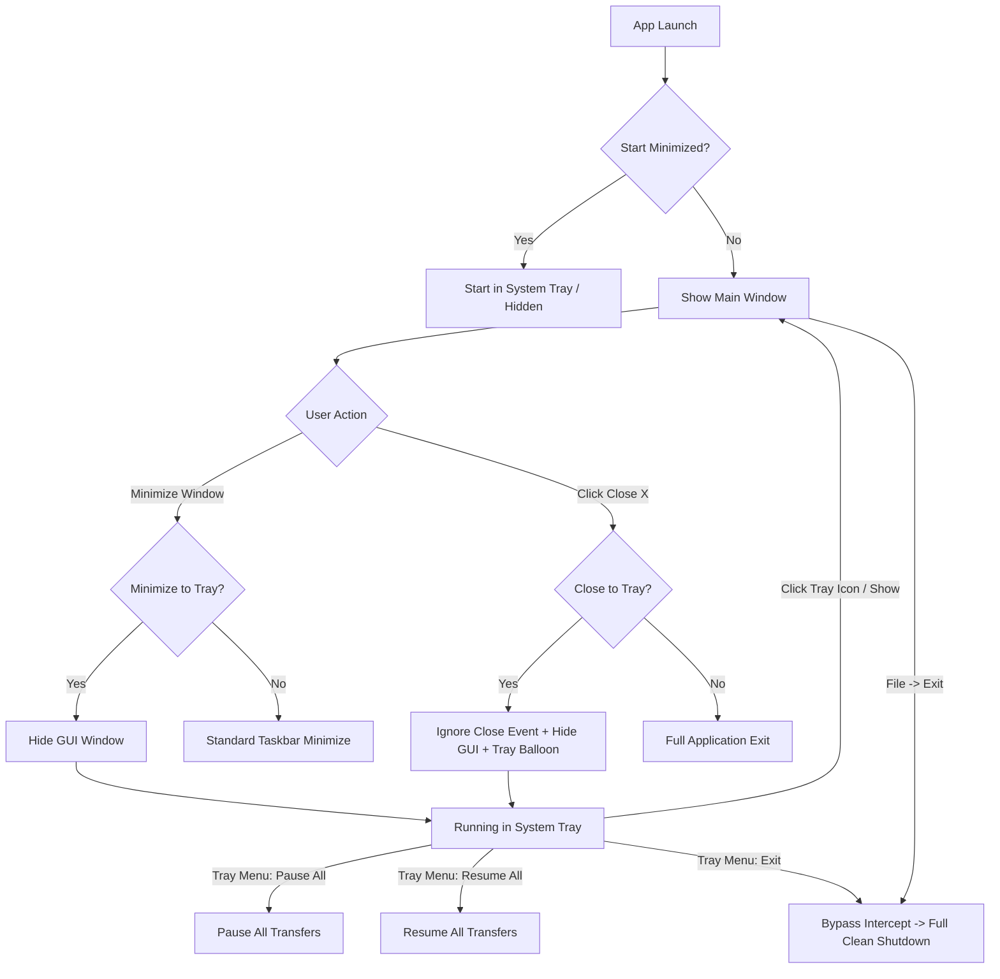

# Window Lifecycle, System Tray & Desktop Notifications

## 1. Overview

My-IDM is designed as a persistent, high-performance background download manager. Long-running multi-segment HTTP downloads and BitTorrent swarms/seeding tasks must not be prematurely interrupted when users close or minimize the main GUI window.

To facilitate uninterrupted background transfers, My-IDM provides native **Windows System Tray** integration, configurable minimize/close window intercepts, one-click global queue controls (Pause All / Resume All), and desktop completion notifications.

---

## 2. Configuration & Settings

System tray behavior is managed via [`my_idm.config.GeneralConfig`](file:///d:/Projects/my-idm/my_idm/config.py) and configured under **Preferences -> General & Downloads -> System Tray & Window Behavior**:

| Setting | Type | Default | Description |
| :--- | :--- | :--- | :--- |
| `enable_system_tray` | `bool` | `True` | Enables the Windows notification area (system tray) icon and context menu. |
| `minimize_to_tray` | `bool` | `True` | Intercepts window minimize actions, hiding the taskbar entry and keeping the app accessible via the tray icon. |
| `close_to_tray` | `bool` | `True` | Intercepts window close (`X` button), keeping background downloads, seeding, and browser interception active. |
| `start_minimized` | `bool` | `False` | Launches My-IDM silently to the system tray on startup without presenting the main window. |
| `notify_on_completion`| `bool` | `True` | Fires Windows desktop toast notifications when transfers successfully complete. |

---

## 3. System Tray Architecture (`MainWindow`)

### Tray Icon Initialization (`_setup_system_tray`)
1. **Availability Check**: Verifies `QSystemTrayIcon.isSystemTrayAvailable()`.
2. **Icon & Tooltip**: Sets the application icon via `get_app_icon()` and assigns tooltip `My-IDM — Download Manager`.
3. **Tray Context Menu**:
   - `🪟 Show My-IDM` / `🪟 Hide My-IDM`: Dynamic toggle tracking window foreground visibility.
   - `⏸️ Pause All Downloads`: Pauses all active, queued, and stalled transfers.
   - `▶️ Resume All Downloads`: Resumes all paused and stopped transfers.
   - `⚙️ Preferences…`: Opens the Preferences modal directly to tab 0 (General & Downloads).
   - `🚪 Exit My-IDM`: Sets `_force_exit = True` and triggers clean application termination.
4. **Activation Handling (`_on_tray_activated`)**:
   - Left-click (`Trigger`) or double-click (`DoubleClick`) toggles the main window (`_toggle_show_window`).
   - If the window is currently hidden or minimized, it is restored via `showNormal()`, raised, and focused with `activateWindow()`.

---

## 4. Window State Events & Interceptions

### Minimize Interception (`changeEvent`)
When the main window receives a `QEvent.Type.WindowStateChange`:
- If `self.isMinimized()` is true and `cfg.enable_system_tray` & `cfg.minimize_to_tray` are active:
- A single-shot zero-delay timer `QTimer.singleShot(0, self.hide)` cleanly hides the window from the Windows taskbar without visual artifacts.

### Close Interception (`closeEvent`)
When the user clicks the window `X` (close) button or presses Alt+F4:
1. **Close-to-Tray Check**:
   - If `_force_exit` is `False` and `cfg.enable_system_tray` & `cfg.close_to_tray` are enabled:
   - The event is explicitly ignored (`event.ignore()`).
   - `self.hide()` hides the window from the screen and taskbar.
   - A one-time tray notification bubble (`showMessage`) alerts the user:
     > *"My-IDM is running in the system tray and continuing downloads in the background."*
2. **Full Application Exit (`_exit_app`)**:
   - Triggered via **File -> Exit** or **Tray Menu -> Exit**.
   - Sets `self._force_exit = True` and invokes `self.close()`.
   - Bypasses close-to-tray interception, halts UI update timers, saves window geometry and table column widths to SQLite, displays the optional `IDMExitSplashScreen`, stops background engines (`HTTPEngine`, `TorrentEngine`, `TorServiceManager`), and accepts the close event.

---

## 5. Desktop Notifications & Interactive Toast Alerts

My-IDM integrates deeply with the native Windows Action Center and notification pipeline:

1. **Explicit AppUserModelID & Application Branding**:
   - `ctypes.windll.shell32.SetCurrentProcessExplicitAppUserModelID("My-IDM")` ensures Windows Shell and Action Center identify the application as **My-IDM** in notification banner headers instead of an internal package string.
   - `app.setApplicationDisplayName("My-IDM")` pairs with Qt to ensure consistency across window managers and taskbar groups.

2. **Unified Notification Delegate Pipeline**:
   - Rather than relying solely on detached external tools, [`my_idm.notifications`](file:///d:/Projects/my-idm/my_idm/notifications.py) supports a delegate handler pattern via `register_notification_handler()`.
   - On application startup, `MainWindow._setup_system_tray()` registers `MainWindow.show_tray_notification`, dispatching toasts through `QSystemTrayIcon.showMessage()` via thread-safe Qt queued signals (`_sig_show_tray_notification`).
   - Browser capture alerts (`notify_browser_download_caught`), download completions (`notify_download_complete`), and errors (`notify_download_error`) route seamlessly through this pipeline.

3. **Click-to-Focus Window Activation**:
   - `self._tray_icon.messageClicked` connects to `self._on_tray_message_clicked` -> `self._restore_and_focus()`.
   - **Clicking any desktop toast** immediately restores the window from system tray / minimized state, raises it above background windows, and requests active foreground focus using `my_idm.single_instance.activate_window()` (`ShowWindow(hwnd, SW_RESTORE)` + `SetForegroundWindow(hwnd)`).

---

## 6. Reorganized Preferences Hierarchy

To simplify settings discovery and reduce tab clutter, preferences tabs are structured as follows:

| Index | Tab Title | Contents |
| :---: | :--- | :--- |
| **0** | **⚙️ General & Downloads** | Default save path, segments, concurrent transfer limits, exponential retry backoff, auto-resume, completion notifications, system tray behavior, and backlog auto-processing locations. |
| **1** | **🧲 BitTorrent** | Post-download seeding switches, seeding time & ratio ceilings, upload speed throttling, torrent-to-HTTP ratio, and DHT/tracker timeout. |
| **2** | **🌐 Browser Integration** | Loopback REST server (127.0.0.1:19582), minimum file size threshold (KB), bypassed file extensions, Chromium (Chrome/Edge/Brave) unpacked loader, and Mozilla Firefox `.xpi` packaging & guide. |
| **3** | **🛡️ Network & Privacy** | **Unified VPN & Tor tab**: Network interface adapter binding, instant VPN Kill Switch loop, HTTP/SOCKS5 proxy settings, and Tor Onion Routing (daemon lifecycle, traffic routing switches, executable discovery). |
| **4** | **🛡️ Antivirus & Security** | Pre-download URL extension inspection, double-extension heuristic detection, post-download Windows Defender / custom AV command execution, and quarantine. |
| **5** | **🧰 External Tools** | AnimePahe scraper integration (CLI & GUI paths, repository root, video quality, audio language), default video player assignment, and command preview. |
