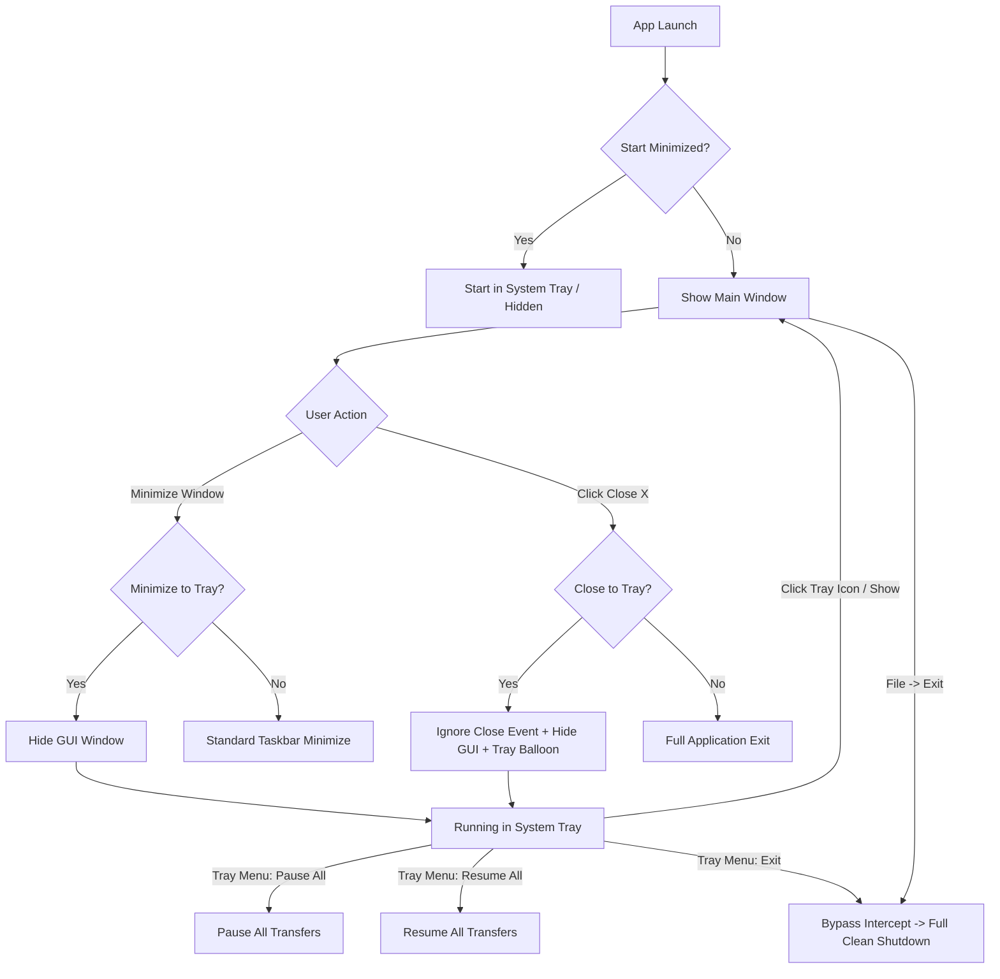

# Window Lifecycle, System Tray & Desktop Notifications

## 1. Overview

My-IDM is designed as a persistent, high-performance background download manager. Long-running multi-segment HTTP downloads and BitTorrent swarms/seeding tasks must not be prematurely interrupted when users close or minimize the main GUI window.

To facilitate uninterrupted background transfers, My-IDM provides native **Windows System Tray** integration, configurable minimize/close window intercepts, one-click global queue controls (Pause All / Resume All), and desktop completion notifications.



---

## 2. Configuration & Settings

System tray behavior is managed via [`my_idm.config.GeneralConfig`](file:///d:/Projects/my-idm/my_idm/config.py) and configured under **Preferences -> General & Downloads -> System Tray & Window Behavior**:

| Setting | Type | Default | Description |
| :--- | :--- | :--- | :--- |
| `enable_system_tray` | `bool` | `True` | Enables the Windows notification area (system tray) icon and context menu. |
| `minimize_to_tray` | `bool` | `True` | Intercepts window minimize actions, hiding the taskbar entry and keeping the app accessible via the tray icon. |
| `close_to_tray` | `bool` | `True` | Intercepts window close (`X` button), keeping background downloads, seeding, and browser interception active. |
| `start_minimized` | `bool` | `False` | Launches My-IDM silently to the system tray on startup without presenting the main window. |
| `notify_on_completion`| `bool` | `True` | Fires Windows desktop toast notifications when transfers successfully complete. |
| `capture_hotkey_enabled` | `bool` | `False` | Binds a system-wide chord that toggles download capture. Off by default: a global hotkey claims a key combination on the whole desktop. |
| `capture_hotkey_sequence` | `str` | `"Ctrl+Alt+D"` | The chord. Must include Ctrl, Alt or Win — a bare key would be swallowed in every other application. |
| `clipboard_monitor_enabled` | `bool` | `False` | Adds downloads when one or more URLs are copied. Off by default: reading the clipboard without being asked is surveillance. |
| `clipboard_monitor_max_urls` | `int` | `20` | Ceiling on URLs added by a single copy. |

The last four live in a **Capture** group on the same page and are documented in
[Capture Subsystem](capture.md), which also explains why a failed chord registration is reported
in the status bar instead of being swallowed.

---

## 3. System Tray Architecture (`MainWindow`)

### Tray Icon Initialization (`_setup_system_tray`)
1. **Availability Check**: Verifies `QSystemTrayIcon.isSystemTrayAvailable()`.
2. **Icon & Tooltip**: Sets the application icon via `get_app_icon()` and assigns tooltip `My-IDM — Download Manager`.
3. **Tray Context Menu**:
   - Entries use an **emoji glyph in the action text with no icon**, so every label shares one
     indent. Qt reserves the icon column for the whole menu, so mixing an icon-based entry with
     glyph-based entries renders them at visibly different indents.
   - `🪟 Show My-IDM` / `🪟 Hide My-IDM`: Dynamic toggle tracking window foreground visibility.
   - `➕ Add Download…`: Opens the Add Download dialog. The main window is restored first via
     `_restore_and_focus()` — the dialog is modal and parented to the window, so without it the
     dialog would open unreachable behind the hidden window.
   - `⏸️ Pause All Downloads`: Pauses all active, queued, and stalled transfers.
   - `▶️ Resume All Downloads`: Resumes all paused and stopped transfers.
   - `🎯 Download Capture` and `📋 Clipboard Capture`: The only **checkable** entries in the menu.
     They show live state rather than describing an action, because a row that reads "Enable
     capture" while capture is on is a lie the user has to guess about. `MainWindow._sync_capture_actions()`
     mirrors the real state onto them with `blockSignals`, and is called from the tray, the
     global hotkey and both config-changed signals, so the menu cannot drift from what capture is
     actually doing. See [Capture Subsystem](capture.md).
   - `⚙️ Preferences…`: Opens the Preferences modal on the General & Downloads page (`TAB_GENERAL`).
   - `🔄 Restart My-IDM`: Restarts the application in place.
   - `🚪 Exit My-IDM`: Sets `_force_exit = True` and triggers clean application termination.
4. **Right-Click Guard (`_RightClickGuard`)**:
   - `QMenu` treats a right-button press + release as an **ordinary activation** of whatever
     item is under the cursor. On this menu the bottom two rows are **Restart** and **Exit**, so
     a reflexive right-click — the gesture people reach for after a fumbled left-click — shut
     My-IDM down mid-download, with no confirmation.
   - An event filter consumes `MouseButtonPress`, `MouseButtonRelease` and
     `MouseButtonDblClick` when the button is `Qt.MouseButton.RightButton`, so a right-click can
     only dismiss the menu. **All three** must be swallowed: filtering only the release still
     lets the press reach `QMenu`'s activation logic, so a partial guard looks installed and
     changes nothing.
   - Left, middle and back, plus every non-mouse event, pass through untouched.
   - `QMenu` has no `viewport()` in Qt 6 (it paints its own items), so the menu itself is the only
     object that needs the filter.
   - The guard is held in `self._tray_right_click_guard`: a filter with no Python reference would
     be garbage-collected and silently stop filtering.
5. **Activation Handling (`_on_tray_activated`)**:
   - Left-click (`Trigger`) or double-click (`DoubleClick`) toggles the main window (`_toggle_show_window`).
   - If the window is currently hidden or minimized, it is restored via `showNormal()`, raised, and focused with `activateWindow()`.

---

## 4. Window State Events & Interceptions

### Minimum Width Follows What the Window Holds (`_fit_min_width_to_toolbar`)
Set by `setMinimumWidth(MAX(toolbar.sizeHint(), centralWidget().minimumSizeHint()))`, not fixed:

- **the toolbar's `sizeHint`** — a `QToolBar` narrower than its contents folds the remainder into
  a `>>` overflow button, which hides download controls behind a second click;
- **the downloads list's own minimum** — a window narrower than that clips the columns instead of
  scrolling them.

Measured rather than hard-coded, because both numbers move: the row's width with the font, the
scale factor and which actions are on it, the list's with its columns. The previous fixed **1100px**
floor was measured against a toolbar carrying a queue switcher and a Statistics button and outlived
both by ~230px. `MIN_WINDOW_WIDTH = 640` is only the pre-measurement starting value.

- Re-run at the end of `_setup_toolbar()`, again in `showEvent()`, and in `_on_theme_applied()` (a
  theme can change the font metrics it is measured against).
- Capped at `QApplication.primaryScreen().availableGeometry().width()`. On a display too small for
  the full row, degrading to the overflow button beats a minimum the window cannot be fitted to.
- **Only ever raises.** A shorter toolbar later — the Tor label going from `Tor: Connecting...` to
  `Tor: OFF`, a shorter locale — must not shrink a window the user already opened.

At 1920×1032, 100% scaling, after the queue switcher and Statistics button left the strip: toolbar
needs **787px**, the downloads list **866px**, so the floor settles at **866**. It was 1100 before,
and the toolbar used to be 1025 — which is why the old floor was doing nothing useful for the
toolbar it was written for.

### Minimize Interception (`changeEvent`)
When the main window receives a `QEvent.Type.WindowStateChange`:
- If `self.isMinimized()` is true and `cfg.enable_system_tray` & `cfg.minimize_to_tray` are active:
- A single-shot zero-delay timer `QTimer.singleShot(0, self.hide)` cleanly hides the window from the Windows taskbar without visual artifacts.

### Close Interception (`closeEvent`)
When the user clicks the window `X` (close) button or presses Alt+F4:
1. **Close-to-Tray Check**:
   - If `_force_exit` is `False` and `cfg.enable_system_tray` & `cfg.close_to_tray` are enabled:
   - The event is explicitly ignored (`event.ignore()`).
   - `self.hide()` hides the window from the screen and taskbar.
   - A one-time tray notification bubble (`showMessage`) alerts the user:
     > *"My-IDM is running in the system tray and continuing downloads in the background."*
2. **Full Application Exit (`_exit_app`)**:
   - Triggered via **File -> Exit** or **Tray Menu -> Exit**.
   - Sets `self._force_exit = True` and invokes `self.close()`.
   - Bypasses close-to-tray interception, halts UI update timers, saves window geometry and table column widths to SQLite, displays the optional `IDMExitSplashScreen`, stops background engines (`HTTPEngine`, `TorrentEngine`, `TorServiceManager`), and accepts the close event.

---

## 5. Desktop Notifications & Interactive Toast Alerts

My-IDM integrates deeply with the native Windows Action Center and notification pipeline:

1. **Explicit AppUserModelID & Application Branding**:
   - `ctypes.windll.shell32.SetCurrentProcessExplicitAppUserModelID("My-IDM")` ensures Windows Shell and Action Center identify the application as **My-IDM** in notification banner headers instead of an internal package string.
   - `app.setApplicationDisplayName("My-IDM")` pairs with Qt to ensure consistency across window managers and taskbar groups.

2. **Unified Notification Delegate Pipeline**:
   - Rather than relying solely on detached external tools, [`my_idm.notifications`](file:///d:/Projects/my-idm/my_idm/notifications.py) supports a delegate handler pattern via `register_notification_handler()`.
   - On application startup, `MainWindow._setup_system_tray()` registers `MainWindow.show_tray_notification`, dispatching toasts through `QSystemTrayIcon.showMessage()` via thread-safe Qt queued signals (`_sig_show_tray_notification`).
   - Browser capture alerts (`notify_browser_download_caught`), download completions (`notify_download_complete`), and errors (`notify_download_error`) route seamlessly through this pipeline.

3. **Click-to-Focus Window Activation**:
   - `self._tray_icon.messageClicked` connects to `self._on_tray_message_clicked` -> `self._restore_and_focus()`.
   - **Clicking any desktop toast** immediately restores the window from system tray / minimized state, raises it above background windows, and requests active foreground focus using `my_idm.single_instance.activate_window()` (`ShowWindow(hwnd, SW_RESTORE)` + `SetForegroundWindow(hwnd)`).

---

## 6. Reorganized Preferences Hierarchy

To simplify settings discovery and reduce tab clutter, preferences pages are registered in
`settings_dialog.py` as **named** constants. `TAB_ORDER` *is* the insertion order, and
`TAB_TITLES` holds the sidebar captions:

| `TAB_*` name | Index | Title | Contents |
| :--- | :---: | :--- | :--- |
| `TAB_GENERAL` | **0** | 📁 General & Downloads | Default save path, segments, segment start stagger, concurrent transfer limits, exponential retry backoff, auto-resume, completion notifications, free-disk-space gate, system tray behavior, and backlog auto-processing locations. |
| `TAB_VIEWS` | **1** | 👁️ Views & Columns | Segregated-view mode (Status / Date / File Type) with its enable checkbox, plus column select and ordering for the downloads table. |
| `TAB_TORRENT` | **2** | 🧲 BitTorrent | Post-download seeding switches, seeding time & ratio ceilings, upload speed throttling, torrent-to-HTTP ratio, and DHT/tracker timeout. |
| `TAB_BROWSER` | **3** | 🌐 Browser Integration | Loopback REST server (127.0.0.1:19582), minimum file size threshold (KB), bypassed file extensions, Chromium (Chrome/Edge/Brave) unpacked loader, and Mozilla Firefox `.xpi` packaging & guide. |
| `TAB_VPN` | **4** | 🛡️ VPN & Proxy | Network interface adapter binding, instant VPN Kill Switch loop, and HTTP/SOCKS5 proxy settings. |
| `TAB_TOR` | **5** | 🧅 Tor | Tor Onion Routing: daemon lifecycle, traffic routing switches, and executable discovery. |
| `TAB_SECURITY` | **6** | 🛡️ Antivirus & Security | Pre-download URL extension inspection, double-extension heuristic detection, post-download Windows Defender / custom AV command execution, and quarantine. |
| `TAB_EXTERNAL_TOOLS` | **7** | 🌐 AnimePahe Scraper | AnimePahe scraper integration (CLI & GUI paths, repository root, video quality, audio language), default video player assignment, and command preview. |
| `TAB_YOUTUBE` | **8** | ▶️ YouTube (yt-dlp) | yt-dlp integration, playlist limits, and preferred video quality. |

### 6.1 Callers pass a name, never an index

`MainWindow` has six Tools-menu entries that open Preferences on a *specific* page
(`_on_open_torrent_settings`, `_on_open_browser_settings`, `_on_open_network_settings`,
`_on_open_tor_settings`, `_on_open_security_settings`, `_on_open_external_tools_settings`),
plus a toolbar and tray entry that open it on General.

All of them pass a `TAB_*` name, resolved by `tab_index()`.

> **Why this is not a style preference.** `SettingsDialog.__init__` accepted an integer and
> clamped it with `0 <= initial_tab < self._tabs.count()`. Every index a caller could hold
> was in range, so when a page was inserted the dialog raised nothing and simply opened
> the **wrong page** — no exception, no log line, nothing for the user to notice until they
> clicked. The 6 → 9 tab change left all six Tools-menu entries one or two pages off:
> BitTorrent Settings opened Views & Columns, External Tools opened Tor, and so on.
>
> `tab_index()` raises `ValueError` for an unknown name instead. That converts a silent
> wrong-page click into a loud failure the moment a page is renamed, which is the only
> version of this bug that can be caught before release.
>
> `SettingsDialog` still accepts an integer (legacy, and the two no-argument callers), but
> `initial_tab=5` meaning "AnimePahe" now means "Tor" — so anything that names a page must
> pass the name. Tests pin the registry against the dialog's actual page order, titles and
> count, so the two cannot drift.

### 6.2 Both engines get the same `GeneralConfig`

`DownloadManager.set_general_config()` pushes the new object to **both** engines:

```python
self._http.set_general_config_sync(config)
self._torrent.set_general_config(config)
```

`SettingsDialog` hands back a *copy* of the config (`GeneralConfig.from_dict(cfg.to_dict())`),
so an engine that is not updated keeps the object it was built with at startup and keeps
enforcing the old settings until the next launch. That is not hypothetical: the free-disk
space gate and `metadata_fetch_timeout_days` both live on `GeneralConfig`, so with only the
HTTP engine wired, unticking "check free disk space" stopped HTTP downloads being checked
while torrents carried on being refused with the previous headroom. A half-applied
preference is the hardest kind to spot from the UI — nothing looks wrong, one subsystem
just quietly disagrees with the setting the user can see.
