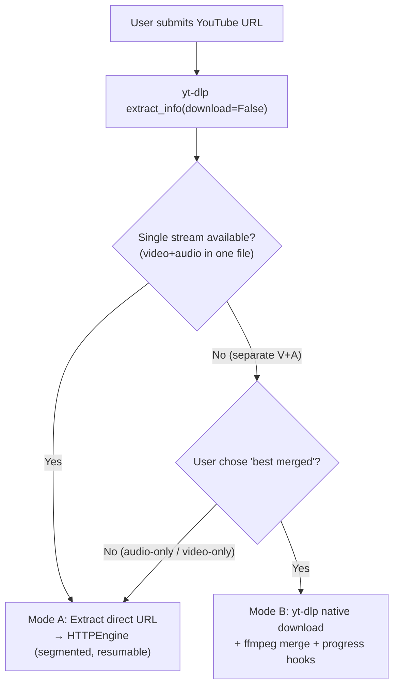
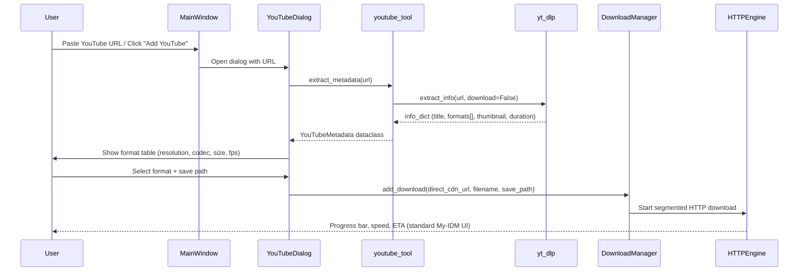
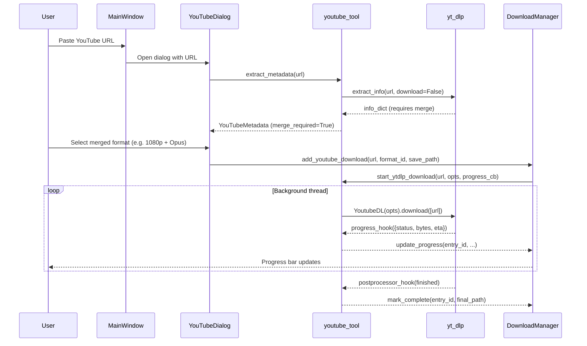
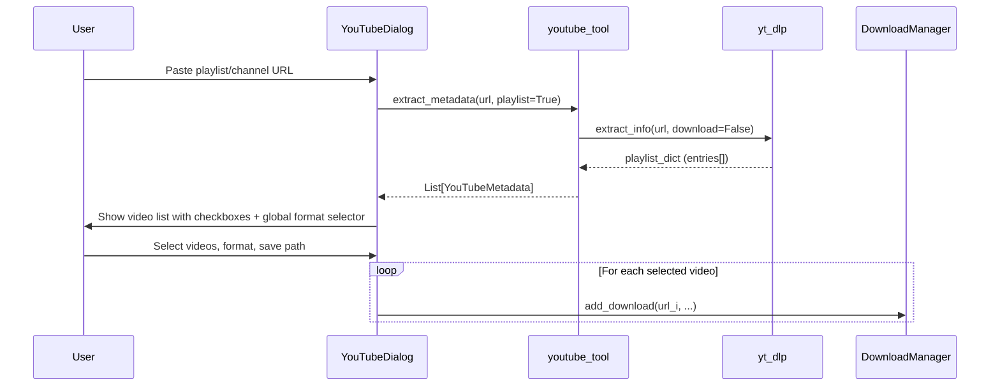

# 🎬 YouTube Scraper Architecture

Technical architecture for YouTube / generic video-site download integration in **My-IDM**, powered by [`yt-dlp`](https://github.com/yt-dlp/yt-dlp) as the external extraction engine.

---

## Table of Contents

- [1. Design Philosophy](#1-design-philosophy)
- [2. Why yt-dlp](#2-why-yt-dlp)
- [3. Integration Modes](#3-integration-modes)
- [4. Architecture Overview](#4-architecture-overview)
- [5. Data Flow](#5-data-flow)
- [6. Configuration Schema](#6-configuration-schema)
- [7. Module Breakdown](#7-module-breakdown)
- [8. UI / UX Specifications](#8-ui--ux-specifications)
- [9. Implementation Steps](#9-implementation-steps)
- [10. Error Handling & Edge Cases](#10-error-handling--edge-cases)
- [11. Security & Privacy](#11-security--privacy)
- [12. Testing Strategy](#12-testing-strategy)

---

## 1. Design Philosophy

YouTube's internal APIs, encryption signatures, and anti-bot protections change frequently. Building a native YouTube downloader would impose a permanent maintenance burden on this project.

**Core principle**: delegate all YouTube-specific extraction logic to an external, community-maintained tool (`yt-dlp`), and integrate it as a **subprocess or Python library** — the same pattern used for the [AnimePahe scraper](file:///d:/Projects/my-idm/my_idm/external_tools.py).

This gives us:
- **Zero maintenance** for YouTube protocol changes (yt-dlp releases handle it)
- **Broad site coverage** — yt-dlp supports 1800+ sites, not just YouTube
- **Clean separation** — My-IDM manages downloads; yt-dlp resolves URLs and metadata

---

## 2. Why yt-dlp

| Criteria | yt-dlp | Native Implementation |
|:---|:---|:---|
| YouTube breakage fixes | Community patches within hours | Requires our own reverse engineering |
| Site coverage | 1800+ extractors | YouTube only |
| Format selection | Comprehensive filter syntax | Would need custom logic |
| Anti-bot / PO tokens | Plugin ecosystem (`bgutil-ytdlp-pot-provider`) | Manual, fragile |
| Subtitle / metadata | Built-in | Custom parsing |
| License | Unlicense (public domain) | N/A |
| Install | `pip install yt-dlp` or standalone binary | N/A |

### Dependencies
- **`yt-dlp`** — URL resolution, metadata extraction, format negotiation
- **`ffmpeg`** (optional, recommended) — required for merging separate video+audio streams, post-processing (audio extraction, thumbnail embedding, subtitle embedding)

---

## 3. Integration Modes

My-IDM will support **two complementary integration modes**:

### Mode A: URL Extraction → HTTPEngine Delegation (Preferred)

```
yt-dlp (extract_info, download=False)
        │
        ▼
   Direct stream URL(s) + metadata
        │
        ▼
   My-IDM HTTPEngine
   (segmented download, resume, speed throttle, VPN/Tor)
```

**How it works:**
1. User pastes a YouTube URL → My-IDM calls `yt-dlp.extract_info(url, download=False)`
2. yt-dlp returns a JSON info dict containing direct CDN stream URLs + metadata (title, thumbnail, duration, filesize)
3. My-IDM creates a standard `DownloadEntry` with the resolved direct URL
4. HTTPEngine downloads it using segmented parallel streams, exactly like any normal HTTP download
5. My-IDM gets full control over: resume, speed limiting, scheduling, VPN/Tor routing, antivirus scanning

**Advantages:** Full My-IDM feature set (segments, resume, speed control, Tor, AV scan)
**Limitations:** Cannot merge separate video+audio streams (requires Mode B); direct URLs may expire quickly (YouTube CDN URLs are time-limited, typically ~6 hours)

### Mode B: yt-dlp Native Download with Progress Hooks

```
yt-dlp (download=True, progress_hooks=[...])
        │
        ▼
   yt-dlp handles download + ffmpeg merge internally
        │
        ▼
   Progress hooks → My-IDM UI progress updates
```

**How it works:**
1. User selects a format that requires merging (e.g., `bestvideo+bestaudio`)
2. My-IDM spawns yt-dlp in a background thread with `progress_hooks` callbacks
3. yt-dlp downloads both streams and merges them via ffmpeg
4. Progress hooks relay `downloaded_bytes`, `total_bytes`, `eta` back to a `DownloadEntry` for UI display
5. `postprocessor_hooks` signal completion

**Advantages:** Handles complex formats (4K + Opus audio merge), subtitle embedding, thumbnail embedding
**Limitations:** No segmented download, no My-IDM speed limiting, no resume (yt-dlp manages its own partial files)

### Decision Logic



---

## 4. Architecture Overview

```
┌─────────────────────────────────────────────────────────┐
│                     GUI Layer                            │
│  MainWindow → YouTubeDialog → Format Selection Table    │
│  Settings → External Tools → YouTube Tab                │
├─────────────────────────────────────────────────────────┤
│              YouTube Integration Layer                   │
│                  youtube_tool.py                         │
│    ┌──────────────────┬────────────────────┐            │
│    │  MetadataExtractor│  DownloadBridge    │            │
│    │  (extract_info)   │  (Mode A / Mode B) │            │
│    └──────────────────┴────────────────────┘            │
├─────────────────────────────────────────────────────────┤
│               External Tool (yt-dlp)                     │
│    Python library (import yt_dlp) or subprocess          │
│    + optional ffmpeg for merging / post-processing       │
├─────────────────────────────────────────────────────────┤
│          Existing My-IDM Infrastructure                  │
│    HTTPEngine │ DownloadManager │ Database │ Backlog     │
└─────────────────────────────────────────────────────────┘
```

---

## 5. Data Flow

### 5.1 Mode A — URL Extraction Flow



### 5.2 Mode B — yt-dlp Native Download Flow



### 5.3 Playlist / Channel Batch Flow



---

## 6. Configuration Schema

Extend the existing [`ExternalToolsConfig`](file:///d:/Projects/my-idm/my_idm/config.py#L437) dataclass:

```python
@dataclass
class ExternalToolsConfig:
    # ... existing AnimePahe fields ...

    # YouTube / yt-dlp settings
    ytdlp_enabled: bool = True
    ytdlp_path: str = ""                    # Path to yt-dlp binary (empty = use pip-installed)
    ytdlp_ffmpeg_path: str = ""             # Path to ffmpeg binary (empty = system PATH)
    ytdlp_default_format: str = "bestvideo[height<=1080]+bestaudio/best"
    ytdlp_prefer_mode_a: bool = True        # Prefer URL extraction over native download
    ytdlp_embed_thumbnail: bool = True      # Embed thumbnail in downloaded file
    ytdlp_embed_subtitles: bool = False     # Download & embed subtitles
    ytdlp_subtitle_langs: str = "en"        # Comma-separated subtitle language codes
    ytdlp_cookies_browser: str = ""         # Browser to extract cookies from (chrome, firefox, edge, "")
    ytdlp_extra_args: str = ""              # Additional CLI args passed to yt-dlp
    ytdlp_auto_detect_urls: bool = True     # Auto-detect YouTube URLs in Add Download dialog
    ytdlp_last_save_path: str = ""          # Last used save directory for YouTube downloads
    ytdlp_last_format: str = ""             # Last selected format string
```

### QSettings Persistence

Stored under `ExternalTools` group (same as AnimePahe):
```
[ExternalTools]
ytdlp_enabled=true
ytdlp_path=
ytdlp_ffmpeg_path=
ytdlp_default_format=bestvideo[height<=1080]+bestaudio/best
ytdlp_prefer_mode_a=true
...
```

---

## 7. Module Breakdown

### 7.1 `my_idm/youtube_tool.py` (New File)

The core integration module. Responsibilities:

| Component | Description |
|:---|:---|
| `YouTubeMetadata` | Dataclass holding extracted video info (title, thumbnail, duration, formats, uploader, upload_date) |
| `YouTubeFormat` | Dataclass for a single format option (format_id, ext, resolution, fps, vcodec, acodec, filesize, url) |
| `extract_metadata(url)` | Calls `yt_dlp.extract_info(download=False)`, returns `YouTubeMetadata` |
| `extract_playlist(url)` | Extracts playlist/channel metadata, returns `List[YouTubeMetadata]` |
| `resolve_direct_url(url, format_id)` | Returns the direct CDN stream URL for Mode A |
| `start_native_download(url, opts, progress_cb, done_cb)` | Runs yt-dlp download in a daemon thread for Mode B |
| `detect_youtube_url(text)` | Regex to detect YouTube/supported-site URLs in clipboard or text input |
| `check_ytdlp_available()` | Verifies yt-dlp is importable or the binary exists at the configured path |
| `check_ffmpeg_available()` | Verifies ffmpeg is on PATH or at the configured path |
| `get_ytdlp_version()` | Returns installed yt-dlp version string |

#### Key Implementation Details

```python
# extract_metadata pseudo-implementation
def extract_metadata(url: str, config: ExternalToolsConfig) -> YouTubeMetadata:
    ydl_opts = {
        "quiet": True,
        "no_warnings": True,
        "extract_flat": False,
        "format": config.ytdlp_default_format,
    }
    if config.ytdlp_cookies_browser:
        ydl_opts["cookiesfrombrowser"] = (config.ytdlp_cookies_browser,)
    if config.ytdlp_ffmpeg_path:
        ydl_opts["ffmpeg_location"] = config.ytdlp_ffmpeg_path
    
    with yt_dlp.YoutubeDL(ydl_opts) as ydl:
        info = ydl.extract_info(url, download=False)
    
    formats = [
        YouTubeFormat(
            format_id=f["format_id"],
            ext=f.get("ext", "?"),
            resolution=f.get("resolution", "audio only"),
            fps=f.get("fps"),
            vcodec=f.get("vcodec", "none"),
            acodec=f.get("acodec", "none"),
            filesize=f.get("filesize") or f.get("filesize_approx"),
            url=f.get("url", ""),
            has_video=f.get("vcodec", "none") != "none",
            has_audio=f.get("acodec", "none") != "none",
        )
        for f in info.get("formats", [])
        if f.get("url")  # Only formats with downloadable URLs
    ]
    
    return YouTubeMetadata(
        id=info["id"],
        title=info.get("title", "Unknown"),
        thumbnail=info.get("thumbnail"),
        duration=info.get("duration"),
        uploader=info.get("uploader"),
        upload_date=info.get("upload_date"),
        description=info.get("description", ""),
        formats=formats,
        webpage_url=info.get("webpage_url", url),
        is_playlist="entries" in info,
    )
```

```python
# Mode B native download with progress hooks
def start_native_download(
    url: str,
    save_dir: str,
    format_id: str,
    config: ExternalToolsConfig,
    progress_cb: Callable[[dict], None],
    done_cb: Callable[[str], None],
    error_cb: Callable[[str], None],
) -> threading.Thread:
    
    def _worker():
        ydl_opts = {
            "format": format_id,
            "outtmpl": os.path.join(save_dir, "%(title)s.%(ext)s"),
            "progress_hooks": [progress_cb],
            "postprocessor_hooks": [_on_postprocess],
            "quiet": True,
            "no_warnings": True,
        }
        if config.ytdlp_embed_thumbnail:
            ydl_opts.setdefault("postprocessors", []).append(
                {"key": "EmbedThumbnail"}
            )
        if config.ytdlp_embed_subtitles:
            ydl_opts["writesubtitles"] = True
            ydl_opts["subtitleslangs"] = config.ytdlp_subtitle_langs.split(",")
            ydl_opts.setdefault("postprocessors", []).append(
                {"key": "FFmpegEmbedSubtitle"}
            )
        
        try:
            with yt_dlp.YoutubeDL(ydl_opts) as ydl:
                ydl.download([url])
            done_cb(save_dir)
        except Exception as exc:
            error_cb(str(exc))
    
    t = threading.Thread(target=_worker, name="ytdlp-download", daemon=True)
    t.start()
    return t
```

### 7.2 `my_idm/youtube_dialog.py` (New File)

A Qt dialog for YouTube URL input and format selection.

| Widget | Description |
|:---|:---|
| URL input + "Analyze" button | Text field to paste a YouTube URL; clicking Analyze calls `extract_metadata` |
| Thumbnail preview | Shows the video thumbnail (downloaded via `QNetworkAccessManager`) |
| Video info panel | Title, uploader, duration, upload date |
| Format selection table | `QTableView` with columns: Resolution, FPS, Codec, Size, Audio, Type |
| Quality preset dropdown | Quick presets: "Best (1080p)", "Best (720p)", "Audio Only (MP3)", "Best Available" |
| Save path selector | Directory picker, defaults to `ytdlp_last_save_path` |
| Options panel | Checkboxes: Embed thumbnail, Embed subtitles, Subtitle language selector |
| Download button | Dispatches to Mode A or Mode B based on selected format |

### 7.3 Changes to Existing Files

| File | Change |
|:---|:---|
| [`config.py`](file:///d:/Projects/my-idm/my_idm/config.py) | Add `ytdlp_*` fields to `ExternalToolsConfig` |
| [`external_tools.py`](file:///d:/Projects/my-idm/my_idm/external_tools.py) | Add `launch_ytdlp_cli()` for subprocess mode, `check_ytdlp_installed()` |
| [`settings_dialog.py`](file:///d:/Projects/my-idm/my_idm/settings_dialog.py) | Add YouTube sub-tab under External Tools preferences tab |
| [`main_window.py`](file:///d:/Projects/my-idm/my_idm/main_window.py) | Add "Download YouTube Video…" action in toolbar/menu, auto-detect YouTube URLs on paste |
| [`manager.py`](file:///d:/Projects/my-idm/my_idm/manager.py) | Add `add_youtube_download()` method for Mode B downloads, progress relay |
| [`download_model.py`](file:///d:/Projects/my-idm/my_idm/download_model.py) | Handle `source_type = "youtube"` for display icon and metadata columns |
| [`database.py`](file:///d:/Projects/my-idm/my_idm/database.py) | Store YouTube metadata in existing `metadata_json` column (video_id, format, uploader) |
| [`dialogs.py`](file:///d:/Projects/my-idm/my_idm/dialogs.py) | Auto-detect YouTube URLs in the "Add Download" dialog → redirect to `YouTubeDialog` |

---

## 8. UI / UX Specifications

### 8.1 YouTube Download Dialog Mockup

```
┌─────────────────────────────────────────────────────────┐
│  🎬 Download YouTube Video                          [✕] │
├─────────────────────────────────────────────────────────┤
│                                                         │
│  URL: [https://youtube.com/watch?v=...    ] [Analyze▶]  │
│                                                         │
│  ┌──────────┐  Title: Rick Astley - Never Gonna...     │
│  │          │  Uploader: Rick Astley                     │
│  │ Thumbnail│  Duration: 3:33                           │
│  │          │  Uploaded: 2009-10-25                      │
│  └──────────┘                                           │
│                                                         │
│  Quality Preset: [Best (1080p)          ▾]              │
│                                                         │
│  ┌─────────────────────────────────────────────────┐    │
│  │ Res.    │ FPS │ Codec    │ Size    │ Audio │ ⬇ │    │
│  ├─────────┼─────┼──────────┼─────────┼───────┼───┤    │
│  │ 1080p   │ 30  │ avc1     │ 48 MB   │  ✓    │ ○ │    │
│  │ 1080p   │ 30  │ vp9+opus │ 42 MB   │ merge │ ● │    │
│  │ 720p    │ 30  │ avc1     │ 22 MB   │  ✓    │ ○ │    │
│  │ 480p    │ 30  │ avc1     │ 11 MB   │  ✓    │ ○ │    │
│  │ audio   │  -  │ opus     │ 3.2 MB  │  ✓    │ ○ │    │
│  │ audio   │  -  │ m4a      │ 3.5 MB  │  ✓    │ ○ │    │
│  └─────────────────────────────────────────────────┘    │
│                                                         │
│  ☐ Embed thumbnail   ☐ Embed subtitles [en ▾]          │
│                                                         │
│  Save to: [D:\Downloads\YouTube\             ] [Browse] │
│                                                         │
│                              [Cancel]  [⬇ Download]    │
└─────────────────────────────────────────────────────────┘
```

### 8.2 Toolbar / Menu Integration

- **Tools menu**: `Tools → Download YouTube Video…` (shortcut: `Ctrl+Y`)
- **Add Download dialog**: Auto-detect YouTube URLs → show "Open in YouTube Downloader" button
- **Toolbar**: Optional YouTube icon button (configurable visibility via preferences)

### 8.3 Download Table Appearance

- YouTube downloads show a small 🎬 badge in the Name column
- `metadata_json` stores `video_id`, `uploader`, `format_note` for the details panel
- Mode B downloads show yt-dlp-relayed progress (may not show segment info)

### 8.4 Settings → External Tools → YouTube Tab

```
┌──────────────────────────────────────────────────────┐
│  YouTube / yt-dlp Settings                           │
├──────────────────────────────────────────────────────┤
│                                                      │
│  ☑ Enable YouTube integration                        │
│                                                      │
│  yt-dlp path:  [auto-detect                ] [Browse]│
│  ffmpeg path:  [auto-detect                ] [Browse]│
│  Version: yt-dlp 2026.09.15  [Check for Updates]    │
│                                                      │
│  ── Default Format ──────────────────────────────    │
│  Format string: [bestvideo[h<=1080]+bestaudio/best]  │
│  ☑ Prefer direct URL mode (faster, resumable)        │
│                                                      │
│  ── Post-processing ─────────────────────────────    │
│  ☑ Embed thumbnail in downloaded file                │
│  ☐ Download & embed subtitles                        │
│    Languages: [en                                  ] │
│                                                      │
│  ── Authentication ──────────────────────────────    │
│  Cookie source: [None ▾]  (Chrome / Firefox / Edge)  │
│  ⚠ Uses a throwaway account — automated access       │
│    risks account restrictions                        │
│                                                      │
│  ── Misc ────────────────────────────────────────    │
│  ☑ Auto-detect YouTube URLs in Add Download dialog   │
│  Extra yt-dlp args: [                              ] │
│                                                      │
└──────────────────────────────────────────────────────┘
```

---

## 9. Implementation Steps

Ordered checklist with dependencies. Each step is independently testable.

### Phase 1: Foundation (Core Module + Config)

- [ ] **1.1** Add `ytdlp_*` fields to `ExternalToolsConfig` in [`config.py`](file:///d:/Projects/my-idm/my_idm/config.py#L437)
  - Add all fields listed in §6 to the dataclass
  - Update `to_dict()`, `from_dict()`, `save()`, `load()` methods
  - Write unit tests for serialization round-trip

- [ ] **1.2** Create `my_idm/youtube_tool.py` — core extraction module
  - Implement `YouTubeMetadata` and `YouTubeFormat` dataclasses
  - Implement `check_ytdlp_available()` and `get_ytdlp_version()`
  - Implement `check_ffmpeg_available()`
  - Implement `detect_youtube_url(text) → Optional[str]` regex matcher
  - Write unit tests with mocked `yt_dlp` (avoid network calls in CI)

- [ ] **1.3** Implement `extract_metadata(url, config)` in `youtube_tool.py`
  - Call `yt_dlp.YoutubeDL.extract_info(url, download=False)`
  - Parse formats into `YouTubeFormat` list
  - Handle playlists (`entries` key) → return `List[YouTubeMetadata]`
  - Determine `merge_required` flag per format (has video but no audio, or vice versa)
  - Write integration test with a known stable public-domain video URL

- [ ] **1.4** Implement `resolve_direct_url(url, format_id, config)` for Mode A
  - Extract the direct CDN URL from the chosen format
  - Validate URL is accessible (HEAD request)
  - Return `(direct_url, filename, filesize, content_type)`

### Phase 2: Mode A — HTTPEngine Integration

- [ ] **2.1** Add `add_youtube_download()` to `DownloadManager`
  - Accept YouTube metadata + selected format
  - For Mode A: call `resolve_direct_url()`, then `add_download()` with the direct URL
  - Store YouTube metadata in `metadata_json` (video_id, uploader, format_note, original_url)
  - Sanitize video title for safe filename (`utils.sanitize_filename()`)

- [ ] **2.2** Handle URL expiration (Mode A specific)
  - YouTube CDN URLs typically expire after ~6 hours
  - On resume of a failed/paused YouTube download: re-extract URL via `resolve_direct_url()`
  - Store `original_youtube_url` in `metadata_json` for re-resolution
  - Add `_refresh_youtube_url(entry)` method to `DownloadManager`

### Phase 3: Mode B — yt-dlp Native Download

- [ ] **3.1** Implement `start_native_download()` in `youtube_tool.py`
  - Run `yt_dlp.YoutubeDL().download()` in a daemon thread (`ytdlp-download`)
  - Wire `progress_hooks` → callback that translates to `DownloadEntry` progress fields
  - Wire `postprocessor_hooks` → callback for completion
  - Handle thread cancellation (set `yt_dlp` abort flag)

- [ ] **3.2** Add Mode B download tracking to `DownloadManager`
  - Create a `DownloadEntry` with `source_type = "youtube_native"` and status `DOWNLOADING`
  - Map yt-dlp progress hook fields to entry fields:
    - `d["downloaded_bytes"]` → `entry.downloaded`
    - `d["total_bytes"]` → `entry.total_size`
    - `d["speed"]` → `entry.speed`
    - `d["eta"]` → `entry.eta`
  - On `postprocessor_hooks[status=finished]` → mark entry `COMPLETED`, store final file path
  - On exception → mark entry `ERROR` with error message

- [ ] **3.3** Implement cancellation for Mode B
  - Set a threading event or flag that the worker thread checks
  - On cancel: close yt-dlp's internal downloader (may require monkey-patching or using subprocess mode as fallback)

### Phase 4: YouTube Dialog (UI)

- [ ] **4.1** Create `my_idm/youtube_dialog.py`
  - URL input field + "Analyze" button
  - Show loading spinner during `extract_metadata()` (run in `QThread` or `QRunnable`)
  - Display video thumbnail (fetch via `QNetworkAccessManager`)
  - Display video info: title, uploader, duration, upload date

- [ ] **4.2** Build format selection table
  - `QTableView` with columns: Resolution, FPS, Video Codec, Audio Codec, Size, Type (single/merge)
  - Quality preset dropdown: "Best 1080p", "Best 720p", "Audio Only", "Best Available"
  - Preset changes selection in the table
  - Highlight which mode (A vs B) will be used for each format

- [ ] **4.3** Build options panel
  - Embed thumbnail checkbox
  - Embed subtitles checkbox + language selector
  - Save path directory picker (defaults to last used path)

- [ ] **4.4** Implement playlist/channel support in dialog
  - Detect playlist URLs → show video list with checkboxes
  - "Select All" / "Deselect All" buttons
  - Global format selector applied to all selected videos
  - Progress: queue all selected videos as separate downloads

### Phase 5: Menu / Toolbar Integration

- [ ] **5.1** Add YouTube action to MainWindow
  - `Tools → Download YouTube Video…` menu item (shortcut: `Ctrl+Y`)
  - Use `_create_emoji_icon("🎬")` for the icon
  - Triggered → open `YouTubeDialog`

- [ ] **5.2** Auto-detect YouTube URLs in "Add Download" dialog
  - When user pastes a URL in the existing "Add Download" dialog, check `detect_youtube_url()`
  - If YouTube URL detected: show inline banner "This looks like a YouTube link — [Open YouTube Downloader]"
  - Clicking the banner transfers the URL to `YouTubeDialog`

- [ ] **5.3** Add YouTube icon badge to download table
  - In `DownloadTableModel._display_data()`, check `metadata_json` for `video_id`
  - Prepend 🎬 emoji or small icon to the filename display

### Phase 6: Settings UI

- [ ] **6.1** Add YouTube sub-tab to External Tools preferences
  - Enable/disable toggle
  - yt-dlp path browser (with auto-detect status)
  - ffmpeg path browser (with auto-detect status)
  - yt-dlp version display + "Check for Updates" button (runs `pip install -U yt-dlp`)
  - Default format string input
  - Mode A preference toggle
  - Post-processing options (thumbnail, subtitles)
  - Cookie source dropdown
  - Extra args text field

- [ ] **6.2** Wire settings persistence
  - Load/save to `ExternalToolsConfig`
  - Live validation: show ✓/✗ status next to yt-dlp and ffmpeg paths
  - "Test" button: attempts `extract_metadata()` on a known short video

### Phase 7: Polish & Edge Cases

- [ ] **7.1** Handle age-restricted videos
  - Detect `age_gate` in info dict → prompt user for cookie source
  - Show warning: "This video is age-restricted. You need to provide browser cookies."

- [ ] **7.2** Handle geo-restricted videos
  - Detect geo-restriction errors from yt-dlp
  - If VPN/Tor is enabled, suggest routing through VPN

- [ ] **7.3** Handle live streams
  - Detect `is_live` in info dict → warn user "Live streams cannot be downloaded with segmented mode"
  - Force Mode B for live streams

- [ ] **7.4** Handle private/members-only videos
  - Detect authentication errors → prompt for cookie source
  - Clear error messaging in the dialog

- [ ] **7.5** yt-dlp auto-update mechanism
  - Settings button: "Update yt-dlp" → runs `pip install -U yt-dlp` in subprocess
  - Optional: check for updates on startup (configurable)

---

## 10. Error Handling & Edge Cases

| Scenario | Handling |
|:---|:---|
| yt-dlp not installed | Show install prompt in dialog: `pip install yt-dlp` |
| ffmpeg not found | Disable Mode B options, show warning for merge formats |
| Network error during extraction | Retry with exponential backoff (max 3 attempts) |
| URL expired during Mode A download | Auto re-resolve URL via `_refresh_youtube_url()` |
| Age-restricted video | Prompt user for browser cookie source |
| Geo-restricted video | Suggest VPN/Tor if available |
| Rate-limited by YouTube | Back off, show "Rate limited — try again in X seconds" |
| Unsupported URL | Show "yt-dlp doesn't support this site" with list of supported sites link |
| yt-dlp crash / hang | Watchdog timer (30s no progress) → kill thread, mark error |
| Disk full during download | Standard My-IDM disk space handling |

---

## 11. Security & Privacy

- **Cookie source warning**: Prominently warn users that providing browser cookies exposes their YouTube account credentials to yt-dlp. Recommend using a throwaway/secondary account.
- **No telemetry**: yt-dlp does not phone home. My-IDM does not log YouTube URLs beyond the download entry.
- **Tor/VPN integration**: Mode A downloads go through My-IDM's VPN/Tor stack. Mode B downloads are NOT routed through VPN/Tor (yt-dlp manages its own HTTP connections). Document this clearly.
- **Antivirus scanning**: Downloaded files are scanned by the existing AV subsystem post-completion.

---

## 12. Testing Strategy

| Layer | Test Type | Details |
|:---|:---|:---|
| `youtube_tool.py` | Unit (mocked) | Mock `yt_dlp.YoutubeDL` → test metadata parsing, format classification, URL detection regex |
| `youtube_tool.py` | Integration | Real `extract_metadata()` call on a known Creative Commons video (network required, skip in CI) |
| `ExternalToolsConfig` | Unit | Serialization round-trip for new `ytdlp_*` fields |
| `YouTubeDialog` | Unit (headless) | Widget creation, format table population from mock data |
| Mode A flow | Integration | Full flow: extract URL → add to manager → verify HTTPEngine picks it up |
| Mode B flow | Integration | Full flow: native download with progress hooks → verify entry updates |
| URL detection | Unit | Test regex against: youtube.com, youtu.be, youtube.com/shorts/, /playlist?list=, non-YouTube URLs |
| Error paths | Unit | Test yt-dlp ImportError, network error, age-gate, geo-block handling |

### Test Fixtures

```python
# Mocked yt-dlp info dict for unit tests
MOCK_VIDEO_INFO = {
    "id": "dQw4w9WgXcQ",
    "title": "Rick Astley - Never Gonna Give You Up",
    "thumbnail": "https://i.ytimg.com/vi/dQw4w9WgXcQ/maxresdefault.jpg",
    "duration": 213,
    "uploader": "Rick Astley",
    "upload_date": "20091025",
    "formats": [
        {
            "format_id": "22",
            "ext": "mp4",
            "resolution": "1280x720",
            "fps": 30,
            "vcodec": "avc1.64001F",
            "acodec": "mp4a.40.2",
            "filesize": 23_000_000,
            "url": "https://cdn.example.com/video.mp4",
        },
        {
            "format_id": "137",
            "ext": "mp4",
            "resolution": "1920x1080",
            "fps": 30,
            "vcodec": "avc1.640028",
            "acodec": "none",
            "filesize": 48_000_000,
            "url": "https://cdn.example.com/video_only.mp4",
        },
        {
            "format_id": "140",
            "ext": "m4a",
            "resolution": "audio only",
            "fps": None,
            "vcodec": "none",
            "acodec": "mp4a.40.2",
            "filesize": 3_500_000,
            "url": "https://cdn.example.com/audio.m4a",
        },
    ],
    "webpage_url": "https://www.youtube.com/watch?v=dQw4w9WgXcQ",
}
```
