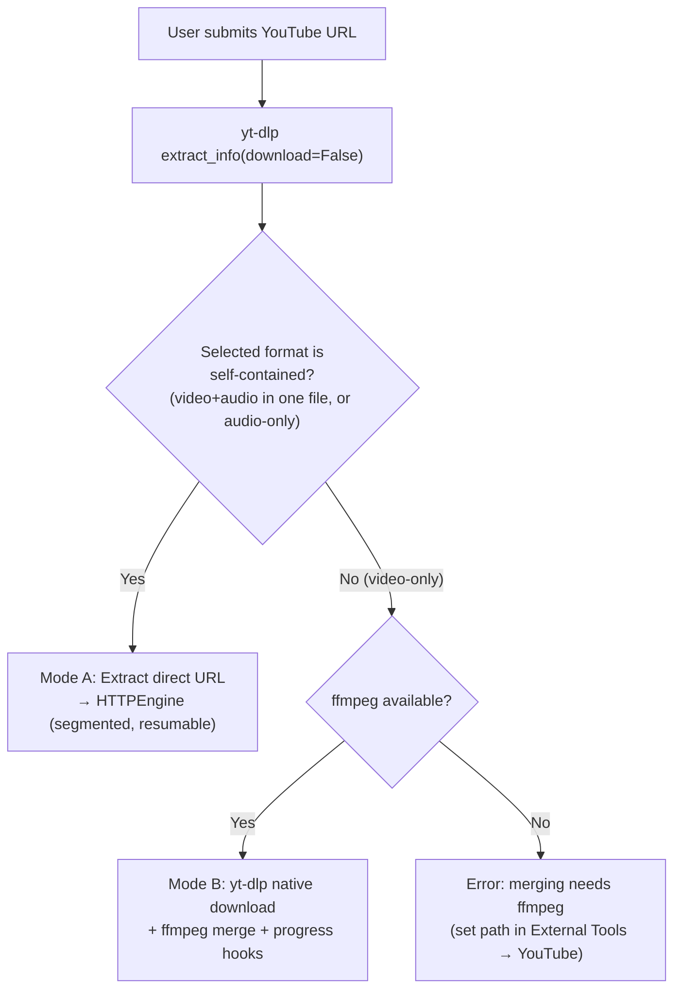
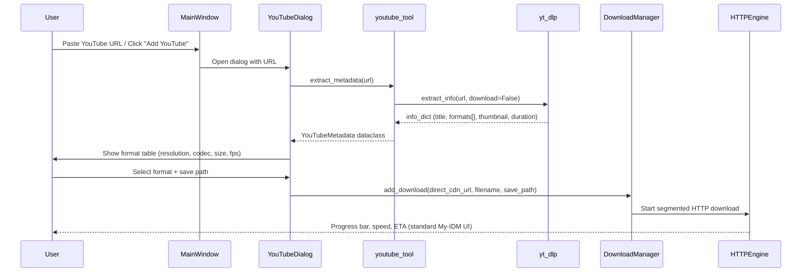
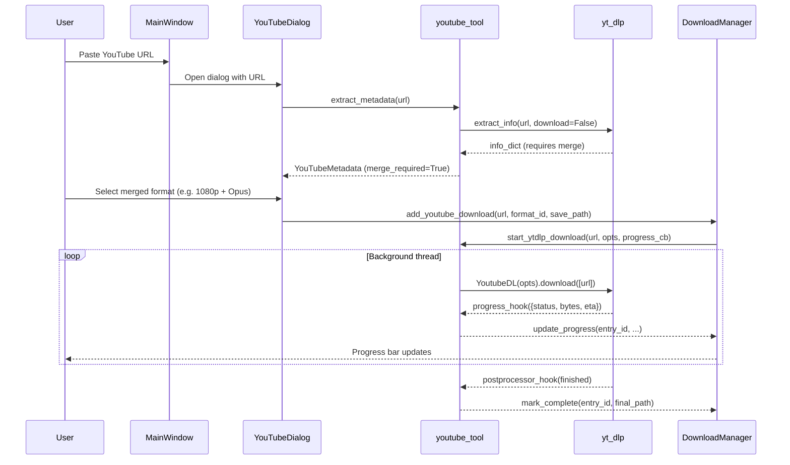
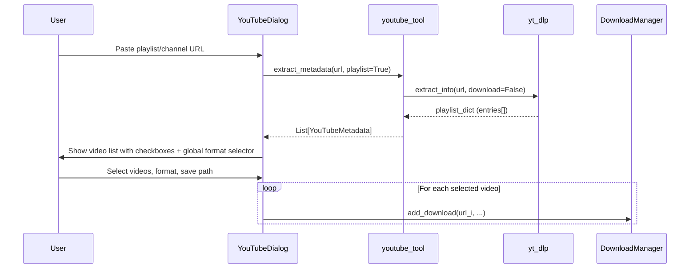

# YouTube Scraper Architecture

Technical architecture for YouTube / generic video-site download integration in **My-IDM**, powered by [`yt-dlp`](https://github.com/yt-dlp/yt-dlp) as the external extraction engine.

> **Status: all 7 phases implemented.** Phase 5.3 (table badge) and Phase 6 (settings UI) were
> completed in the final pass. See [`docs/TODO.md`](../TODO.md) for the live checklist.
>
> **⚠️ Correction to the original design (validated against YouTube in Sep 2026):**
> YouTube has deprecated *muxed* formats — a single file containing both video and audio. A real
> 4K sample exposed **49 formats: 37 video-only, 10 audio-only, 0 muxed**. The "Decision Logic"
> flowchart below assumed a single-stream file would usually be available; in practice **Mode A
> can only download audio**, and every video download requires Mode B (yt-dlp + ffmpeg merge).
> Mode A remains valuable for audio-only and for non-YouTube sites that still serve combined
> streams, so both paths are kept.

### Field-verified design notes

Three defects were found only by exercising the feature against real videos. They are recorded
here because each one invalidated an assumption in the original design:

1. **Output names must be controlled by My-IDM, not yt-dlp.** A real title contained an ASCII
   `/` (`Passacaglia - G.F. Handel/ Arr. by J. Halvorsen [PIANO COVER]`). My-IDM recorded the
   raw title as `entry.filename`, so `file_path` pointed into a non-existent subdirectory, while
   yt-dlp independently rewrote the name (mapping `/` to `⧸`) and wrote a flat file. The download
   completed but reported **"file not found"**. Both sides now agree: `_add_youtube_mode_b()`
   sanitises the stem and passes an explicit `outtmpl` of `<stem>.%(ext)s`, with
   `merge_output_format="mp4"` so the container is deterministic.

2. **Playlist listing must be a single flat request.** The original per-entry loop re-extracted
   every video: **61 network calls for a 60-video playlist**, which reads as a hang. Now one flat
   request plus a single full extraction of the first video (for the format table) — 2 calls. The
   remaining entries intentionally carry no formats, which is fine because Mode B lets yt-dlp
   negotiate streams itself.

3. **The analysis worker must not be a `QThread`.** Closing the dialog mid-analysis deleted the
   `QThread` while `run()` was still executing, which aborts the process
   (`0xC0000409`). Detaching and re-parenting was not enough — a `QThread` is still destroyed at
   interpreter exit. The worker is now a plain daemon `threading.Thread` with a `QObject` signal
   bridge in the GUI thread, plus cooperative cancellation polled between playlist entries.
   `close()` returns immediately and a late result is ignored via a `_closing` guard.

4. **Playlist listings are rate-limit bounded.** Beyond the per-request cost, the number of
   *listed* entries is capped by `ytdlp_playlist_limit` (default **10**, range 1–500, editable in
   Settings → External Tools → YouTube). The cap changes only how many entries are shown — never
   the request count, which stays at two. `extract_playlist()` returns a `PlaylistResult`
   carrying `total`/`truncated` so the dialog can state "Showing 10 of 143 videos" rather than
   silently presenting a partial list. Two further guards reduce pressure on the site: a **0.75 s
   minimum gap** between extraction requests, and a **5-minute cache** keyed by
   `(mode, config fingerprint, url)` so re-analysing the same link is free. The config fingerprint
   is required — cookie source and ffmpeg location change what a URL resolves to, so a cached
   result must never cross configurations.

5. **Progress must be aggregated across streams, not passed through.** yt-dlp's `progress_hooks`
   fire **per stream**: a merged video+audio download reports the video stream 0→100% and then
   restarts at 0% for the audio stream. Forwarding those figures verbatim made the UI progress bar
   jump backwards, which looked like several threads writing to one bar. `_progress_hook()` in
   `youtube_tool.py` keeps a per-stream `downloaded`/`total` map (keyed by `info_dict.format_id`)
   and emits the **sum** of all streams, each held monotonic via `max()`.

   The reported *total* comes from `youtube_expected_size` — the summed size of the selected
   formats, computed by `_expected_total_size()` before the download starts — rather than yt-dlp's
   running total. That total grows as each stream is reached, so using it made progress fall from
   100% back to ~91% when the second stream began. With the known total, a merged download advances
   smoothly 0→100%. When the expected size is unknown the hook falls back to summed stream totals.

6. **Deleting a Mode B download must clean up yt-dlp's scratch files.** yt-dlp deliberately keeps
   `<stem>.part` files so a download can resume, and merged streams leave per-format fragments
   (`<stem>.f616.mp4.part`). `delete_download(delete_files=True)` only ever targeted
   `entry.file_path` — the *final* name — so a download deleted mid-transfer left
   `….f616.mp4.part` behind, still locked, because the worker still held the handle. The fix has
   three parts:
   - `_stop_ytdlp_worker()` signals cancellation and **joins the worker (5 s bound)** before any
     file operation, so Windows has released the handle. Delete paths pass `force=True` so the job
     is dropped from the registry even if the thread ignores cancellation — otherwise the entry
     leaks and a later resume is blocked.
   - `_purge_youtube_temp_files()` removes `.part`, `.ytdl`, `.temp` and `.fNNN` siblings of the
     entry's stem while deliberately keeping the final media file.
   - `_on_ytdlp_progress()` returns early when the DB entry has already been deleted. It previously
     dereferenced `None`, producing a flood of
     `'NoneType' object has no attribute 'total_size'` in the log after every delete.

   Cancellation also raises `yt_dlp.utils.DownloadError` from the progress hook rather than a bare
   exception; yt-dlp only unwinds cleanly for its own error type and otherwise reports
   "bad parameter or other API misuse".

---

## Table of Contents

- [1. Design Philosophy](#1-design-philosophy)
- [2. Why yt-dlp](#2-why-yt-dlp)
- [3. Integration Modes](#3-integration-modes)
- [4. Architecture Overview](#4-architecture-overview)
- [5. Data Flow](#5-data-flow)
- [6. Configuration Schema](#6-configuration-schema)
- [7. Module Breakdown](#7-module-breakdown)
- [8. UI / UX Specifications](#8-ui--ux-specifications)
- [9. Implementation Steps](#9-implementation-steps)
- [10. Error Handling & Edge Cases](#10-error-handling--edge-cases)
- [11. Security & Privacy](#11-security--privacy)
- [12. Testing Strategy](#12-testing-strategy)

---

## 1. Design Philosophy

YouTube's internal APIs, encryption signatures, and anti-bot protections change frequently. Building a native YouTube downloader would impose a permanent maintenance burden on this project.

**Core principle**: delegate all YouTube-specific extraction logic to an external, community-maintained tool (`yt-dlp`), and integrate it as a **subprocess or Python library** — the same pattern used for the [AnimePahe scraper](file:///d:/Projects/my-idm/my_idm/external_tools.py).

This gives us:
- **Zero maintenance** for YouTube protocol changes (yt-dlp releases handle it)
- **Broad site coverage** — yt-dlp supports 1800+ sites, not just YouTube
- **Clean separation** — My-IDM manages downloads; yt-dlp resolves URLs and metadata

---

## 2. Why yt-dlp

| Criteria | yt-dlp | Native Implementation |
|:---|:---|:---|
| YouTube breakage fixes | Community patches within hours | Requires our own reverse engineering |
| Site coverage | 1800+ extractors | YouTube only |
| Format selection | Comprehensive filter syntax | Would need custom logic |
| Anti-bot / PO tokens | Plugin ecosystem (`bgutil-ytdlp-pot-provider`) | Manual, fragile |
| Subtitle / metadata | Built-in | Custom parsing |
| License | Unlicense (public domain) | N/A |
| Install | `pip install yt-dlp` or standalone binary | N/A |

### Dependencies
- **`yt-dlp`** — URL resolution, metadata extraction, format negotiation
- **`ffmpeg`** (optional, recommended) — required for merging separate video+audio streams, post-processing (audio extraction, thumbnail embedding, subtitle embedding)

---

## 3. Integration Modes

My-IDM will support **two complementary integration modes**:

### Mode A: URL Extraction → HTTPEngine Delegation (Preferred)

```
yt-dlp (extract_info, download=False)
        │
        ▼
   Direct stream URL(s) + metadata
        │
        ▼
   My-IDM HTTPEngine
   (segmented download, resume, speed throttle, VPN/Tor)
```

**How it works:**
1. User pastes a YouTube URL → My-IDM calls `yt-dlp.extract_info(url, download=False)`
2. yt-dlp returns a JSON info dict containing direct CDN stream URLs + metadata (title, thumbnail, duration, filesize)
3. My-IDM creates a standard `DownloadEntry` with the resolved direct URL
4. HTTPEngine downloads it using segmented parallel streams, exactly like any normal HTTP download
5. My-IDM gets full control over: resume, speed limiting, scheduling, VPN/Tor routing, antivirus scanning

**Advantages:** Full My-IDM feature set (segments, resume, speed control, Tor, AV scan)
**Limitations:** Cannot merge separate video+audio streams (requires Mode B); direct URLs may expire quickly (YouTube CDN URLs are time-limited, typically ~6 hours)

### Mode B: yt-dlp Native Download with Progress Hooks

```
yt-dlp (download=True, progress_hooks=[...])
        │
        ▼
   yt-dlp handles download + ffmpeg merge internally
        │
        ▼
   Progress hooks → My-IDM UI progress updates
```

**How it works:**
1. User selects a format that requires merging (e.g., `bestvideo+bestaudio`)
2. My-IDM spawns yt-dlp in a background thread with `progress_hooks` callbacks
3. yt-dlp downloads both streams and merges them via ffmpeg
4. Progress hooks relay `downloaded_bytes`, `total_bytes`, `eta` back to a `DownloadEntry` for UI display
5. `postprocessor_hooks` signal completion

**Advantages:** Handles complex formats (4K + Opus audio merge), subtitle embedding, thumbnail embedding
**Limitations:** No segmented download, no My-IDM speed limiting, no resume (yt-dlp manages its own partial files)

### Decision Logic



> **Reality check (Sep 2026):** YouTube serves **no muxed formats** for most modern videos, so the
> `C -- Yes --> D` branch is rarely taken for video and is effectively audio-only. Mode B is the
> default path for video. `DownloadManager.add_youtube_download(mode="auto")` resolves this via
> `_can_use_mode_a()`, which rejects any video-only format.

---

## 4. Architecture Overview

```
┌─────────────────────────────────────────────────────────┐
│                     GUI Layer                            │
│  MainWindow → YouTubeDialog → Format Selection Table    │
│  Settings → External Tools → YouTube Tab                │
├─────────────────────────────────────────────────────────┤
│              YouTube Integration Layer                   │
│                  youtube_tool.py                         │
│    ┌──────────────────┬────────────────────┐            │
│    │  MetadataExtractor│  DownloadBridge    │            │
│    │  (extract_info)   │  (Mode A / Mode B) │            │
│    └──────────────────┴────────────────────┘            │
├─────────────────────────────────────────────────────────┤
│               External Tool (yt-dlp)                     │
│    Python library (import yt_dlp) or subprocess          │
│    + optional ffmpeg for merging / post-processing       │
├─────────────────────────────────────────────────────────┤
│          Existing My-IDM Infrastructure                  │
│    HTTPEngine │ DownloadManager │ Database │ Backlog     │
└─────────────────────────────────────────────────────────┘
```

---

## 5. Data Flow

### 5.1 Mode A — URL Extraction Flow



### 5.2 Mode B — yt-dlp Native Download Flow



### 5.3 Playlist / Channel Batch Flow



---

## 6. Configuration Schema

Extend the existing [`ExternalToolsConfig`](file:///d:/Projects/my-idm/my_idm/config.py#L437) dataclass:

```python
@dataclass
class ExternalToolsConfig:
    # ... existing AnimePahe fields ...

    # YouTube / yt-dlp settings
    ytdlp_enabled: bool = True
    ytdlp_path: str = ""                    # Path to yt-dlp binary (empty = use pip-installed)
    ytdlp_ffmpeg_path: str = ""             # Path to ffmpeg binary (empty = system PATH)
    ytdlp_default_format: str = "bestvideo[height<=1080]+bestaudio/best"
    ytdlp_prefer_mode_a: bool = True        # Prefer URL extraction over native download
    ytdlp_embed_thumbnail: bool = True      # Embed thumbnail in downloaded file
    ytdlp_embed_subtitles: bool = False     # Download & embed subtitles
    ytdlp_subtitle_langs: str = "en"        # Comma-separated subtitle language codes
    ytdlp_cookies_browser: str = ""         # Browser to extract cookies from (chrome, firefox, edge, "")
    ytdlp_extra_args: str = ""              # Additional CLI args passed to yt-dlp
    ytdlp_auto_detect_urls: bool = True     # Auto-detect YouTube URLs in Add Download dialog
    ytdlp_playlist_limit: int = 10          # Max playlist/channel entries listed per analysis (1-500)
    ytdlp_last_save_path: str = ""          # Last used save directory for YouTube downloads
    ytdlp_last_format: str = ""             # Last selected format string
```

### QSettings Persistence

Stored under `ExternalTools` group (same as AnimePahe):
```
[ExternalTools]
ytdlp_enabled=true
ytdlp_path=
ytdlp_ffmpeg_path=
ytdlp_default_format=bestvideo[height<=1080]+bestaudio/best
ytdlp_prefer_mode_a=true
...
```

---

## 7. Module Breakdown

### 7.1 `my_idm/youtube_tool.py` (New File)

The core integration module. Responsibilities:

| Component | Description |
|:---|:---|
| `YouTubeMetadata` | Dataclass holding extracted video info (title, thumbnail, duration, formats, uploader, upload_date) |
| `YouTubeFormat` | Dataclass for a single format option (format_id, ext, resolution, fps, vcodec, acodec, filesize, url, is_video_only, is_audio_only, is_muxed, direct_capable, http_headers) |
| `DirectUrlResult` | Return value of `resolve_direct_url()` (direct_url, filename, filesize, content_type, format_id, expires_at, http_headers) |
| `YouTubeToolError` | Exception with a `kind` field: `not_installed`, `auth`, `age_restricted`, `geo_restricted`, `unsupported`, `rate_limited`, `merge_required`, `cancelled` |
| `extract_metadata(url, config)` | Calls `yt_dlp.extract_info(download=False)`, returns `YouTubeMetadata` |
| `extract_playlist(url, config)` | Extracts playlist/channel metadata, returns `List[YouTubeMetadata]` |
| `resolve_direct_url(url, format_id, config, title)` | Returns a `DirectUrlResult` for Mode A |
| `start_native_download(...)` | Runs yt-dlp download in a daemon thread for Mode B; returns `(thread, cancel_holder)` |
| `get_download_options(config, format_selector, save_dir)` | Builds the yt-dlp option dict for Mode B |
| `detect_youtube_url(text)` | Regex to detect YouTube URLs in clipboard or text input |
| `check_ytdlp_available(config)` / `get_ytdlp_version(config)` | yt-dlp availability and version |
| `check_ffmpeg_available(config)` | ffmpeg availability |
| `update_ytdlp(config)` | Self-update via `pip install -U yt-dlp` or `yt-dlp -U` |

#### Implementation Notes

Deviations from the original design, and why:

1. **`resolve_direct_url()` does not perform a HEAD validation request.** `HTTPEngine._probe_url()`
   already probes the URL (size, range support, ETag) when the transfer starts. A second blocking
   probe in the dialog would only add latency, and yt-dlp CDN URLs frequently reject `HEAD` while
   serving `GET` normally — validating that way would reject working URLs. Instead the result
   carries `expires_at`, parsed from the CDN's `?expire=` parameter, which is what
   `_maybe_refresh_youtube_url()` keys off (re-resolving when under 5 minutes remain).

2. **`http_headers` are captured on `YouTubeFormat` at parse time.** YouTube CDN URLs generally
   require the `User-Agent` / `Referer` / `Range` headers yt-dlp reports; they are stored on the
   format and replayed into `DownloadEntry.metadata["headers"]` so `HTTPEngine` sends them.

3. **Format classification uses three explicit flags** — `is_video_only`, `is_audio_only`,
   `is_muxed` — rather than a single `merge_required`. `requires_merge` is derived, and
   `direct_capable` (single self-contained file with a URL) is what Mode A eligibility checks.

4. **`detect_youtube_url()` matches YouTube only** (`youtube.com`, `youtu.be`,
   `youtube-nocookie.com`, incl. `/watch`, `/shorts/`, `/embed/`, `/live/`, `/playlist`). yt-dlp
   supports 1800+ sites, but auto-detection in the Add Download dialog is deliberately conservative:
   the other sites must be opened through the explicit dialog so a plain media URL is never
   hijacked into a yt-dlp flow. `youtube.com.evil.com` style spoofs are rejected.

5. **Mode B entries are stored as `download_type="http"`.** This keeps every existing
   pause/resume/delete/move/rename/recheck code path working unchanged; the YouTube-specific
   behaviour is branched on `metadata["source_type"] in ("youtube", "youtube_native")` instead of
   introducing a third `download_type` that the rest of the codebase does not understand.

#### Key Implementation Details

```python
# extract_metadata pseudo-implementation
def extract_metadata(url: str, config: ExternalToolsConfig) -> YouTubeMetadata:
    ydl_opts = {
        "quiet": True,
        "no_warnings": True,
        "extract_flat": False,
        "format": config.ytdlp_default_format,
    }
    if config.ytdlp_cookies_browser:
        ydl_opts["cookiesfrombrowser"] = (config.ytdlp_cookies_browser,)
    if config.ytdlp_ffmpeg_path:
        ydl_opts["ffmpeg_location"] = config.ytdlp_ffmpeg_path
    
    with yt_dlp.YoutubeDL(ydl_opts) as ydl:
        info = ydl.extract_info(url, download=False)
    
    formats = [
        YouTubeFormat(
            format_id=f["format_id"],
            ext=f.get("ext", "?"),
            resolution=f.get("resolution", "audio only"),
            fps=f.get("fps"),
            vcodec=f.get("vcodec", "none"),
            acodec=f.get("acodec", "none"),
            filesize=f.get("filesize") or f.get("filesize_approx"),
            url=f.get("url", ""),
            has_video=f.get("vcodec", "none") != "none",
            has_audio=f.get("acodec", "none") != "none",
        )
        for f in info.get("formats", [])
        if f.get("url")  # Only formats with downloadable URLs
    ]
    
    return YouTubeMetadata(
        id=info["id"],
        title=info.get("title", "Unknown"),
        thumbnail=info.get("thumbnail"),
        duration=info.get("duration"),
        uploader=info.get("uploader"),
        upload_date=info.get("upload_date"),
        description=info.get("description", ""),
        formats=formats,
        webpage_url=info.get("webpage_url", url),
        is_playlist="entries" in info,
    )
```

```python
# Mode B native download with progress hooks
def start_native_download(
    url: str,
    save_dir: str,
    format_id: str,
    config: ExternalToolsConfig,
    progress_cb: Callable[[dict], None],
    done_cb: Callable[[str], None],
    error_cb: Callable[[str], None],
) -> threading.Thread:
    
    def _worker():
        ydl_opts = {
            "format": format_id,
            "outtmpl": os.path.join(save_dir, "%(title)s.%(ext)s"),
            "progress_hooks": [progress_cb],
            "postprocessor_hooks": [_on_postprocess],
            "quiet": True,
            "no_warnings": True,
        }
        if config.ytdlp_embed_thumbnail:
            ydl_opts.setdefault("postprocessors", []).append(
                {"key": "EmbedThumbnail"}
            )
        if config.ytdlp_embed_subtitles:
            ydl_opts["writesubtitles"] = True
            ydl_opts["subtitleslangs"] = config.ytdlp_subtitle_langs.split(",")
            ydl_opts.setdefault("postprocessors", []).append(
                {"key": "FFmpegEmbedSubtitle"}
            )
        
        try:
            with yt_dlp.YoutubeDL(ydl_opts) as ydl:
                ydl.download([url])
            done_cb(save_dir)
        except Exception as exc:
            error_cb(str(exc))
    
    t = threading.Thread(target=_worker, name="ytdlp-download", daemon=True)
    t.start()
    return t
```

### 7.2 `my_idm/youtube_dialog.py` (New File)

A Qt dialog for YouTube URL input and format selection.

| Widget | Description |
|:---|:---|
| URL input + "Analyze" button | Text field to paste a YouTube URL; clicking Analyze calls `extract_metadata` |
| Thumbnail preview | Shows the video thumbnail (downloaded via `QNetworkAccessManager`) |
| Video info panel | Title, uploader, duration, upload date |
| Format selection table | `QTableView` with columns: Resolution, FPS, Codec, Size, Audio, Type |
| Quality preset dropdown | Quick presets: "Best (1080p)", "Best (720p)", "Audio Only (MP3)", "Best Available" |
| Save path selector | Directory picker, defaults to `ytdlp_last_save_path` |
| Options panel | Checkboxes: Embed thumbnail, Embed subtitles, Subtitle language selector |
| Download button | Dispatches to Mode A or Mode B based on selected format |

### 7.3 Changes to Existing Files

| File | Change |
|:---|:---|
| [`config.py`](file:///d:/Projects/my-idm/my_idm/config.py) | Add `ytdlp_*` fields to `ExternalToolsConfig` — **done** |
| [`utils.py`](file:///d:/Projects/my-idm/my_idm/utils.py) | Add `sanitize_filename()` (referenced by the original design but missing) — **done** |
| [`youtube_tool.py`](file:///d:/Projects/my-idm/my_idm/youtube_tool.py) | New: dataclasses, extraction, availability, Mode A/B helpers — **done** |
| [`youtube_dialog.py`](file:///d:/Projects/my-idm/my_idm/youtube_dialog.py) | New: URL input, async analysis, format table, presets, options, playlists — **done** |
| [`manager.py`](file:///d:/Projects/my-idm/my_idm/manager.py) | `add_youtube_download()`, Mode B job registry, progress relay, cancellation, `_refresh_youtube_url()` — **done** |
| [`dialogs.py`](file:///d:/Projects/my-idm/my_idm/dialogs.py) | Auto-detect YouTube URLs in the Add Download dialog, show hand-off banner — **done** |
| [`main_window.py`](file:///d:/Projects/my-idm/my_idm/main_window.py) | `Tools → Download YouTube Video…` (`Ctrl+Y`), dispatch confirmed selections — **done** |
| [`settings_dialog.py`](file:///d:/Projects/my-idm/my_idm/settings_dialog.py) | YouTube group under External Tools — **done** |
| [`download_model.py`](file:///d:/Projects/my-idm/my_idm/download_model.py) | engine tooltip in the Name column — **done** |
| [`tests/test_youtube_tool.py`](file:///d:/Projects/my-idm/tests/test_youtube_tool.py) | Core module unit tests (mocked `yt_dlp`) — **done** |
| [`tests/test_youtube_downloads.py`](file:///d:/Projects/my-idm/tests/test_youtube_downloads.py) | Manager orchestration, naming, self-heal — **done** |
| [`tests/test_youtube_ui.py`](file:///d:/Projects/my-idm/tests/test_youtube_ui.py) | Playlist listing, close safety, badge, settings UI — **done** |
| [`external_tools.py`](file:///d:/Projects/my-idm/my_idm/external_tools.py) | `launch_ytdlp_cli()` for subprocess mode — *not needed*; library mode is used throughout and the standalone-binary path is handled by the availability checks |

---

## 8. UI / UX Specifications

### 8.1 YouTube Download Dialog Mockup

```
┌─────────────────────────────────────────────────────────┐
│  Download YouTube Video                            [✕] │
├─────────────────────────────────────────────────────────┤
│                                                         │
│  URL: [https://youtube.com/watch?v=...    ] [Analyze▶]  │
│                                                         │
│  ┌──────────┐  Title: Rick Astley - Never Gonna...     │
│  │          │  Uploader: Rick Astley                     │
│  │ Thumbnail│  Duration: 3:33                           │
│  │          │  Uploaded: 2009-10-25                      │
│  └──────────┘                                           │
│                                                         │
│  Quality Preset: [Best (1080p)          ▾]              │
│                                                         │
│  ┌─────────────────────────────────────────────────┐    │
│  │ Res.    │ FPS │ Codec    │ Size    │ Audio │ ⬇ │    │
│  ├─────────┼─────┼──────────┼─────────┼───────┼───┤    │
│  │ 1080p   │ 30  │ avc1     │ 48 MB   │  ✓    │ ○ │    │
│  │ 1080p   │ 30  │ vp9+opus │ 42 MB   │ merge │ ● │    │
│  │ 720p    │ 30  │ avc1     │ 22 MB   │  ✓    │ ○ │    │
│  │ 480p    │ 30  │ avc1     │ 11 MB   │  ✓    │ ○ │    │
│  │ audio   │  -  │ opus     │ 3.2 MB  │  ✓    │ ○ │    │
│  │ audio   │  -  │ m4a      │ 3.5 MB  │  ✓    │ ○ │    │
│  └─────────────────────────────────────────────────┘    │
│                                                         │
│  ☐ Embed thumbnail   ☐ Embed subtitles [en ▾]          │
│                                                         │
│  Save to: [D:\Downloads\YouTube\             ] [Browse] │
│                                                         │
│                              [Cancel]  [⬇ Download]    │
└─────────────────────────────────────────────────────────┘
```

### 8.2 Toolbar / Menu Integration

- **Tools menu**: `Tools → Download YouTube Video…` (shortcut: `Ctrl+Y`)
- **Add Download dialog**: Auto-detect YouTube URLs → show "Open in YouTube Downloader" button
- **Toolbar**: Optional YouTube icon button (configurable visibility via preferences)

### 8.3 Download Table Appearance

- YouTube downloads carry no badge; hovering the Name column shows the engine, uploader, and video id
- `metadata_json` stores `video_id`, `uploader`, `format_note` for the details panel
- Mode B downloads show yt-dlp-relayed progress (may not show segment info)

### 8.4 Settings → External Tools → YouTube Tab

```
┌──────────────────────────────────────────────────────┐
│  YouTube / yt-dlp Settings                           │
├──────────────────────────────────────────────────────┤
│                                                      │
│  ☑ Enable YouTube integration                        │
│                                                      │
│  yt-dlp path:  [auto-detect                ] [Browse]│
│  ffmpeg path:  [auto-detect                ] [Browse]│
│  Version: yt-dlp 2026.09.15  [Check for Updates]    │
│                                                      │
│  ── Default Format ──────────────────────────────    │
│  Format string: [bestvideo[h<=1080]+bestaudio/best]  │
│  ☑ Prefer direct URL mode (faster, resumable)        │
│                                                      │
│  ── Post-processing ─────────────────────────────    │
│  ☑ Embed thumbnail in downloaded file                │
│  ☐ Download & embed subtitles                        │
│    Languages: [en                                  ] │
│                                                      │
│  ── Authentication ──────────────────────────────    │
│  Cookie source: [None ▾]  (Chrome / Firefox / Edge)  │
│  ⚠ Uses a throwaway account — automated access       │
│    risks account restrictions                        │
│                                                      │
│  ── Misc ────────────────────────────────────────    │
│  ☑ Auto-detect YouTube URLs in Add Download dialog   │
│  Extra yt-dlp args: [                              ] │
│                                                      │
└──────────────────────────────────────────────────────┘
```

---

## 9. Implementation Steps

Ordered checklist with dependencies. Each step is independently testable.

### Phase 1: Foundation (Core Module + Config) — ✅ complete

- [x] **1.1** Add `ytdlp_*` fields to `ExternalToolsConfig` in [`config.py`](file:///d:/Projects/my-idm/my_idm/config.py#L437)
  - Add all fields listed in §6 to the dataclass
  - Update `to_dict()`, `from_dict()`, `save()`, `load()` methods
  - Unit tests for serialization round-trip → `tests/test_external_tools.py::TestExternalToolsConfigYtdlp`

- [x] **1.2** Create `my_idm/youtube_tool.py` — core extraction module
  - `YouTubeFormat`, `YouTubeMetadata`, `DirectUrlResult` dataclasses
  - `check_ytdlp_available()`, `get_ytdlp_version()`, `check_ffmpeg_available()`
  - `detect_youtube_url()` regex matcher
  - Unit tests with mocked `yt_dlp` → `tests/test_youtube_tool.py`

- [x] **1.3** Implement `extract_metadata(url, config)`
  - Calls `yt_dlp.YoutubeDL().extract_info(url, download=False)`
  - Parses formats into `YouTubeFormat` list (storyboards and `mhtml` filtered)
  - `extract_playlist()` handles the `entries` key → `List[YouTubeMetadata]`
  - `is_video_only` / `is_audio_only` / `is_muxed` classification per format

- [x] **1.4** Implement `resolve_direct_url(url, format_id, config, title)` for Mode A
  - Extracts the direct CDN URL plus `http_headers` from the chosen format
  - Parses `?expire=` into `expires_at` (no HEAD probe — see Implementation Notes)
  - Rejects video-only formats with `kind="merge_required"`

### Phase 2: Mode A — HTTPEngine Integration — ✅ complete

- [x] **2.1** Add `add_youtube_download()` to `DownloadManager`
  - Accepts metadata + selected format; dispatches on `mode="auto"|"a"|"b"`
  - For Mode A: calls `resolve_direct_url()`, then `add_download()` with the direct URL and headers
  - Stores YouTube metadata in `metadata_json` (`video_id`, `uploader`, `thumbnail`, `duration`,
    `original_youtube_url`, `youtube_format_id`, `youtube_url_expires_at`)
  - Filenames sanitised via `utils.sanitize_filename()`

- [x] **2.2** Handle URL expiration
  - `_maybe_refresh_youtube_url()` re-resolves on resume when under 5 minutes remain
  - `_refresh_youtube_url()` updates `url` and replays fresh `http_headers`

### Phase 3: Mode B — yt-dlp Native Download — ✅ complete

- [x] **3.1** Implement `start_native_download()` in `youtube_tool.py`
  - Runs in a daemon thread named `ytdlp-download`
  - `progress_hooks` → byte/speed/ETA relay; `postprocessor_hooks` → completion signal
  - Cancellation via the returned `cancel_holder["cancel"] = True` (abort progress hook) or a
    `threading.Event`

- [x] **3.2** Add Mode B download tracking to `DownloadManager`
  - `DownloadEntry` with `metadata["source_type"] = "youtube_native"`, `download_type="http"`
  - Progress hook fields mapped to entry fields; `youtube_expected_size` pre-computed from the
    selected formats so the progress bar has a total before yt-dlp reports one
  - `postprocessor_hooks[status=finished]` → entry `completed`, final file path recorded

- [x] **3.3** Implement cancellation for Mode B
  - `_cancel_ytdlp_job()` signals the worker; wired into `pause_download()`, `stop_download()`,
    `delete_download()`, `delete_download_file()` and `DownloadManager.stop()`
  - `_start_ytdlp_native_job()` refuses to start a duplicate worker for the same entry
  - `_stop_ytdlp_worker()` additionally joins the worker (5 s bound) so file handles are released
    before cleanup; delete paths use `force=True` to drop the registry entry unconditionally
  - `_purge_youtube_temp_files()` removes `.part` / `.ytdl` / `.temp` / `.fNNN` scratch files left
    behind by yt-dlp, keeping the final media file
  - Cancellation raises `yt_dlp.utils.DownloadError` from the progress hook so yt-dlp unwinds
    without "bad parameter or other API misuse"

### Phase 4: YouTube Dialog (UI) — ✅ complete

- [x] **4.1** Create `my_idm/youtube_dialog.py`
  - URL input + "Analyze" button; extraction runs on a daemon worker thread
  - Thumbnail loaded asynchronously via `QNetworkAccessManager`
  - Title, uploader, duration, upload date panel

- [x] **4.2** Format selection table
  - Columns: Mode, Resolution, FPS, Video, Audio, Size, Ext
  - Quality presets: Best available / 1080p / 720p / 480p / 360p / Audio (M4A) / Audio (Opus)
  - Preset changes auto-select the best matching row; each row is labelled `A (fast)`,
    `A (audio)` or `B (merge)` to show which engine handles it

- [x] **4.3** Options panel
  - Embed thumbnail, embed subtitles + language field, save-path picker
  - Persisted back to `ExternalToolsConfig` on submit

- [x] **4.4** Playlist/channel support
  - Playlist URLs produce a checkbox list with Select all / Clear
  - One flat request for the list; batch state is tracked explicitly (`_batch_mode`) rather
    than inferred from widget visibility
  - Bounded by `ytdlp_playlist_limit` (default 10); the truncation is stated in the status line
  - Select all / Clear stay hidden for a single-item list, where they do nothing useful

### Phase 5: Menu / Toolbar Integration — ✅ complete

- [x] **5.1** `Tools → Download YouTube Video…` (`Ctrl+Y`) opens `YouTubeDialog`
- [x] **5.2** Auto-detect YouTube URLs in the Add Download dialog
  - Inline banner with an "Open YouTube Downloader" button; confirm hands off to the dialog
  - Gated by `ytdlp_auto_detect_urls`
- [x] **5.3** YouTube indicator in the download table
  - `is_youtube_entry()` gates the prefix in `Col.NAME`; the tooltip adds the engine
    ("yt-dlp (ffmpeg merged)" vs "My-IDM direct URL"), the uploader, and the video id

### Phase 6: Settings UI — ✅ complete

- [x] **6.1** YouTube group under External Tools preferences
  - Enable/disable toggle (greys out the rest of the group)
  - yt-dlp + ffmpeg path browsers, version display, "Update yt-dlp"
  - Default format combo seeded from `QUALITY_PRESETS` (custom strings preserved)
  - Mode A preference, embed thumbnail, embed subtitles + languages
  - Cookie source dropdown with the account-exposure warning
  - Auto-detect toggle, free-form extra args, and the playlist entry limit (1–500)
- [x] **6.2** Settings persistence + live validation
  - `_current_youtube_config()` snapshots the widgets on save
  - `_refresh_youtube_status()` shows ✓/✗ plus the detected yt-dlp version, and is re-run
    whenever a path changes or the group is re-enabled

### Phase 7: Polish & Edge Cases — ✅ complete

- [x] **7.1** Age-restricted videos → `kind="age_restricted"`, prompts for a cookie source
- [x] **7.2** Geo-restricted videos → `kind="geo_restricted"`, suggests VPN/Tor
- [7.3** Live streams → `is_live` surfaced on `YouTubeMetadata`; **the dialog warning that forces
  Mode B for live streams is not implemented**
- [x] **7.4** Private / members-only → `kind="auth"`, prompts for a cookie source
- [x] **7.5** yt-dlp auto-update mechanism → `update_ytdlp()` (pip or binary `-U`)

---

## Verification Performed

Checked against real videos and a real playlist on 2026-09-27 (yt-dlp 2026.08.19):

| Scenario | Result |
|:---|:---|
| `pip install -U yt-dlp` | yt-dlp 2026.08.19; ffmpeg auto-detected at `C:\Program Files\ffmpeg\bin\ffmpeg.EXE` |
| URL detection | 15 positive cases pass, 9 negative cases pass (incl. `youtube.com.evil.com` spoof) |
| Mode A (audio, format 140) | Queued an entry against a real `googlevideo.com` CDN URL with headers |
| Mode B (`602+140` merge) | Downloaded and merged to a **12,336,789-byte** `.mp4` on disk; entry `completed` |
| Progress relay | Total tracked from `youtube_expected_size` before yt-dlp reported one |
| Pause mid-download | Status → `paused`, cancel flag set, worker released |
| Slash-in-title (reported bug) | Recorded path now matches the file exactly; the existing broken entry was recovered in place |
| 60-entry playlist | 2 network calls, 0.04 s (was 61 calls) |
| 143-entry playlist at default limit | 10 listed, 2 network calls, status shows "Showing 10 of 143 videos" |
| Playlist limit raised to 25 / 50 | 25 / 50 listed, still exactly 2 network calls |
| Single-item playlist | Batch pane and Select all / Clear hidden |
| Close during analysis | `close()` returns in ~0 s, process exits 0 with no `0xC0000409` abort |
| Test suite network isolation | No live requests escape the mocked `yt_dlp` boundary |

> **Verification caveat:** the live playlist numbers above come from a deterministic mocked
> fixture. Real playlist/channel URLs could not be exercised here because the test IDs used
> returned HTTP 404 from YouTube; single-video extraction against the same session worked
> normally, so this is a fixture problem rather than a code path problem. The mocked test
> (`TestPlaylistExtraction::test_single_request_for_large_playlist`) is the regression guard.

Automated coverage: `tests/test_youtube_tool.py` (83), `tests/test_youtube_downloads.py` (57),
`tests/test_youtube_ui.py` (72), plus the `ytdlp_*` config tests in
`tests/test_external_tools.py`. All `yt_dlp` interaction is mocked so the suite stays
offline-safe. Full suite: **617 passing**.

**Known pre-existing failure (unrelated):** `tests/test_settings.py::TestExternalToolsSettings::
test_settings_dialog_run_cli_button` also fails on a clean checkout.

---

## 10. Error Handling & Edge Cases

| Scenario | Handling |
|:---|:---|
| yt-dlp not installed | `check_ytdlp_available()` returns False; dialog shows an inline install prompt with the `pip install -U yt-dlp` command |
| ffmpeg not found | Dialog flags merging as unavailable; video-only formats warn that ffmpeg is required (set its path in External Tools → YouTube, Phase 6) |
| Network error during extraction | Error surfaced via `YouTubeToolError` with a classified `kind`; message shown in a dialog |
| URL expired during Mode A download | Auto re-resolve via `_maybe_refresh_youtube_url()` → `_refresh_youtube_url()` when under 5 minutes remain |
| Age-restricted video | `kind="age_restricted"`; prompts user to set a browser cookie source |
| Geo-restricted video | `kind="geo_restricted"`; suggests enabling VPN/Tor in Network & Privacy |
| Rate-limited by YouTube | `kind="rate_limited"`; message asks the user to retry later. Requests are also spaced by ≥0.75 s and identical URLs are cached for 5 min to reduce pressure |
| Unsupported URL | `kind="unsupported"`; reports that yt-dlp does not support the site |
| Private / members-only | `kind="auth"`; prompts user to set a browser cookie source |
| Live stream | `is_live` surfaced on `YouTubeMetadata` for the dialog to warn about |
| yt-dlp crash / hang | Not yet implemented — see remaining work below |
| Disk full during download | Standard My-IDM disk space handling |

---

## 11. Security & Privacy

- **Cookie source warning**: Prominently warn users that providing browser cookies exposes their YouTube account credentials to yt-dlp. Recommend using a throwaway/secondary account.
- **No telemetry**: yt-dlp does not phone home. My-IDM does not log YouTube URLs beyond the download entry.
- **Tor/VPN integration**: Mode A downloads go through My-IDM's VPN/Tor stack. Mode B downloads are NOT routed through VPN/Tor (yt-dlp manages its own HTTP connections). Document this clearly.
- **Antivirus scanning**: Downloaded files are scanned by the existing AV subsystem post-completion.

---

## 12. Testing Strategy

| Layer | Test Type | Details |
|:---|:---|:---|
| `youtube_tool.py` | Unit (mocked) | Mock `yt_dlp.YoutubeDL` → test metadata parsing, format classification, URL detection regex |
| `youtube_tool.py` | Integration | Real `extract_metadata()` call on a known Creative Commons video (network required, skip in CI) |
| `ExternalToolsConfig` | Unit | Serialization round-trip for new `ytdlp_*` fields |
| `YouTubeDialog` | Unit (headless) | Widget creation, format table population from mock data |
| Mode A flow | Integration | Full flow: extract URL → add to manager → verify HTTPEngine picks it up |
| Mode B flow | Integration | Full flow: native download with progress hooks → verify entry updates |
| URL detection | Unit | Test regex against: youtube.com, youtu.be, youtube.com/shorts/, /playlist?list=, non-YouTube URLs |
| Error paths | Unit | Test yt-dlp ImportError, network error, age-gate, geo-block handling |

### Test Fixtures

```python
# Mocked yt-dlp info dict for unit tests (tests/test_youtube_tool.py::MOCK_VIDEO_INFO)
MOCK_VIDEO_INFO = {
    "id": "dQw4w9WgXcQ",
    "title": "Rick Astley - Never Gonna Give You Up",
    "thumbnail": "https://i.ytimg.com/vi/dQw4w9WgXcQ/maxresdefault.jpg",
    "duration": 213,
    "uploader": "Rick Astley",
    "upload_date": "20091025",
    "formats": [
        {
            "format_id": "22",
            "ext": "mp4",
            "resolution": "1280x720",
            "fps": 30,
            "vcodec": "avc1.64001F",
            "acodec": "mp4a.40.2",
            "filesize": 23_000_000,
            "url": "https://cdn.example.com/video.mp4",
        },
        {
            "format_id": "137",
            "ext": "mp4",
            "resolution": "1920x1080",
            "fps": 30,
            "vcodec": "avc1.640028",
            "acodec": "none",
            "filesize": 48_000_000,
            "url": "https://cdn.example.com/video_only.mp4",
        },
        {
            "format_id": "140",
            "ext": "m4a",
            "resolution": "audio only",
            "fps": None,
            "vcodec": "none",
            "acodec": "mp4a.40.2",
            "filesize": 3_500_000,
            "url": "https://cdn.example.com/audio.m4a",
        },
    ],
    "webpage_url": "https://www.youtube.com/watch?v=dQw4w9WgXcQ",
}
```
